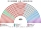
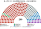

# 席次圖

`0-基本/總體.md` 硬性：繪製仿維基百科的議會席次圖。  
對應表：**可用意識形態而非政黨來表示議會分布。** 本夾採用，理由見 [`15`](15-預期政治生態.md) §2——這與憲法結構一致，不只是製圖偏好。

數字來自 [`15`](15-預期政治生態.md) 的第 4 屆示意。產生器：`shared/tools/parliament_diagram.py`。

## 全院 450

社會保障 74、環境與民生 27、發展優先 168、技術官僚中間 82、市場改革 61、地方分權 38。

過半 **226**、3/5 **270**、2/3 **300**。

**最大帶 168 席，離 226 差 58。** 每一部法律都要跨帶。

## 單一席次 260

單一席次議員選出並更新行政首長、表決行政權供給（[`02`](02-政府組成與建設性更新.md)、[`03`](03-行政權預算與供給.md)），所以另出一張。

發展優先 118、技術官僚中間 48、社會保障 40、市場改革 30、地方分權 18、環境與民生 6。過半 **131**。

**最大帶 118 席，離 131 差 13。** 政府必須由兩帶以上組成——而且**不含最大帶的組合也湊得出 131**（技術官僚 48＋市場改革 30＋社會保障 40＋地方分權 18＝136），見 [`15`](15-預期政治生態.md) §5.2。

## 複數席次 190

不另出圖：複數席次不參與行政首長的選出與更新，也不表決行政權供給，沒有專屬權力。其分布為全院圖減去單一席次圖（發展優先 50、技術官僚中間 34、社會保障 34、市場改革 31、環境與民生 21、地方分權 20）。

值得注意的是**環境與民生帶 27 席中有 21 席來自複數席次**——無得票門檻是它存在的直接原因。

## 顏色

依光譜位置著色，**不用政黨代表色**。座位由左至右依 [`15`](15-預期政治生態.md) §3 的光譜順序排列。
