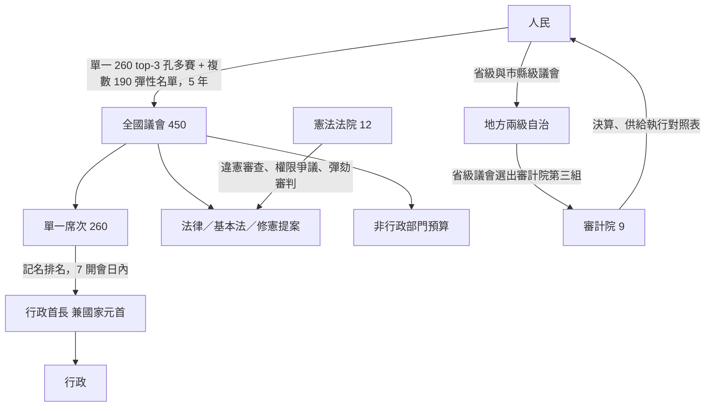
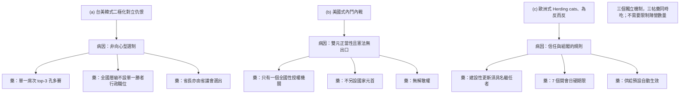
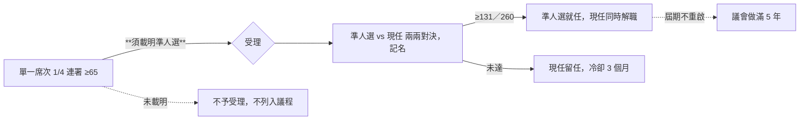
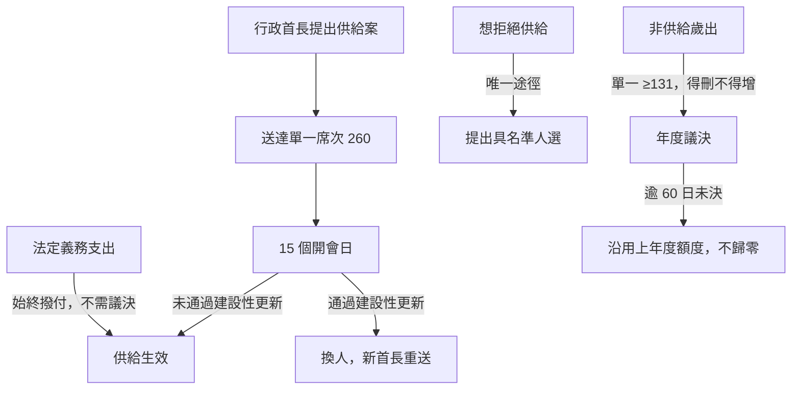
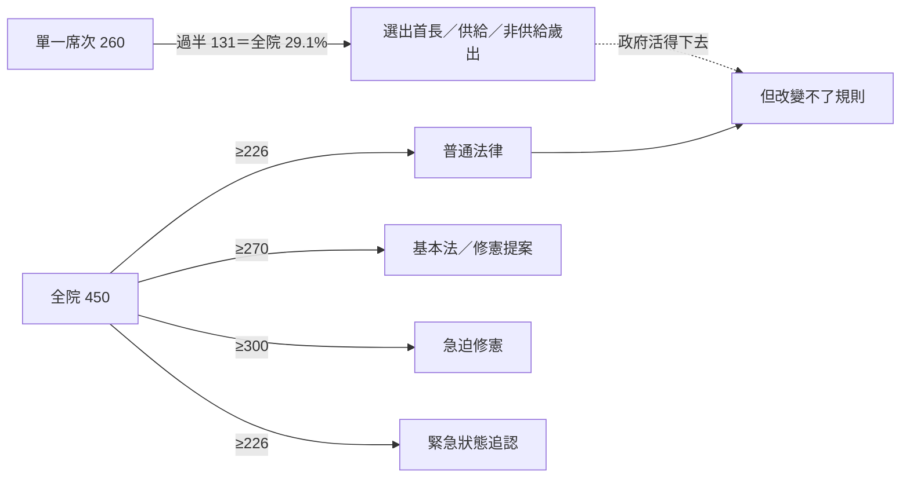
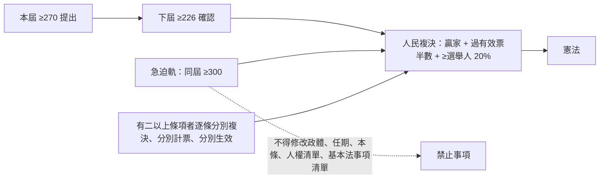
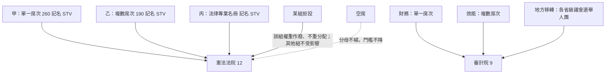
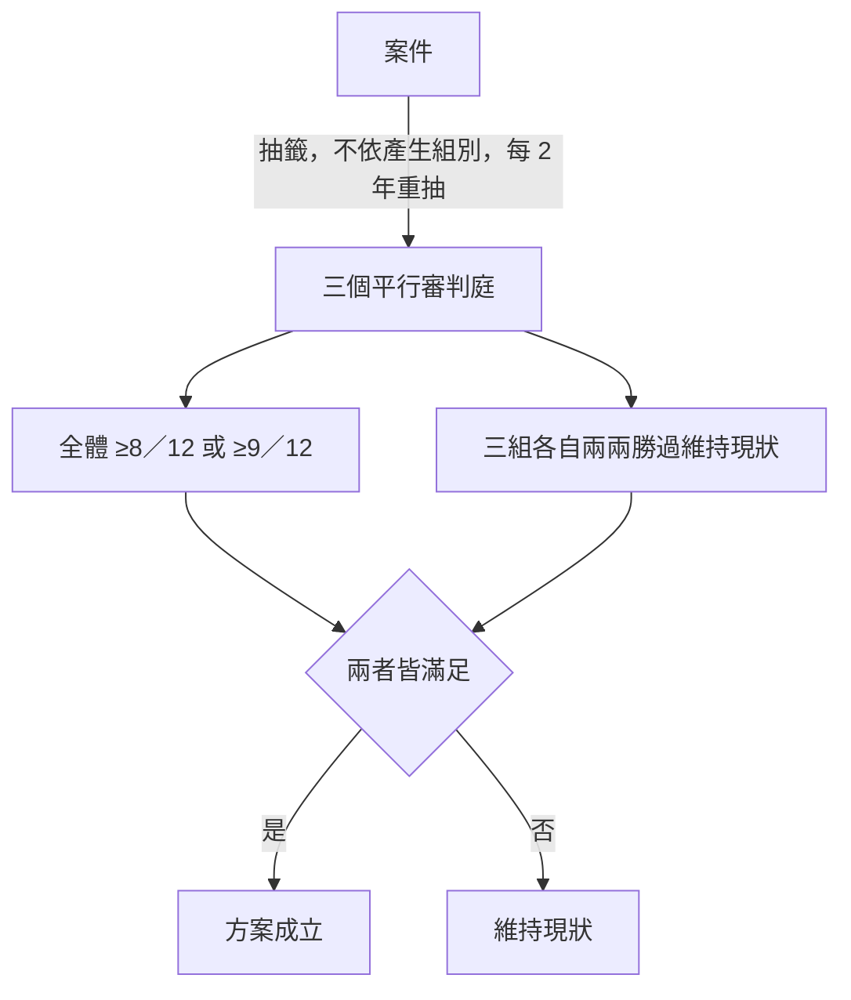
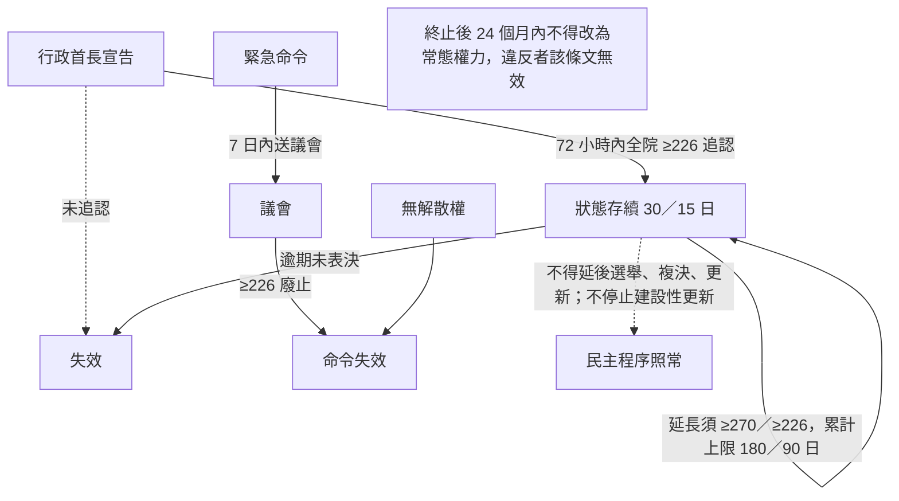
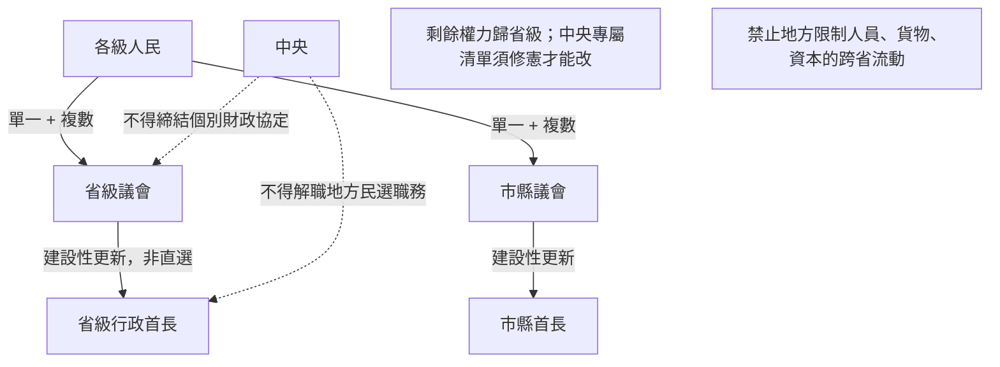

# 憲政架構圖

`0-基本/總體.md`：給多張憲政設計架構圖，方便讀者理解。

## 1 全景：一個授權來源，四權

## 2 為什麼不長得像兩黨對決

## 3 換人：議會內部的兩兩對決

## 4 供給：預設是生效

## 5 錢與規則分屬不同多數

## 6 修憲：跨屆、逐條

## 7 司法與審計人事：三組互不否決

## 8 司法方案：避免極端與派系化

## 9 緊急狀態：預設是結束，而且不碰選舉

## 10 地方：同一個原理的第二次應用

