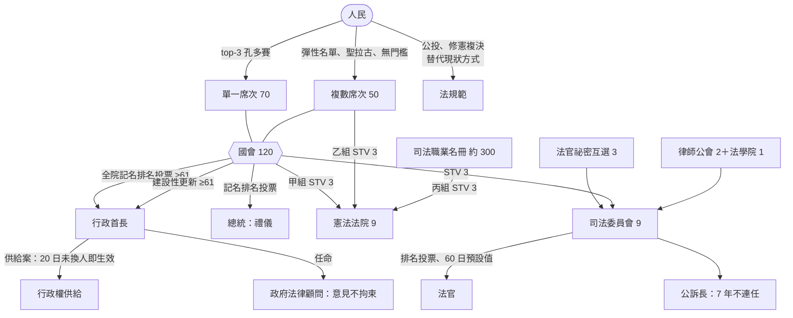
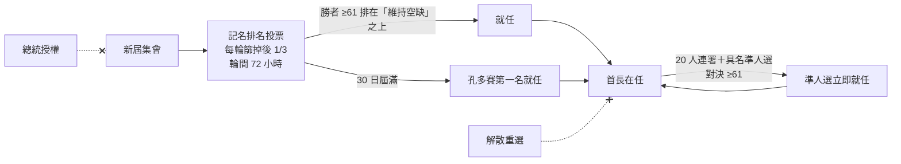
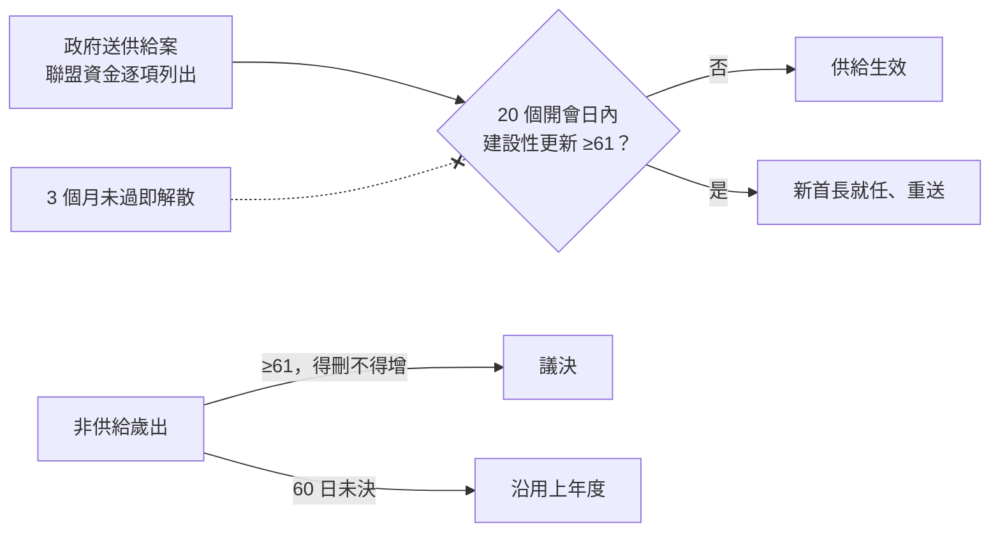
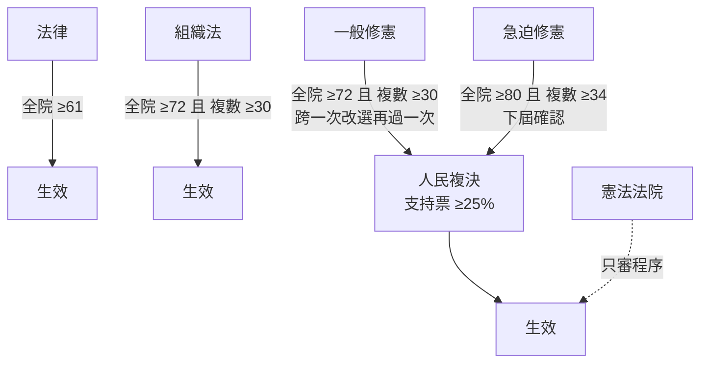
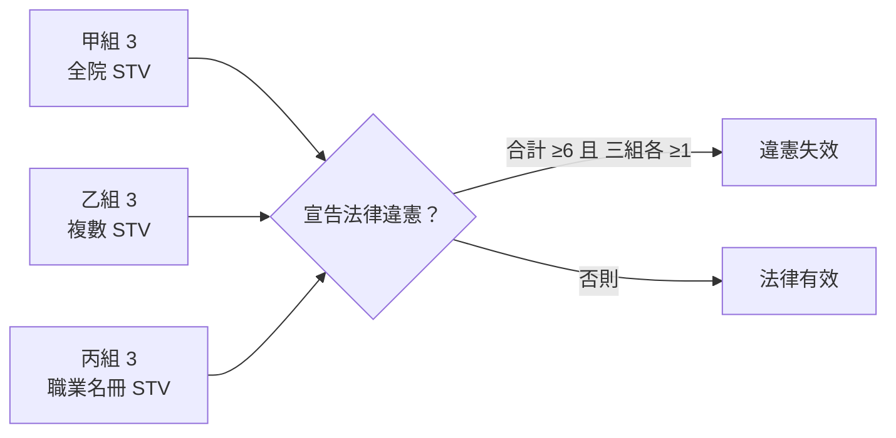
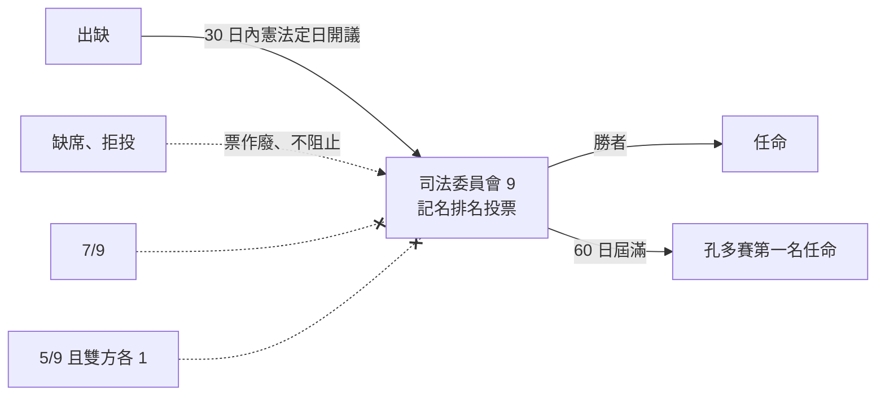

# 憲政架構圖

## 1 總覽：誰選誰

```mermaid
flowchart TB
  P([人民]) -->|top-3 孔多賽| SMD[單一席次 70]
  P -->|彈性名單、聖拉古、無門檻| PR[複數席次 50]
  P -->|公投、修憲複決<br/>替代現狀方式| LAW[法規範]
  SMD --- K{{國會 120}}
  PR --- K
  K -->|全院記名排名投票 ≥61| PM[行政首長]
  K -->|建設性更新 ≥61| PM
  K -->|記名排名投票| PRES[總統：禮儀]
  PM -->|供給案：20 日未換人即生效| BUD[行政權供給]
  K -->|甲組 STV 3| CC[憲法法院 9]
  PR -->|乙組 STV 3| CC
  ROSTER[司法職業名冊 約 300] -->|丙組 STV 3| CC
  JUD[法官祕密互選 3] --> JC[司法委員會 9]
  K -->|STV 3| JC
  BAR[律師公會 2＋法學院 1] --> JC
  JC -->|排名投票、60 日預設值| JUDGES[法官]
  JC --> PROS[公訴長：7 年不連任]
  PM -->|任命| LEG[政府法律顧問：意見不拘束]
```

## 2 組閣：沒有授權、沒有重選

```mermaid
flowchart LR
  E[新屆集會] --> R1[記名排名投票<br/>每輪篩掉後 1/3<br/>輪間 72 小時]
  R1 -->|勝者 ≥61 排在「維持空缺」之上| OK[就任]
  R1 -->|30 日屆滿| DEF[孔多賽第一名就任]
  OK --> GOV[首長在任]
  DEF --> GOV
  GOV -->|20 人連署＋具名準人選<br/>對決 ≥61| NEW[準人選立即就任]
  NEW --> GOV
  X1[總統授權] -.-x E
  X2[解散重選] -.-x GOV
```

## 3 錢：預算不再倒閣

```mermaid
flowchart LR
  G[政府送供給案<br/>聯盟資金逐項列出] --> W{20 個開會日內<br/>建設性更新 ≥61？}
  W -->|否| ON[供給生效]
  W -->|是| CH[新首長就任、重送]
  OTH[非供給歲出] -->|≥61，得刪不得增| OK2[議決]
  OTH -->|60 日未決| PREV[沿用上年度]
  X[3 個月未過即解散] -.-x W
```

## 4 改規則要兩種多數

```mermaid
flowchart TB
  L[法律] -->|全院 ≥61| L1[生效]
  O[組織法] -->|全院 ≥72 且 複數 ≥30| O1[生效]
  C1[一般修憲] -->|全院 ≥72 且 複數 ≥30<br/>跨一次改選再過一次| REF[人民複決<br/>支持票 ≥25%]
  C2[急迫修憲] -->|全院 ≥80 且 複數 ≥34<br/>下屆確認| REF
  REF --> C3[生效]
  CC[憲法法院] -.->|只審程序| C3
```

## 5 憲法法院：從中間向兩側

```mermaid
flowchart LR
  A[甲組 3<br/>全院 STV] --> V{宣告法律違憲？}
  B[乙組 3<br/>複數 STV] --> V
  C[丙組 3<br/>職業名冊 STV] --> V
  V -->|合計 ≥6 且 三組各 ≥1| X[違憲失效]
  V -->|否則| Y[法律有效]
```

## 6 法官遴選：杯葛無效

```mermaid
flowchart LR
  VAC[出缺] -->|30 日內憲法定日開議| JC[司法委員會 9<br/>記名排名投票]
  JC -->|勝者| APP[任命]
  JC -->|60 日屆滿| DEF[孔多賽第一名任命]
  ABS[缺席、拒投] -.->|票作廢、不阻止| JC
  OLD1[7/9] -.-x JC
  OLD2[5/9 且雙方各 1] -.-x JC
```
