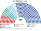

# 席次圖

`0-基本/總體.md`：**給**仿維基百科的議會席次圖。**如**（本夾採用）：有單一畫單一、有複數畫複數；圓點顏色＝所屬政黨／派系的代表色。那條可選掛在席次如下，不掛在本檔的給上。

數字來自 [`16-預期政治生態.md`](16-預期政治生態.md) 的第 5 屆示意。產生器：`shared/tools/parliament_diagram.py`。

## 全院 300（加總）

統俄・領土經營派 96、統俄・名單協調派 49、共產黨 63、自民黨 40、公正俄羅斯 28、新人 18、無黨籍 6。過半 **151**、3/5 **180**、2/3 **200**。

| 門檻 | 席次 | 統俄的缺口 |
|---|---|---|
| 過半（法律） | **151** | **差 6** |
| 3/5（基本法、一般修憲提案） | **180** | 差 35 |
| 2/3（急迫修憲、緊急狀態長期延長） | **200** | 差 55 |

**最大黨 145 席，離 151 差 6。** 法律要跨黨（或買無黨籍），基本法與修憲要找一個黨。

## 單一席次 180

單一席次議員握有行政權預算的一把鑰匙（[`03`](03-行政權預算.md)），所以另出一張。

統俄・領土 80、統俄・名單 12、共產黨 38、自民黨 22、公正俄羅斯 14、新人 8、無黨籍 6。**過半 91。**

**統俄 92 單獨過 91。** 領土經營派 80 已接近；名單協調派的 12 個單一席次補上。

> **同一個黨在這張圖上掌得住錢，在上一張圖上差 6 票掌不住法律。**

## 複數席次 120

杭特法 120 席：40／19／14／11／8 → 53／25／18／14／10。

統俄・領土 16、統俄・名單 37、共產黨 25、自民黨 18、公正俄羅斯 14、新人 10。過半 **61**。統俄 53 不過半。名單協調派在這一組成才是多數派。

## 三張圖的失真對照

**差 ＝ 單一 180 的席次率 − 複數名單得票率。**

| 黨派 | 複數名單得票率 | **複數 120 的席次率** | **單一 180 的席次率** | 差 |
|---|---|---|---|---|
| 統一俄羅斯 | 40% | 44.2% | **51.1%** | **＋11.1** |
| 共產黨 | 19% | 20.8% | 21.1% | ＋2.1 |
| 自民黨 | 14% | 15.0% | 12.2% | −1.8 |
| 公正俄羅斯 | 11% | 11.7% | 7.8% | −3.2 |
| 新人 | 8% | 8.3% | 4.4% | **−3.6** |
| 其他小黨 | 8% | 0% | 0% | −8.0 |

★ 複數席次對大黨有杭特獎勵（40% 票 → 44.2% 席），幅度小於單一席次的孔多賽超額。其餘 8% 被選區 M 吃掉。

## 顏色

兩派統俄用母黨藍的變體，不是整黨一色。其他黨用政黨代表色；無黨籍用灰。座位由左至右依政治光譜排列。

| 政黨／派系 | 色 |
|---|---|
| 統一俄羅斯・領土經營派 | `#0C3484` |
| 統一俄羅斯・名單協調派 | `#5B7FCF` |

## 指向

生態：[`16`](16-預期政治生態.md)。選制：[`01`](01-國家杜馬與選制.md)。單一席次的特殊權力：[`03`](03-行政權預算.md)。
