# 憲政架構圖

`0-基本/總體.md`：給多張憲政設計架構圖，方便讀者理解。

## 1 全景：四權與人民

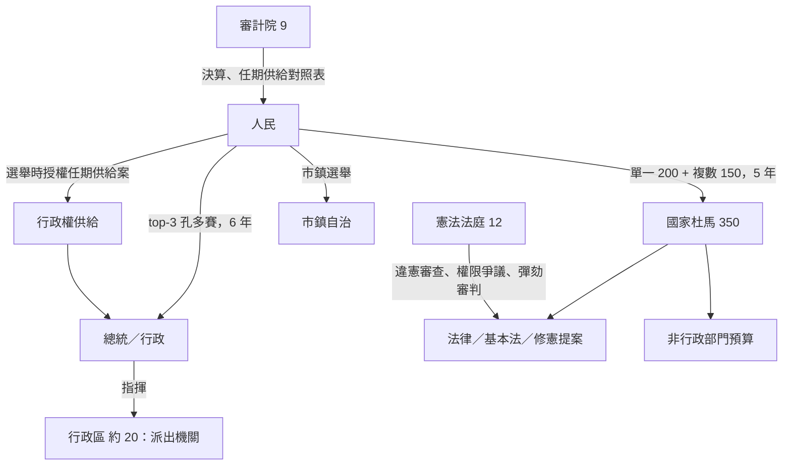

## 2 沒有次國家政治層級：拿掉位子，而不是繞著位子設防

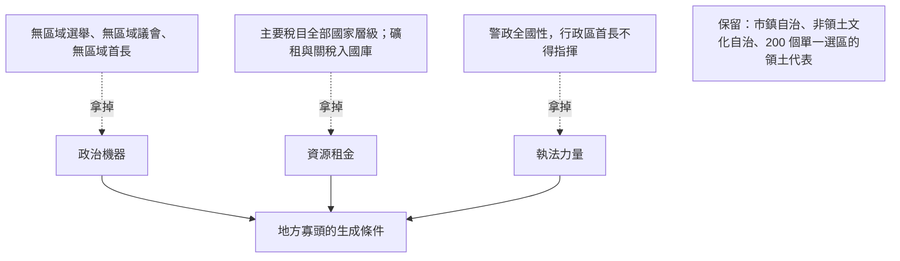

## 3 供給：人民授權，議會沒有停擺開關

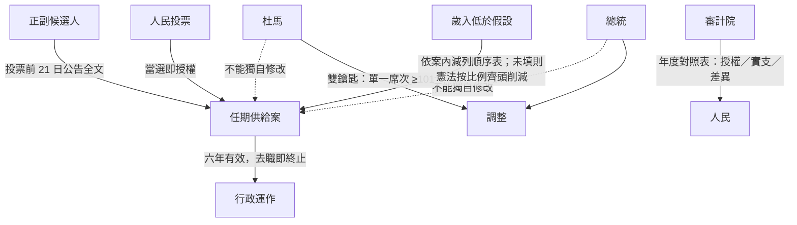

## 4 「部分行政權預算」怎麼落實：範圍，不是天花板

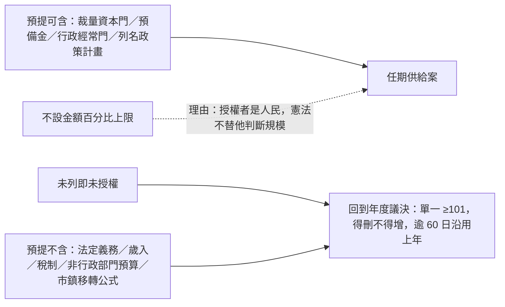

## 5 修憲：跨屆、逐條、不得自我交易

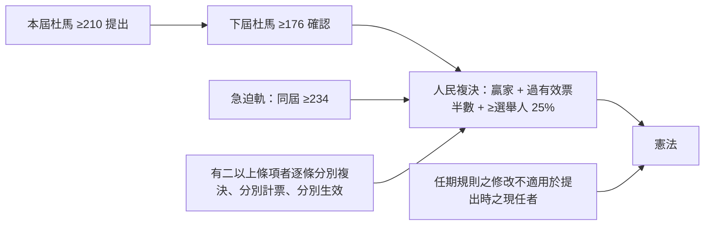

## 6 司法人事：三組互不否決，杯葛者浪費投票權

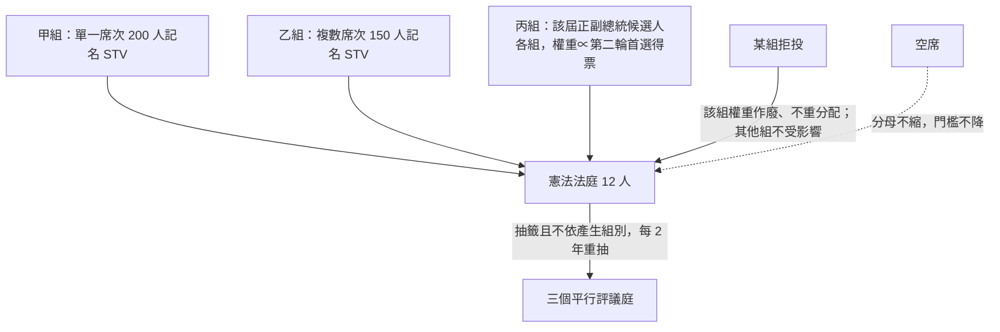

## 7 司法方案：避免極端與派系化

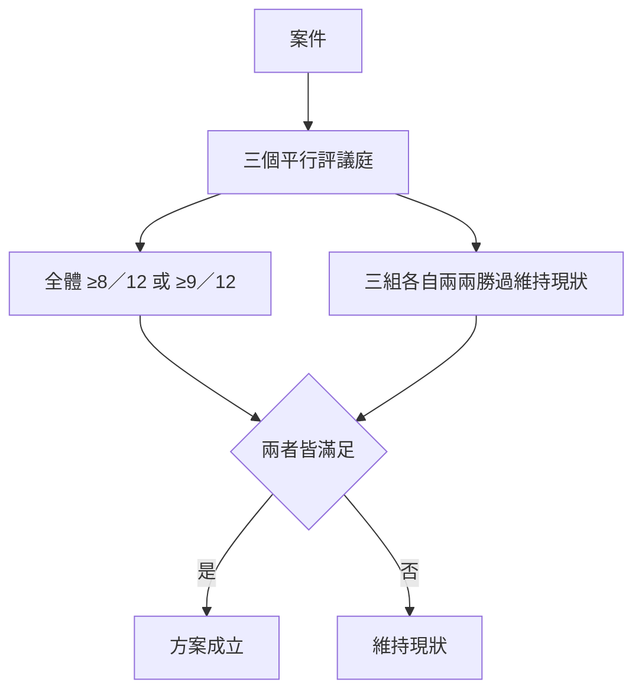

## 8 緊急狀態：預設值是結束，而且不碰選舉

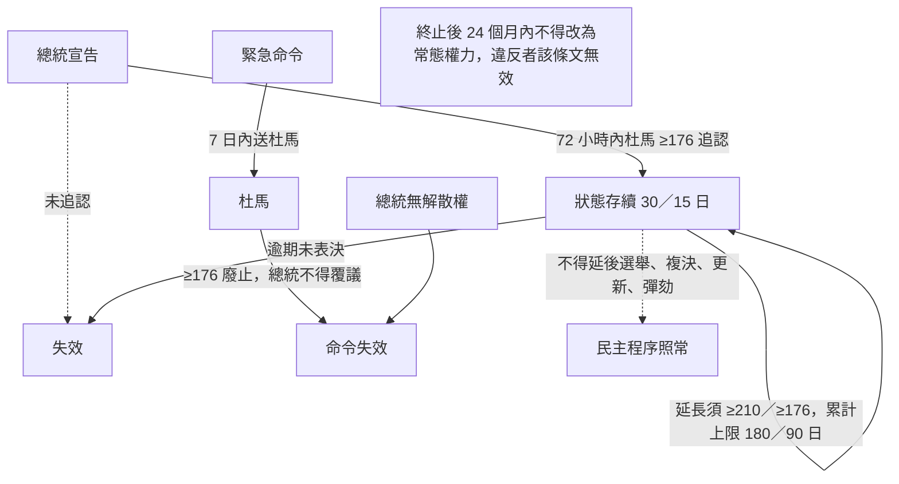

## 9 人選更新：要不要換成這個人和他的那份預算

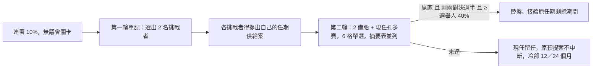

## 10 正當化的兩面

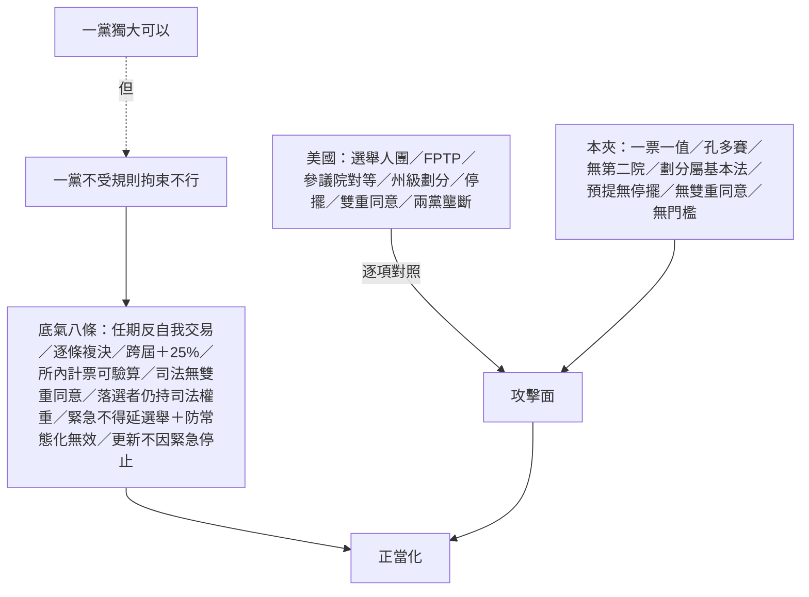

## 11 錢與規則分屬不同多數

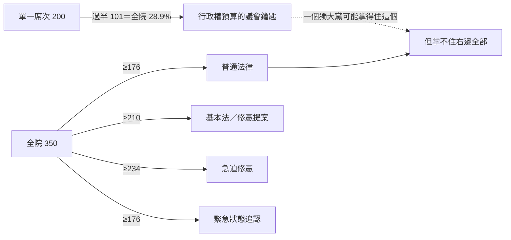
