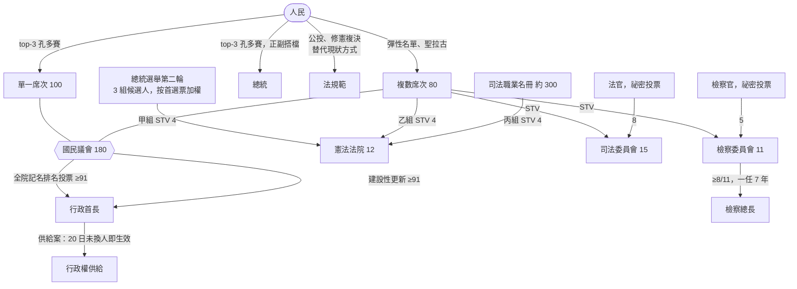
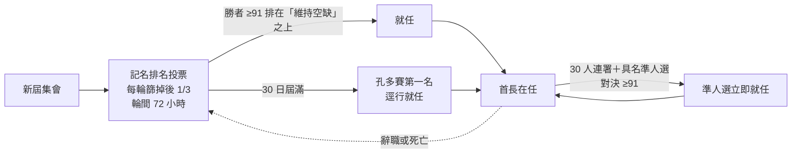
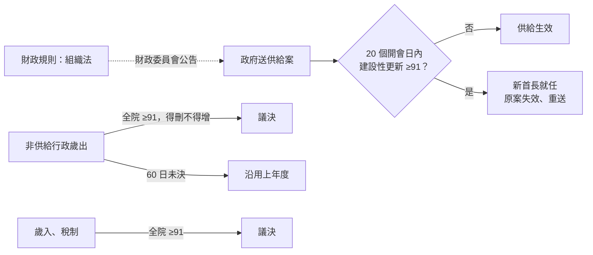
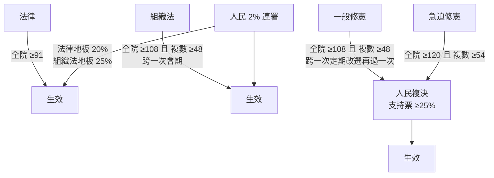
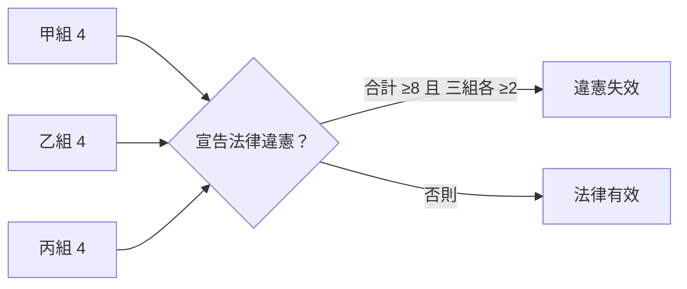
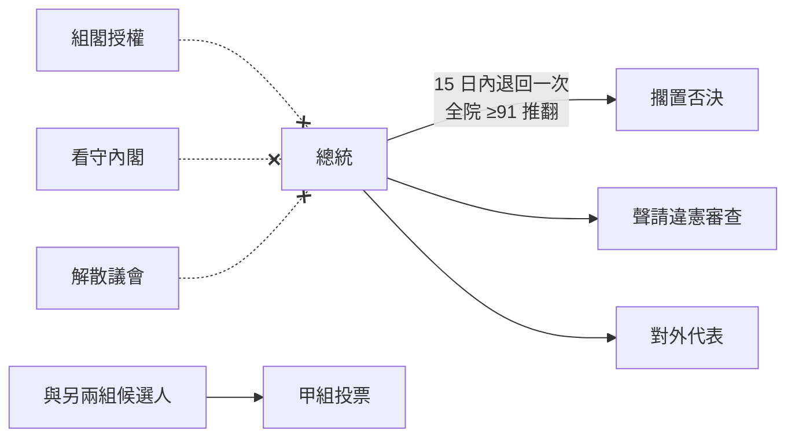

# 憲政架構圖

## 1 總覽：誰選誰

```mermaid
flowchart TB
  P([人民]) -->|top-3 孔多賽| SMD[單一席次 100]
  P -->|彈性名單、聖拉古| PR[複數席次 80]
  P -->|top-3 孔多賽，正副搭檔| PRES[總統]
  P -->|公投、修憲複決<br/>替代現狀方式| LAW[法規範]
  SMD --- NA{{國民議會 180}}
  PR --- NA
  NA -->|全院記名排名投票 ≥91| PM[行政首長]
  NA -->|建設性更新 ≥91| PM
  PM -->|供給案：20 日未換人即生效| BUD[行政權供給]
  PRESC[總統選舉第二輪<br/>3 組候選人，按首選票加權] -->|甲組 STV 4| CC[憲法法院 12]
  PR -->|乙組 STV 4| CC
  ROSTER[司法職業名冊 約 300] -->|丙組 STV 4| CC
  PR -->|STV| JC[司法委員會 15]
  JUD[法官，祕密投票] -->|8| JC
  PR -->|STV| PC[檢察委員會 11]
  PROS[檢察官，祕密投票] -->|5| PC
  PC -->|≥8/11，一任 7 年| PG[檢察總長]
```

## 2 組閣：沒有看守內閣、沒有解散

```mermaid
flowchart LR
  E[新屆集會] --> R1[記名排名投票<br/>每輪篩掉後 1/3<br/>輪間 72 小時]
  R1 -->|勝者 ≥91 排在「維持空缺」之上| OK[就任]
  R1 -->|30 日屆滿| DEF[孔多賽第一名<br/>逕行就任]
  OK --> GOV[首長在任]
  DEF --> GOV
  GOV -->|30 人連署＋具名準人選<br/>對決 ≥91| NEW[準人選立即就任]
  NEW --> GOV
  GOV -.->|辭職或死亡| R1
```

## 3 錢

```mermaid
flowchart LR
  G[政府送供給案] --> W{20 個開會日內<br/>建設性更新 ≥91？}
  W -->|否| ON[供給生效]
  W -->|是| CH[新首長就任<br/>原案失效、重送]
  OTH[非供給行政歲出] -->|全院 ≥91，得刪不得增| OK2[議決]
  OTH -->|60 日未決| PREV[沿用上年度]
  REV[歲入、稅制] -->|全院 ≥91| TAX[議決]
  FR[財政規則：組織法] -.->|財政委員會公告| G
```

## 4 改規則要兩種多數

```mermaid
flowchart TB
  L[法律] -->|全院 ≥91| L1[生效]
  O[組織法] -->|全院 ≥108 且 複數 ≥48<br/>跨一次會期| O1[生效]
  C1[一般修憲] -->|全院 ≥108 且 複數 ≥48<br/>跨一次定期改選再過一次| REF[人民複決<br/>支持票 ≥25%]
  C2[急迫修憲] -->|全院 ≥120 且 複數 ≥54| REF
  REF --> C3[生效]
  INI[人民 2% 連署] -->|法律地板 20%<br/>組織法地板 25%| L1
  INI --> O1
```

## 5 憲法法院的裁決

```mermaid
flowchart LR
  A[甲組 4] --> V{宣告法律違憲？}
  B[乙組 4] --> V
  C[丙組 4] --> V
  V -->|合計 ≥8 且 三組各 ≥2| X[違憲失效]
  V -->|否則| Y[法律有效]
```

## 6 總統：只有四項權力

```mermaid
flowchart LR
  PRES[總統] -->|15 日內退回一次<br/>全院 ≥91 推翻| VETO[擱置否決]
  PRES --> REV[聲請違憲審查]
  PRES --> REP[對外代表]
  PRESC[與另兩組候選人] --> CC[甲組投票]
  X1[組閣授權] -.-x PRES
  X2[看守內閣] -.-x PRES
  X3[解散議會] -.-x PRES
```
