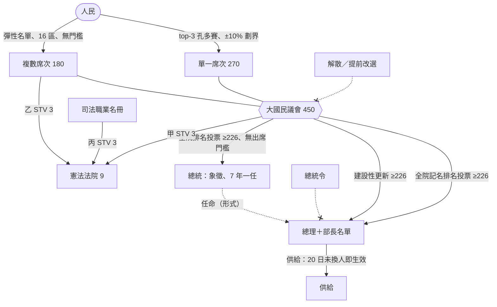
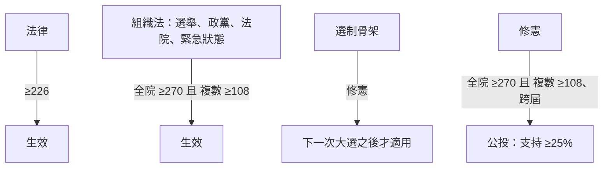
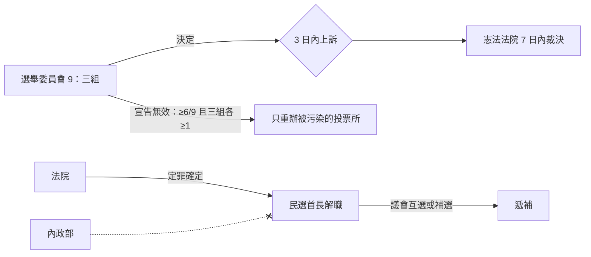

# 憲政架構圖

## 1 總覽

```mermaid
flowchart TB
  P([人民]) -->|top-3 孔多賽、±10% 劃界| SMD[單一席次 270]
  P -->|彈性名單、16 區、無門檻| PR[複數席次 180]
  SMD --- C{{大國民議會 450}}
  PR --- C
  C -->|全院記名排名投票 ≥226| PM[總理＋部長名單]
  C -->|建設性更新 ≥226| PM
  C -->|全院排名投票 ≥226、無出席門檻| PRES[總統：象徵、7 年一任]
  PRES -.->|任命（形式）| PM
  PM -->|供給：20 日未換人即生效| BUD[供給]
  C -->|甲 STV 3| CC[憲法法院 9]
  PR -->|乙 STV 3| CC
  ROSTER[司法職業名冊] -->|丙 STV 3| CC
  X1[總統令] -.-x PM
  X2[解散／提前改選] -.-x C
```

## 2 改規則

```mermaid
flowchart TB
  L[法律] -->|≥226| L1[生效]
  O[組織法：選舉、政黨、法院、緊急狀態] -->|全院 ≥270 且 複數 ≥108| O1[生效]
  E[選制骨架] -->|修憲| E1[下一次大選之後才適用]
  C1[修憲] -->|全院 ≥270 且 複數 ≥108、跨屆| REF[公投：支持 ≥25%]
```

## 3 選舉與民選官員的保護

```mermaid
flowchart LR
  EC[選舉委員會 9：三組] -->|決定| APP{3 日內上訴}
  APP --> CC[憲法法院 7 日內裁決]
  EC -->|宣告無效：≥6/9 且三組各 ≥1| RE[只重辦被污染的投票所]
  COURT[法院] -->|定罪確定| OUT[民選首長解職]
  OUT -->|議會互選或補選| NEW[遞補]
  MIN[內政部] -.-x OUT
```
