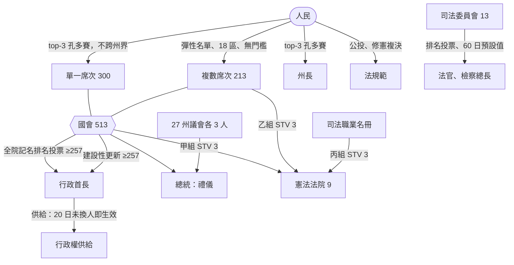
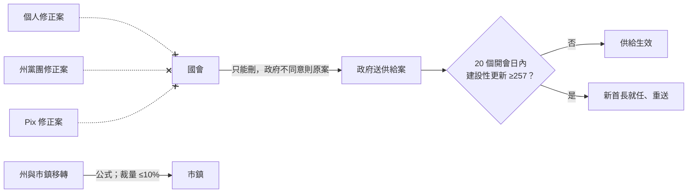
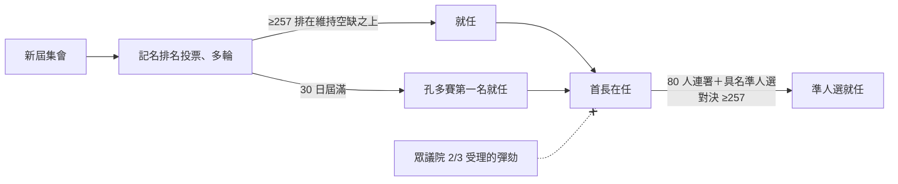
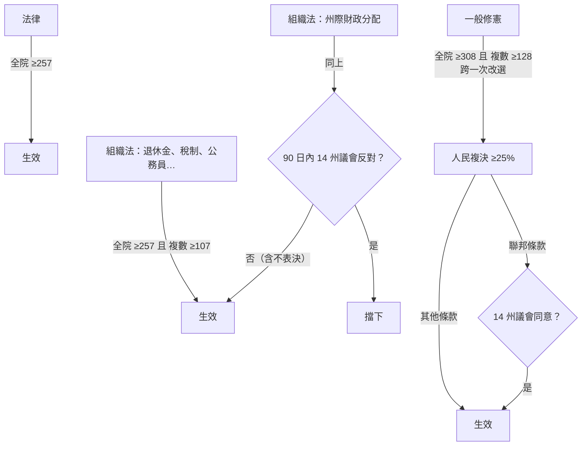
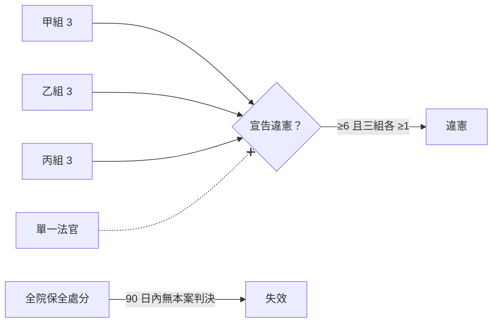
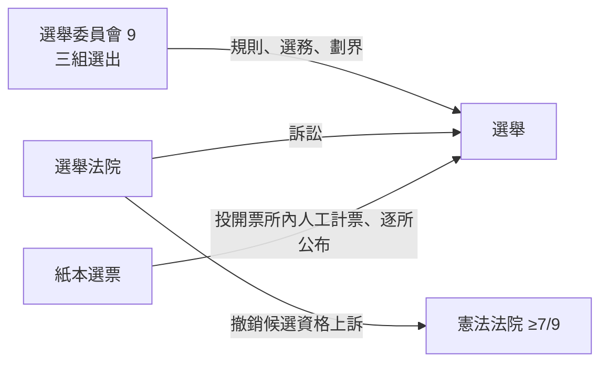

# 憲政架構圖

## 1 總覽：誰選誰

```mermaid
flowchart TB
  P([人民]) -->|top-3 孔多賽，不跨州界| SMD[單一席次 300]
  P -->|彈性名單、18 區、無門檻| PR[複數席次 213]
  P -->|top-3 孔多賽| GOVS[州長]
  P -->|公投、修憲複決| LAW[法規範]
  SMD --- C{{國會 513}}
  PR --- C
  C -->|全院記名排名投票 ≥257| PM[行政首長]
  C -->|建設性更新 ≥257| PM
  C --> PRES[總統：禮儀]
  ST[27 州議會各 3 人] --> PRES
  PM -->|供給：20 日未換人即生效| BUD[行政權供給]
  C -->|甲組 STV 3| CC[憲法法院 9]
  PR -->|乙組 STV 3| CC
  ROSTER[司法職業名冊] -->|丙組 STV 3| CC
  JC[司法委員會 13] -->|排名投票、60 日預設值| JUD[法官、檢察總長]
```

## 2 錢：議員不能不進政府就拿錢

```mermaid
flowchart LR
  G[政府送供給案] --> W{20 個開會日內<br/>建設性更新 ≥257？}
  W -->|否| ON[供給生效]
  W -->|是| CH[新首長就任、重送]
  C[國會] -->|只能刪，政府不同意則原案| G
  X1[個人修正案] -.-x C
  X2[州黨團修正案] -.-x C
  X3[Pix 修正案] -.-x C
  TR[州與市鎮移轉] -->|公式；裁量 ≤10%| MUN[市鎮]
```

## 3 首長：沒有彈劾式的倒閣

```mermaid
flowchart LR
  E[新屆集會] --> R[記名排名投票、多輪]
  R -->|≥257 排在維持空缺之上| OK[就任]
  R -->|30 日屆滿| DEF[孔多賽第一名就任]
  OK --> GOV[首長在任]
  DEF --> GOV
  GOV -->|80 人連署＋具名準人選<br/>對決 ≥257| NEW[準人選就任]
  IMP[眾議院 2/3 受理的彈劾] -.-x GOV
```

## 4 改規則：兩種多數＋州

```mermaid
flowchart TB
  L[法律] -->|全院 ≥257| L1[生效]
  O[組織法：退休金、稅制、公務員…] -->|全院 ≥257 且 複數 ≥107| O1[生效]
  F[組織法：州際財政分配] -->|同上| FS{90 日內 14 州議會反對？}
  FS -->|否（含不表決）| O1
  FS -->|是| NO[擋下]
  C1[一般修憲] -->|全院 ≥308 且 複數 ≥128<br/>跨一次改選| REF[人民複決 ≥25%]
  REF -->|聯邦條款| ST{14 州議會同意？}
  REF -->|其他條款| C3[生效]
  ST -->|是| C3
```

## 5 憲法法院：一個法官暫停不了法律

```mermaid
flowchart LR
  A[甲組 3] --> V{宣告違憲？}
  B[乙組 3] --> V
  C[丙組 3] --> V
  V -->|≥6 且三組各 ≥1| X[違憲]
  ONE[單一法官] -.-x V
  CAU[全院保全處分] -->|90 日內無本案判決| LAPSE[失效]
```

## 6 選舉：規則與裁判分開

```mermaid
flowchart LR
  COM[選舉委員會 9<br/>三組選出] -->|規則、選務、劃界| EL[選舉]
  CT[選舉法院] -->|訴訟| EL
  CT -->|撤銷候選資格上訴| CC[憲法法院 ≥7/9]
  BOX[紙本選票] -->|投開票所內人工計票、逐所公布| EL
```
