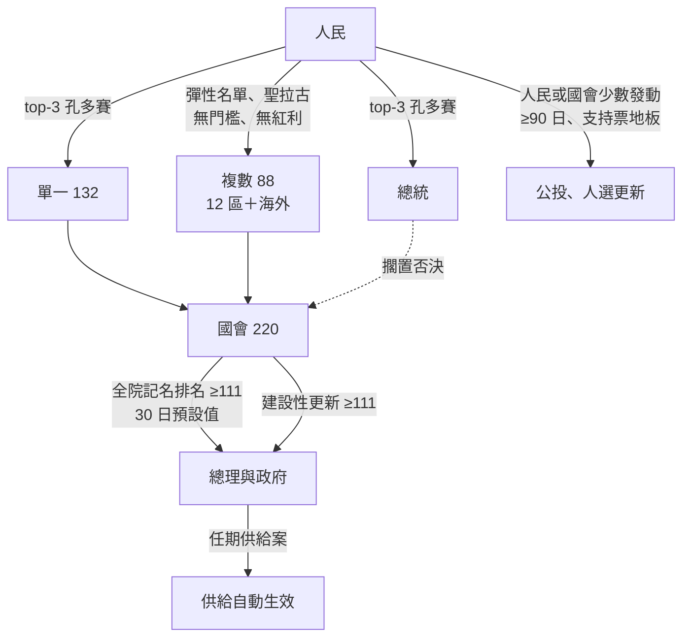
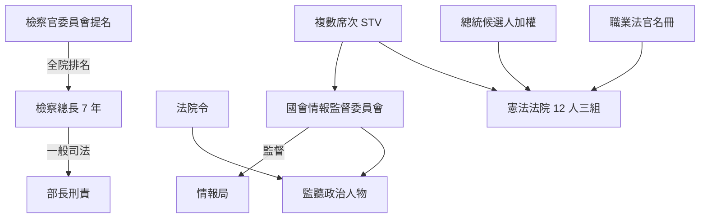
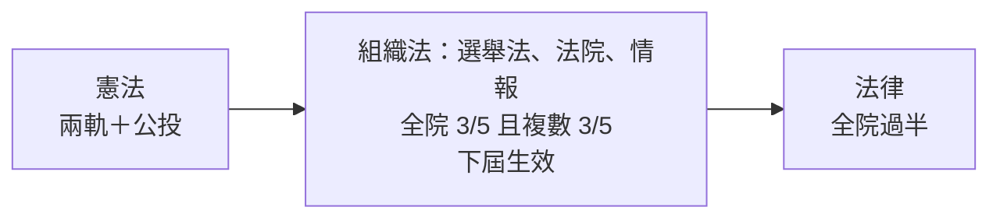

# 憲政架構圖

## 1 選舉與權力來源

```mermaid
flowchart TB
    P[人民] -->|top-3 孔多賽| SMD[單一 132]
    P -->|彈性名單、聖拉古<br/>無門檻、無紅利| LIST[複數 88<br/>12 區＋海外]
    P -->|top-3 孔多賽| PRES[總統]
    P -->|人民或國會少數發動<br/>≥90 日、支持票地板| REF[公投、人選更新]
    SMD --> V[國會 220]
    LIST --> V
    V -->|全院記名排名 ≥111<br/>30 日預設值| PM[總理與政府]
    V -->|建設性更新 ≥111| PM
    PM -->|任期供給案| SUP[供給自動生效]
    PRES -.->|擱置否決| V
```

## 2 監督

```mermaid
flowchart TB
    LIST[複數席次 STV] --> INT[國會情報監督委員會]
    INT -->|監督| EYP[情報局]
    COURT[法院令] --> TAP[監聽政治人物]
    INT --> TAP
    PC[檢察官委員會提名] -->|全院排名| PG[檢察總長 7 年]
    PG -->|一般司法| MIN[部長刑責]
    PRESC[總統候選人加權] --> CC[憲法法院 12 人三組]
    LIST --> CC
    NAMES[職業法官名冊] --> CC
```

## 3 法規位階

```mermaid
flowchart LR
    C[憲法<br/>兩軌＋公投] --> O[組織法：選舉法、法院、情報<br/>全院 3/5 且複數 3/5<br/>下屆生效] --> L[法律<br/>全院過半]
```
