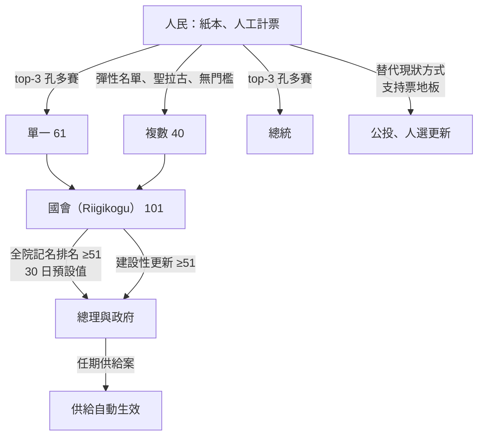
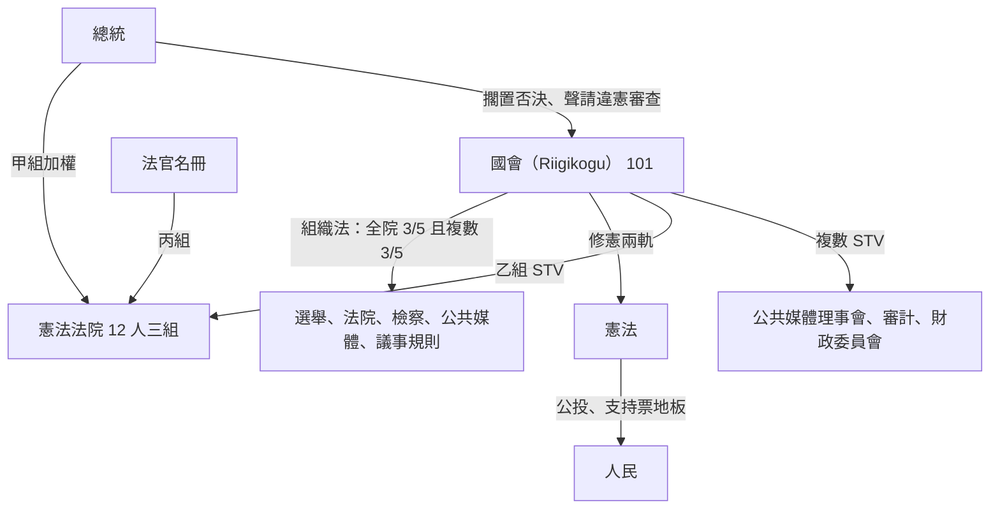

# 憲政架構圖

## 1 選舉與權力來源

```mermaid
flowchart TB
    P[人民：紙本、人工計票] -->|top-3 孔多賽| SMD[單一 61]
    P -->|彈性名單、聖拉古、無門檻| LIST[複數 40]
    P -->|top-3 孔多賽| PRES[總統]
    P -->|替代現狀方式<br/>支持票地板| REF[公投、人選更新]
    SMD --> NR[國會（Riigikogu） 101]
    LIST --> NR
    NR -->|全院記名排名 ≥51<br/>30 日預設值| PM[總理與政府]
    NR -->|建設性更新 ≥51| PM
    PM -->|任期供給案| SUP[供給自動生效]
```

## 2 規則與機關

```mermaid
flowchart TB
    NR[國會（Riigikogu） 101] -->|組織法：全院 3/5 且複數 3/5| ORG[選舉、法院、檢察、公共媒體、議事規則]
    NR -->|修憲兩軌| CON[憲法]
    CON -->|公投、支持票地板| P[人民]
    PRES[總統] -->|甲組加權| CC[憲法法院 12 人三組]
    NR -->|乙組 STV| CC
    J[法官名冊] -->|丙組| CC
    NR -->|複數 STV| MED[公共媒體理事會、審計、財政委員會]
    PRES -->|擱置否決、聲請違憲審查| NR
```
