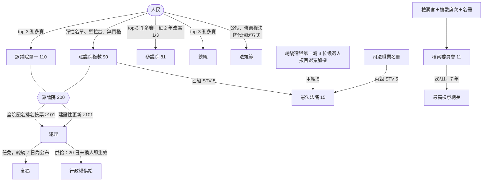
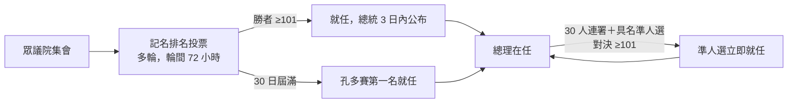
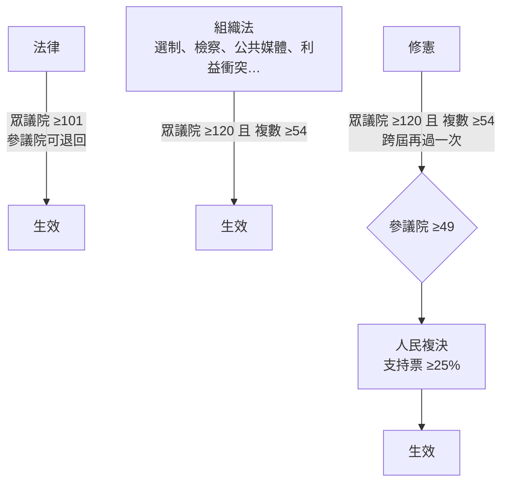
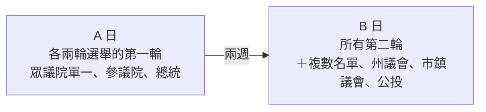
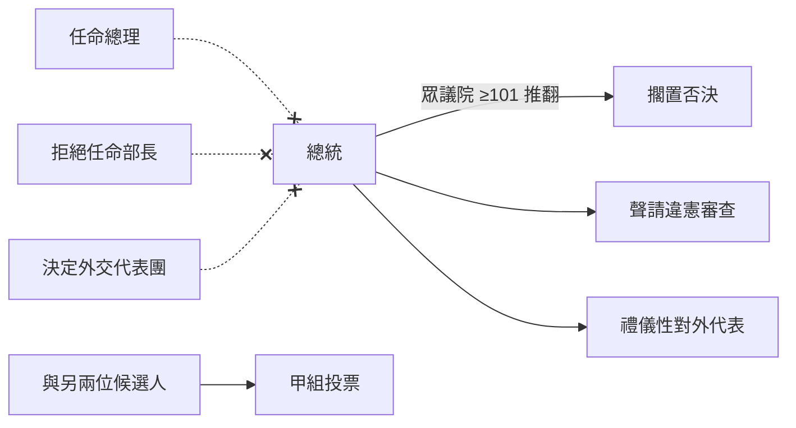

# 憲政架構圖

## 1 總覽：誰選誰

```mermaid
flowchart TB
  P([人民]) -->|top-3 孔多賽| SMD[眾議院單一 110]
  P -->|彈性名單、聖拉古、無門檻| PR[眾議院複數 90]
  P -->|top-3 孔多賽，每 2 年改選 1/3| SEN[參議院 81]
  P -->|top-3 孔多賽| PRES[總統]
  P -->|公投、修憲複決<br/>替代現狀方式| LAW[法規範]
  SMD --- CH{{眾議院 200}}
  PR --- CH
  CH -->|全院記名排名投票 ≥101| PM[總理]
  CH -->|建設性更新 ≥101| PM
  PM -->|任免，總統 7 日內公布| MIN[部長]
  PM -->|供給：20 日未換人即生效| BUD[行政權供給]
  PRESC[總統選舉第二輪 3 位候選人<br/>按首選票加權] -->|甲組 5| CC[憲法法院 15]
  PR -->|乙組 STV 5| CC
  ROSTER[司法職業名冊] -->|丙組 STV 5| CC
  PROS[檢察官＋複數席次＋名冊] --> PCO[檢察委員會 11]
  PCO -->|≥8/11，7 年| PG[最高檢察總長]
```

## 2 組閣：總統不任命、不信任投票

```mermaid
flowchart LR
  E[眾議院集會] --> R1[記名排名投票<br/>多輪，輪間 72 小時]
  R1 -->|勝者 ≥101| OK[就任，總統 3 日內公布]
  R1 -->|30 日屆滿| DEF[孔多賽第一名就任]
  OK --> GOV[總理在任]
  DEF --> GOV
  GOV -->|30 人連署＋具名準人選<br/>對決 ≥101| NEW[準人選立即就任]
  NEW --> GOV
```

## 3 改規則

```mermaid
flowchart TB
  L[法律] -->|眾議院 ≥101<br/>參議院可退回| L1[生效]
  O[組織法<br/>選制、檢察、公共媒體、利益衝突…] -->|眾議院 ≥120 且 複數 ≥54| O1[生效]
  C[修憲] -->|眾議院 ≥120 且 複數 ≥54<br/>跨屆再過一次| S{參議院 ≥49}
  S --> REF[人民複決<br/>支持票 ≥25%]
  REF --> C1[生效]
```

## 4 選舉日

```mermaid
flowchart LR
  A[A 日<br/>各兩輪選舉的第一輪<br/>眾議院單一、參議院、總統] -->|兩週| B[B 日<br/>所有第二輪<br/>＋複數名單、州議會、市鎮議會、公投]
```

## 5 總統：只有四項權力

```mermaid
flowchart LR
  PRES[總統] -->|眾議院 ≥101 推翻| VETO[擱置否決]
  PRES --> REV[聲請違憲審查]
  PRES --> REP[禮儀性對外代表]
  PRESC[與另兩位候選人] --> CC[甲組投票]
  X1[任命總理] -.-x PRES
  X2[拒絕任命部長] -.-x PRES
  X3[決定外交代表團] -.-x PRES
```
