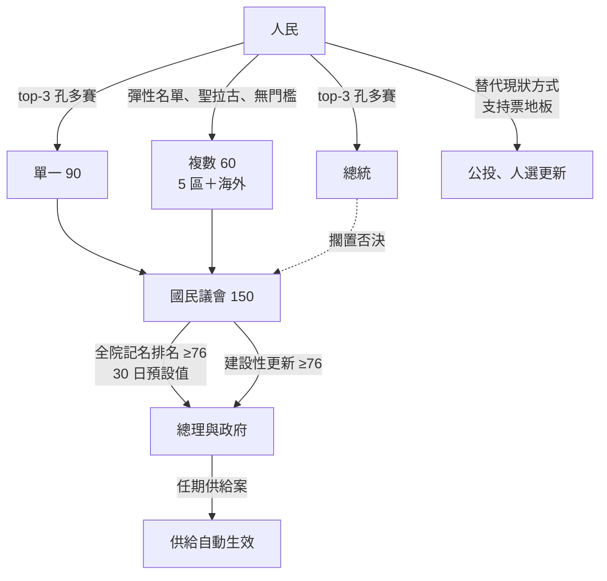
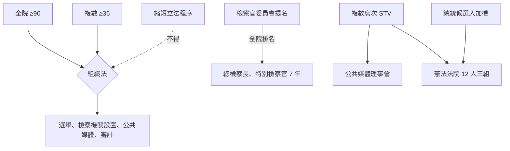

# 憲政架構圖

## 1 選舉與權力來源

```mermaid
flowchart TB
    P[人民] -->|top-3 孔多賽| SMD[單一 90]
    P -->|彈性名單、聖拉古、無門檻| LIST[複數 60<br/>5 區＋海外]
    P -->|top-3 孔多賽| PRES[總統]
    P -->|替代現狀方式<br/>支持票地板| REF[公投、人選更新]
    SMD --> NR[國民議會 150]
    LIST --> NR
    NR -->|全院記名排名 ≥76<br/>30 日預設值| PM[總理與政府]
    NR -->|建設性更新 ≥76| PM
    PM -->|任期供給案| SUP[供給自動生效]
    PRES -.->|擱置否決| NR
```

## 2 規則與檢察

```mermaid
flowchart TB
    NR[全院 ≥90] --> ORG{組織法}
    LIST[複數 ≥36] --> ORG
    ORG --> R[選舉、檢察機關設置、公共媒體、審計]
    FAST[縮短立法程序] -.->|不得| ORG
    PC[檢察官委員會提名] -->|全院排名| PG[總檢察長、特別檢察官 7 年]
    STV[複數席次 STV] --> MED[公共媒體理事會]
    PRESC[總統候選人加權] --> CC[憲法法院 12 人三組]
    STV --> CC
```
