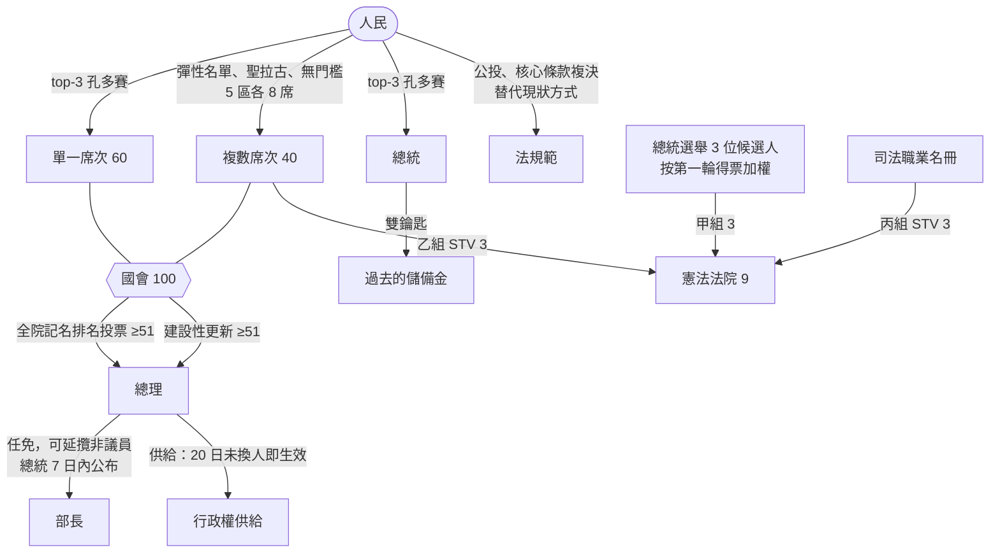
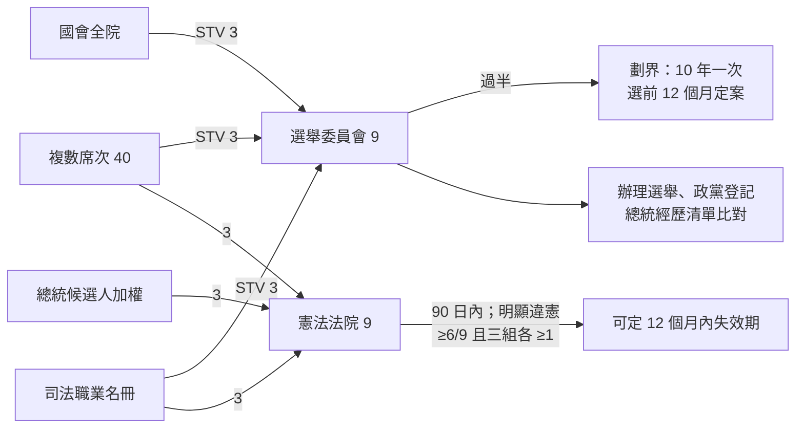
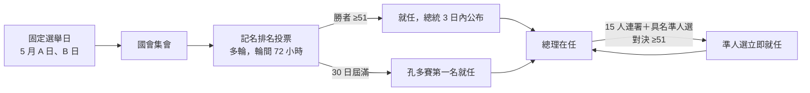
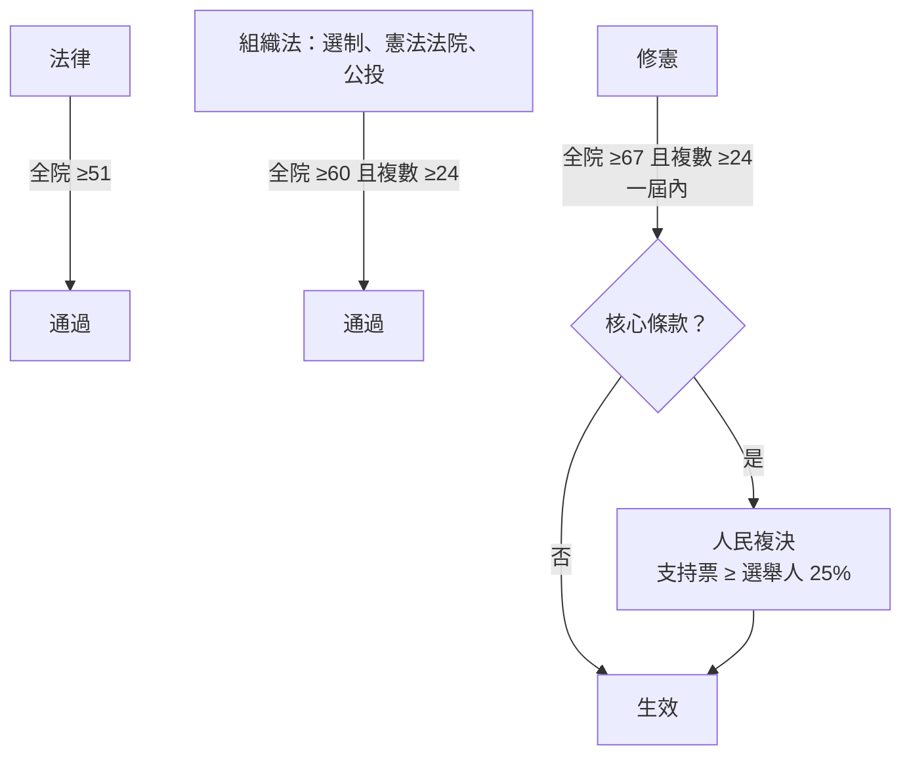
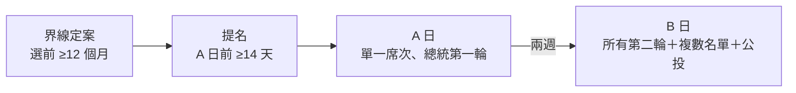

# 憲政架構圖

## 1 總覽：誰選誰

```mermaid
flowchart TB
  P([人民]) -->|top-3 孔多賽| SMD[單一席次 60]
  P -->|彈性名單、聖拉古、無門檻<br/>5 區各 8 席| PR[複數席次 40]
  P -->|top-3 孔多賽| PRES[總統]
  P -->|公投、核心條款複決<br/>替代現狀方式| LAW[法規範]
  SMD --- PARL{{國會 100}}
  PR --- PARL
  PARL -->|全院記名排名投票 ≥51| PM[總理]
  PARL -->|建設性更新 ≥51| PM
  PM -->|任免，可延攬非議員<br/>總統 7 日內公布| MIN[部長]
  PM -->|供給：20 日未換人即生效| BUD[行政權供給]
  PRES -->|雙鑰匙| RES[過去的儲備金]
  PRESC[總統選舉 3 位候選人<br/>按第一輪得票加權] -->|甲組 3| CC[憲法法院 9]
  PR -->|乙組 STV 3| CC
  ROSTER[司法職業名冊] -->|丙組 STV 3| CC
```

## 2 新設的兩個機關

```mermaid
flowchart LR
  PARL[國會全院] -->|STV 3| EC[選舉委員會 9]
  PR[複數席次 40] -->|STV 3| EC
  ROSTER[司法職業名冊] -->|STV 3| EC
  EC -->|過半| B[劃界：10 年一次<br/>選前 12 個月定案]
  EC --> EL[辦理選舉、政黨登記<br/>總統經歷清單比對]
  PRESC[總統候選人加權] -->|3| CC[憲法法院 9]
  PR -->|3| CC
  ROSTER -->|3| CC
  CC -->|90 日內；明顯違憲<br/>≥6/9 且三組各 ≥1| R[可定 12 個月內失效期]
```

維持不變的：法官（總統依總理建議）、總檢察長兼公訴人、CPIB、公共服務委員會、審計長、總統顧問理事會。

## 3 組閣：總統不任命

```mermaid
flowchart LR
  E[固定選舉日<br/>5 月 A 日、B 日] --> S[國會集會]
  S --> R1[記名排名投票<br/>多輪，輪間 72 小時]
  R1 -->|勝者 ≥51| OK[就任，總統 3 日內公布]
  R1 -->|30 日屆滿| DEF[孔多賽第一名就任]
  OK --> GOV[總理在任]
  DEF --> GOV
  GOV -->|15 人連署＋具名準人選<br/>對決 ≥51| NEW[準人選立即就任]
  NEW --> GOV
```

## 4 改規則

```mermaid
flowchart TB
  L[法律] -->|全院 ≥51| L1[通過]
  O[組織法：選制、憲法法院、公投] -->|全院 ≥60 且複數 ≥24| O1[通過]
  C[修憲] -->|全院 ≥67 且複數 ≥24<br/>一屆內| C1{核心條款？}
  C1 -->|否| C3[生效]
  C1 -->|是| C2[人民複決<br/>支持票 ≥ 選舉人 25%] --> C3
```

## 5 選舉日

```mermaid
flowchart LR
  B0[界線定案<br/>選前 ≥12 個月] --> N[提名<br/>A 日前 ≥14 天]
  N --> A[A 日<br/>單一席次、總統第一輪]
  A -->|兩週| B[B 日<br/>所有第二輪＋複數名單＋公投]
```
