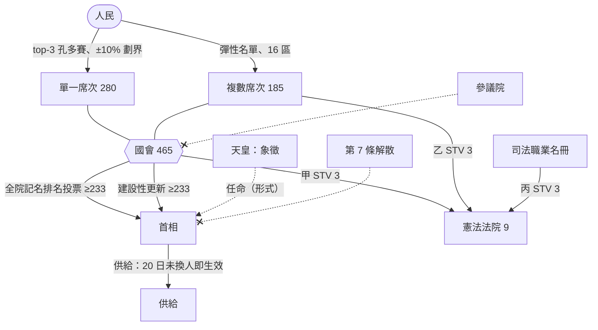
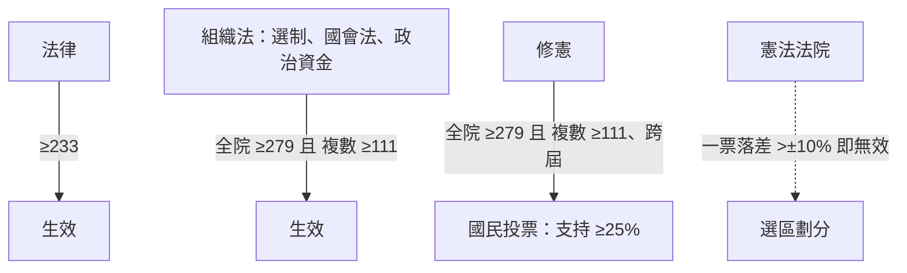

# 憲政架構圖

## 1 總覽

```mermaid
flowchart TB
  P([人民]) -->|top-3 孔多賽、±10% 劃界| SMD[單一席次 280]
  P -->|彈性名單、16 區| PR[複數席次 185]
  SMD --- C{{國會 465}}
  PR --- C
  C -->|全院記名排名投票 ≥233| PM[首相]
  C -->|建設性更新 ≥233| PM
  TENNO[天皇：象徵] -.->|任命（形式）| PM
  PM -->|供給：20 日未換人即生效| BUD[供給]
  C -->|甲 STV 3| CC[憲法法院 9]
  PR -->|乙 STV 3| CC
  ROSTER[司法職業名冊] -->|丙 STV 3| CC
  X1[參議院] -.-x C
  X2[第 7 條解散] -.-x PM
```

## 2 改規則

```mermaid
flowchart TB
  L[法律] -->|≥233| L1[生效]
  O[組織法：選制、國會法、政治資金] -->|全院 ≥279 且 複數 ≥111| O1[生效]
  C1[修憲] -->|全院 ≥279 且 複數 ≥111、跨屆| REF[國民投票：支持 ≥25%]
  CC[憲法法院] -.->|一票落差 >±10% 即無效| SMDMAP[選區劃分]
```
