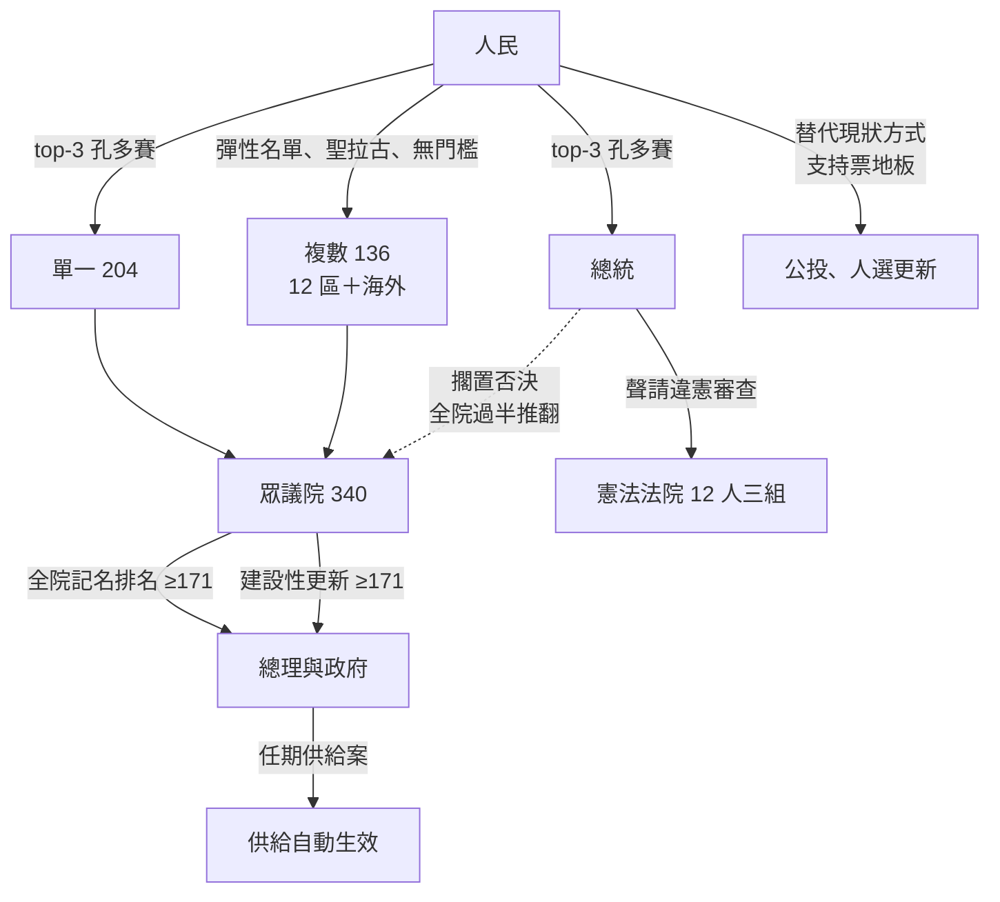
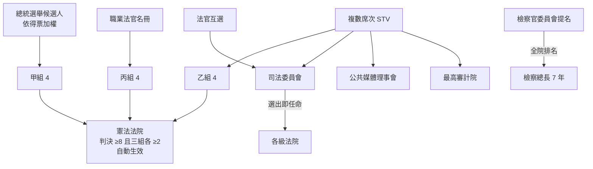
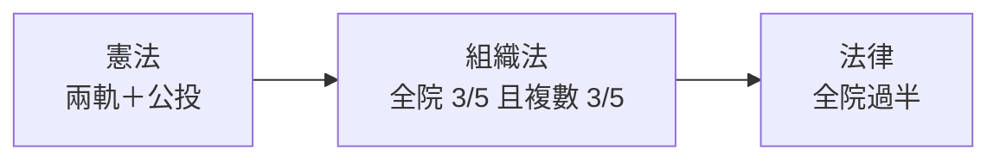

# 憲政架構圖

## 1 選舉與權力來源

```mermaid
flowchart TB
    P[人民] -->|top-3 孔多賽| SMD[單一 204]
    P -->|彈性名單、聖拉古、無門檻| LIST[複數 136<br/>12 區＋海外]
    P -->|top-3 孔多賽| PRES[總統]
    P -->|替代現狀方式<br/>支持票地板| REF[公投、人選更新]
    SMD --> SEJM[眾議院 340]
    LIST --> SEJM
    SEJM -->|全院記名排名 ≥171| PM[總理與政府]
    PM -->|任期供給案| SUP[供給自動生效]
    SEJM -->|建設性更新 ≥171| PM
    PRES -.->|擱置否決<br/>全院過半推翻| SEJM
    PRES -->|聲請違憲審查| CC[憲法法院 12 人三組]
```

## 2 司法與監督

```mermaid
flowchart TB
    PRESC[總統選舉候選人<br/>依得票加權] --> CA[甲組 4]
    LIST[複數席次 STV] --> CB[乙組 4]
    NAMES[職業法官名冊] --> CC3[丙組 4]
    CA & CB & CC3 --> CC[憲法法院<br/>判決 ≥8 且三組各 ≥2<br/>自動生效]
    JUDGES[法官互選] --> KRS[司法委員會]
    LIST --> KRS
    KRS -->|選出即任命| COURTS[各級法院]
    PROSC[檢察官委員會提名] -->|全院排名| PG[檢察總長 7 年]
    LIST --> MEDIA[公共媒體理事會]
    LIST --> NIK[最高審計院]
```

## 3 法規位階

```mermaid
flowchart LR
    C[憲法<br/>兩軌＋公投] --> O[組織法<br/>全院 3/5 且複數 3/5] --> L[法律<br/>全院過半]
```
