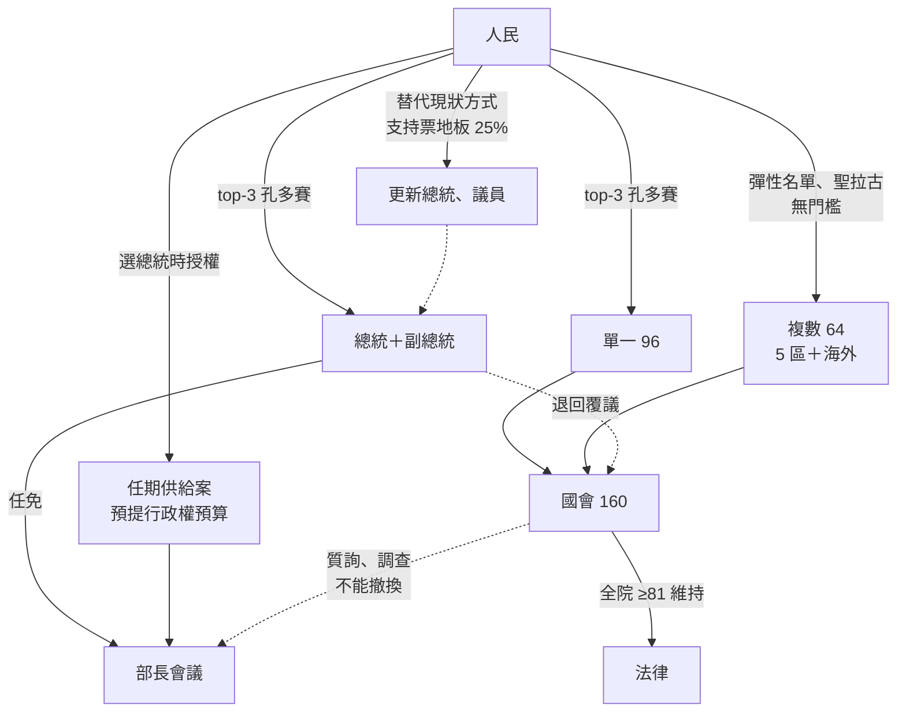
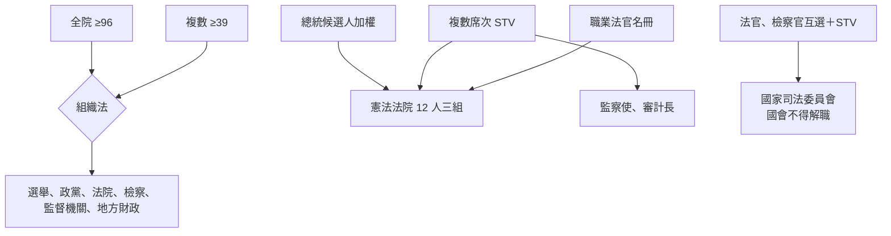
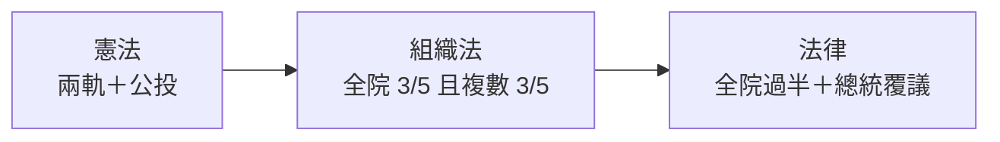

# 憲政架構圖

## 1 選舉與權力來源

```mermaid
flowchart TB
    P[人民] -->|top-3 孔多賽| PRES[總統＋副總統]
    P -->|選總統時授權| SUP[任期供給案<br/>預提行政權預算]
    P -->|top-3 孔多賽| SMD[單一 96]
    P -->|彈性名單、聖拉古<br/>無門檻| LIST[複數 64<br/>5 區＋海外]
    P -->|替代現狀方式<br/>支持票地板 25%| REN[更新總統、議員]
    SMD --> CON[國會 160]
    LIST --> CON
    PRES -->|任免| CAB[部長會議]
    SUP --> CAB
    PRES -.->|退回覆議| CON
    CON -->|全院 ≥81 維持| LAW[法律]
    CON -.->|質詢、調查<br/>不能撤換| CAB
    REN -.-> PRES
```

## 2 改規則與監督

```mermaid
flowchart TB
    CON[全院 ≥96] --> ORG{組織法}
    LIST[複數 ≥39] --> ORG
    ORG --> R[選舉、政黨、法院、檢察、監督機關、地方財政]
    PRESC[總統候選人加權] --> TC[憲法法院 12 人三組]
    STV[複數席次 STV] --> TC
    NAMES[職業法官名冊] --> TC
    STV --> DEF[監察使、審計長]
    J[法官、檢察官互選＋STV] --> JNJ[國家司法委員會<br/>國會不得解職]
```

## 3 法規位階

```mermaid
flowchart LR
    C[憲法<br/>兩軌＋公投] --> O[組織法<br/>全院 3/5 且複數 3/5] --> L[法律<br/>全院過半＋總統覆議]
```
