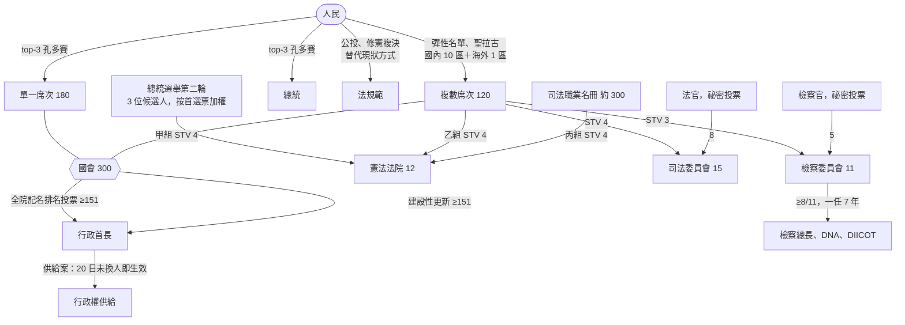
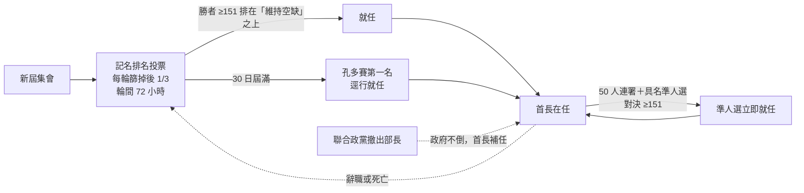
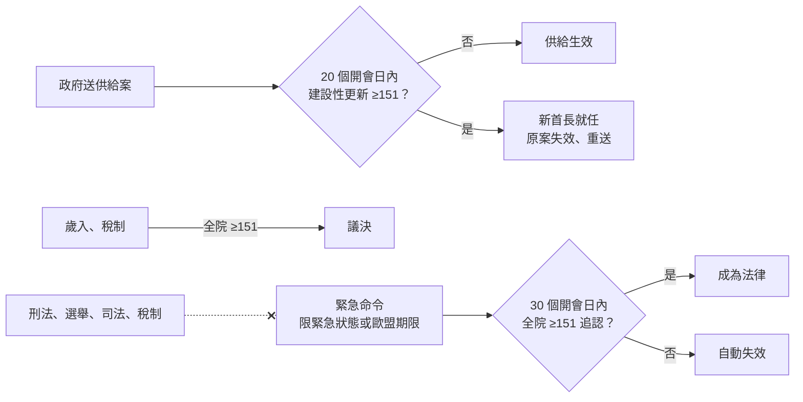
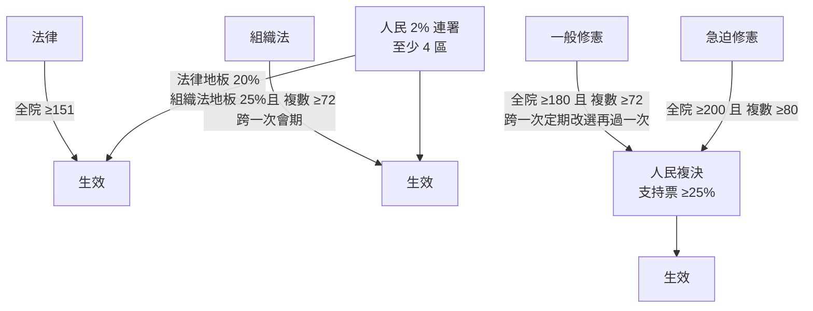
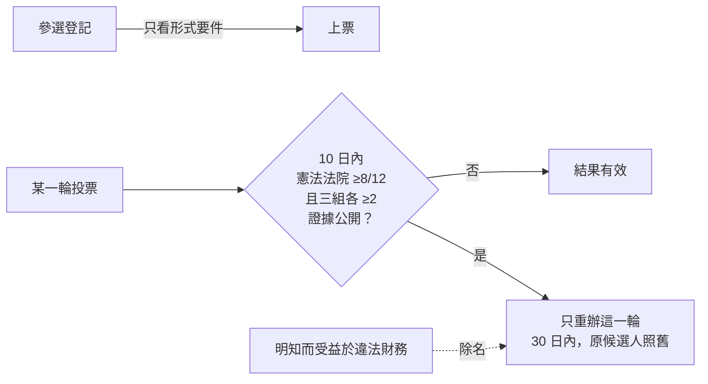
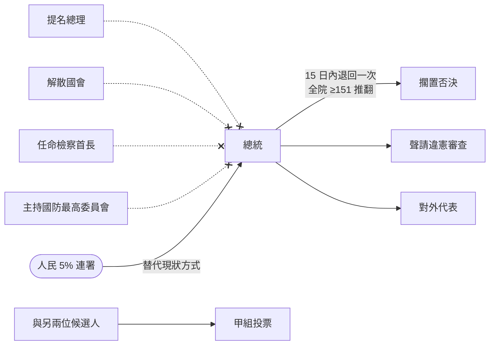

# 憲政架構圖

## 1 總覽：誰選誰

```mermaid
flowchart TB
  P([人民]) -->|top-3 孔多賽| SMD[單一席次 180]
  P -->|彈性名單、聖拉古<br/>國內 10 區＋海外 1 區| PR[複數席次 120]
  P -->|top-3 孔多賽| PRES[總統]
  P -->|公投、修憲複決<br/>替代現狀方式| LAW[法規範]
  SMD --- NA{{國會 300}}
  PR --- NA
  NA -->|全院記名排名投票 ≥151| PM[行政首長]
  NA -->|建設性更新 ≥151| PM
  PM -->|供給案：20 日未換人即生效| BUD[行政權供給]
  PRESC[總統選舉第二輪<br/>3 位候選人，按首選票加權] -->|甲組 STV 4| CC[憲法法院 12]
  PR -->|乙組 STV 4| CC
  ROSTER[司法職業名冊 約 300] -->|丙組 STV 4| CC
  PR -->|STV 4| JC[司法委員會 15]
  JUD[法官，祕密投票] -->|8| JC
  PR -->|STV 3| PC[檢察委員會 11]
  PROS[檢察官，祕密投票] -->|5| PC
  PC -->|≥8/11，一任 7 年| PG[檢察總長、DNA、DIICOT]
```

## 2 組閣：總統不參與，沒有看守，沒有解散

```mermaid
flowchart LR
  E[新屆集會] --> R1[記名排名投票<br/>每輪篩掉後 1/3<br/>輪間 72 小時]
  R1 -->|勝者 ≥151 排在「維持空缺」之上| OK[就任]
  R1 -->|30 日屆滿| DEF[孔多賽第一名<br/>逕行就任]
  OK --> GOV[首長在任]
  DEF --> GOV
  GOV -->|50 人連署＋具名準人選<br/>對決 ≥151| NEW[準人選立即就任]
  NEW --> GOV
  GOV -.->|辭職或死亡| R1
  OUT[聯合政黨撤出部長] -.->|政府不倒，首長補任| GOV
```

## 3 錢與緊急命令

```mermaid
flowchart LR
  G[政府送供給案] --> W{20 個開會日內<br/>建設性更新 ≥151？}
  W -->|否| ON[供給生效]
  W -->|是| CH[新首長就任<br/>原案失效、重送]
  REV[歲入、稅制] -->|全院 ≥151| TAX[議決]
  OUG[緊急命令<br/>限緊急狀態或歐盟期限] --> A{30 個開會日內<br/>全院 ≥151 追認？}
  A -->|是| KEEP[成為法律]
  A -->|否| LAPSE[自動失效]
  X[刑法、選舉、司法、稅制] -.-x OUG
```

## 4 改規則要兩種多數

```mermaid
flowchart TB
  L[法律] -->|全院 ≥151| L1[生效]
  O[組織法] -->|全院 ≥180 且 複數 ≥72<br/>跨一次會期| O1[生效]
  C1[一般修憲] -->|全院 ≥180 且 複數 ≥72<br/>跨一次定期改選再過一次| REF[人民複決<br/>支持票 ≥25%]
  C2[急迫修憲] -->|全院 ≥200 且 複數 ≥80| REF
  REF --> C3[生效]
  INI[人民 2% 連署<br/>至少 4 區] -->|法律地板 20%<br/>組織法地板 25%| L1
  INI --> O1
```

## 5 選舉爭議

```mermaid
flowchart LR
  CAND[參選登記] -->|只看形式要件| BAL[上票]
  VOTE[某一輪投票] --> Q{10 日內<br/>憲法法院 ≥8/12<br/>且三組各 ≥2<br/>證據公開？}
  Q -->|否| VALID[結果有效]
  Q -->|是| RERUN[只重辦這一輪<br/>30 日內，原候選人照舊]
  FIN[明知而受益於違法財務] -.->|除名| RERUN
```

## 6 總統：只有四項權力

```mermaid
flowchart LR
  PRES[總統] -->|15 日內退回一次<br/>全院 ≥151 推翻| VETO[擱置否決]
  PRES --> REV[聲請違憲審查]
  PRES --> REP[對外代表]
  PRESC[與另兩位候選人] --> CC[甲組投票]
  X1[提名總理] -.-x PRES
  X2[解散國會] -.-x PRES
  X3[任命檢察首長] -.-x PRES
  X4[主持國防最高委員會] -.-x PRES
  PEOPLE([人民 5% 連署]) -->|替代現狀方式| PRES
```
