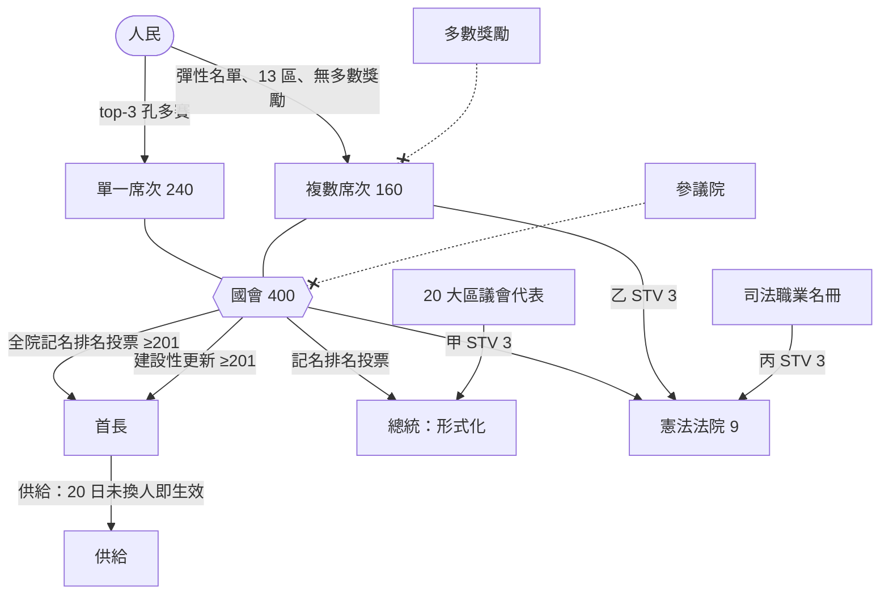
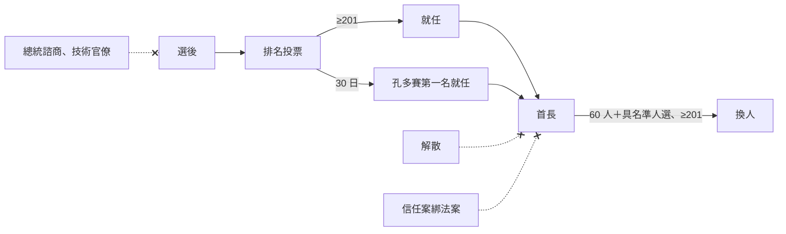
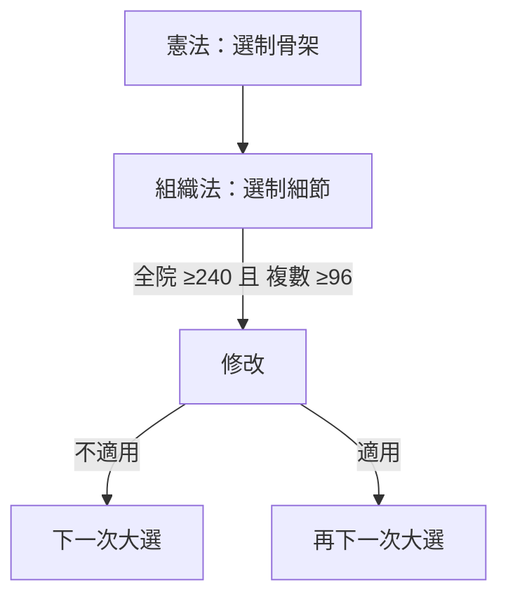
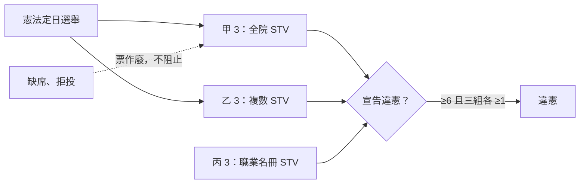

# 憲政架構圖

## 1 總覽

```mermaid
flowchart TB
  P([人民]) -->|top-3 孔多賽| SMD[單一席次 240]
  P -->|彈性名單、13 區、無多數獎勵| PR[複數席次 160]
  SMD --- C{{國會 400}}
  PR --- C
  C -->|全院記名排名投票 ≥201| PM[首長]
  C -->|建設性更新 ≥201| PM
  C -->|記名排名投票| PRES[總統：形式化]
  REG[20 大區議會代表] --> PRES
  PM -->|供給：20 日未換人即生效| BUD[供給]
  C -->|甲 STV 3| CC[憲法法院 9]
  PR -->|乙 STV 3| CC
  ROSTER[司法職業名冊] -->|丙 STV 3| CC
  X1[參議院] -.-x C
  X2[多數獎勵] -.-x PR
```

## 2 政府：沒有技術官僚、沒有提前改選

```mermaid
flowchart LR
  E[選後] --> R[排名投票]
  R -->|≥201| OK[就任]
  R -->|30 日| DEF[孔多賽第一名就任]
  OK --> GOV[首長]
  DEF --> GOV
  GOV -->|60 人＋具名準人選、≥201| NEW[換人]
  X1[總統諮商、技術官僚] -.-x E
  X2[解散] -.-x GOV
  X3[信任案綁法案] -.-x GOV
```

## 3 選舉法：執政多數不能替自己改

```mermaid
flowchart TB
  CON[憲法：選制骨架] --> ORG[組織法：選制細節]
  ORG -->|全院 ≥240 且 複數 ≥96| CHG[修改]
  CHG -->|不適用| NEXT[下一次大選]
  CHG -->|適用| AFTER[再下一次大選]
```

## 4 憲法法院：沒有人能否決別人的那一席

```mermaid
flowchart LR
  A[甲 3：全院 STV] --> V{宣告違憲？}
  B[乙 3：複數 STV] --> V
  C[丙 3：職業名冊 STV] --> V
  V -->|≥6 且三組各 ≥1| X[違憲]
  DATE[憲法定日選舉] --> A
  DATE --> B
  ABS[缺席、拒投] -.->|票作廢，不阻止| A
```
