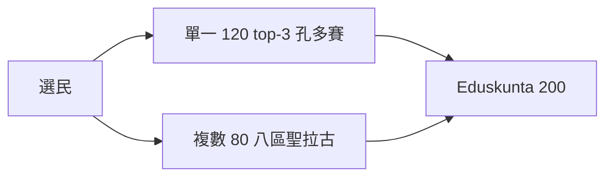
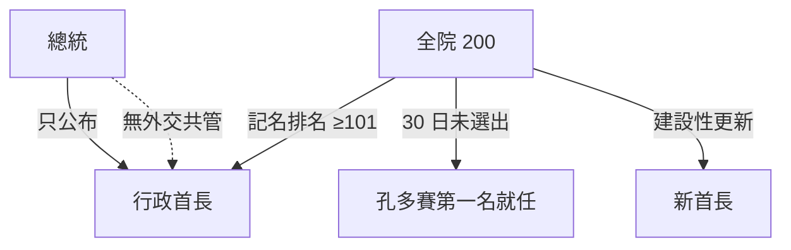
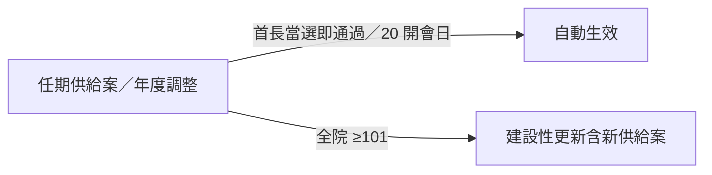
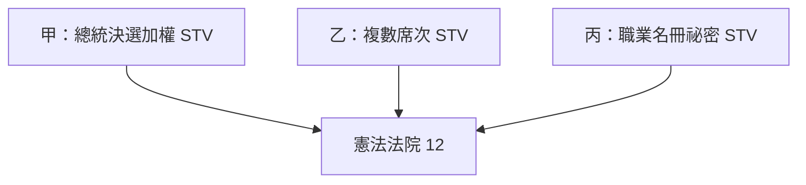

# 憲政架構圖

## 1 選制

```mermaid
flowchart LR
  V[選民] --> SMD[單一 120 top-3 孔多賽]
  V --> LIST[複數 80 八區聖拉古]
  SMD --> ED[Eduskunta 200]
  LIST --> ED
```

## 2 政府

```mermaid
flowchart TD
  ED[全院 200] -->|記名排名 ≥101| PM[行政首長]
  ED -->|30 日未選出| DEF[孔多賽第一名就任]
  ED -->|建設性更新| PM2[新首長]
  P[總統] -->|只公布| PM
  P -.->|無外交共管| PM
```

## 3 供給

```mermaid
flowchart LR
  B[任期供給案／年度調整] -->|首長當選即通過／20 開會日| AUTO[自動生效]
  B -->|全院 ≥101| ALT[建設性更新含新供給案]
```

## 4 憲法法院

```mermaid
flowchart TB
  A[甲：總統決選加權 STV] --> CC[憲法法院 12]
  B[乙：複數席次 STV] --> CC
  C[丙：職業名冊祕密 STV] --> CC
```
