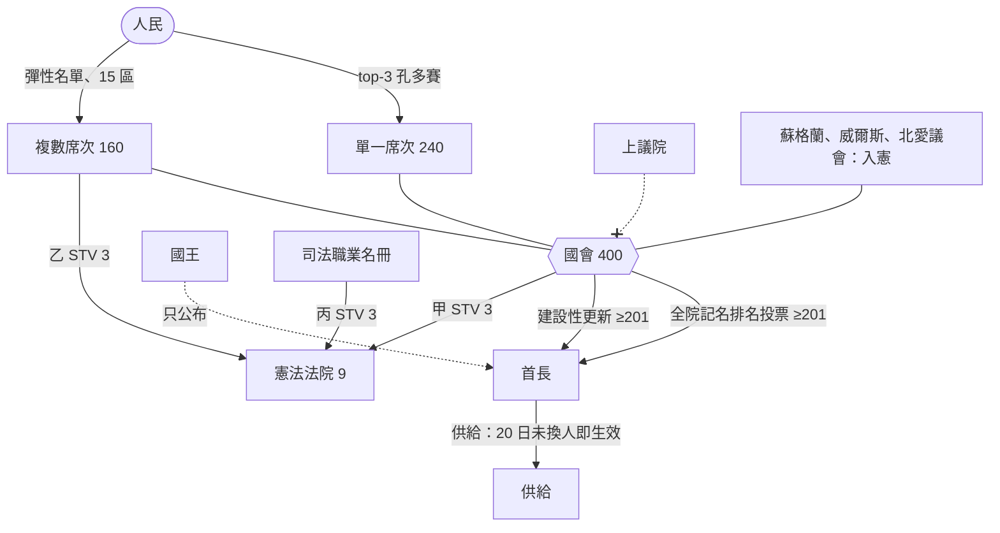
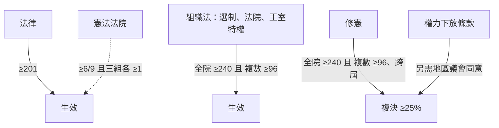
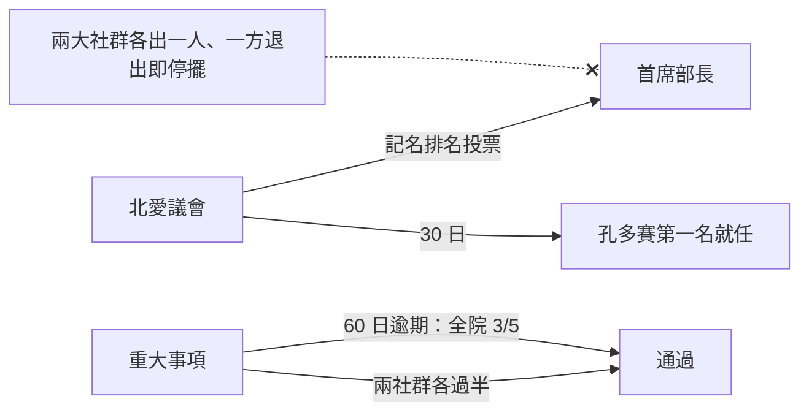

# 憲政架構圖

## 1 總覽

```mermaid
flowchart TB
  P([人民]) -->|top-3 孔多賽| SMD[單一席次 240]
  P -->|彈性名單、15 區| PR[複數席次 160]
  SMD --- C{{國會 400}}
  PR --- C
  C -->|全院記名排名投票 ≥201| PM[首長]
  C -->|建設性更新 ≥201| PM
  KING[國王] -.->|只公布| PM
  PM -->|供給：20 日未換人即生效| BUD[供給]
  C -->|甲 STV 3| CC[憲法法院 9]
  PR -->|乙 STV 3| CC
  ROSTER[司法職業名冊] -->|丙 STV 3| CC
  X[上議院] -.-x C
  DEV[蘇格蘭、威爾斯、北愛議會：入憲] --- C
```

## 2 改規則：國會主權結束

```mermaid
flowchart TB
  L[法律] -->|≥201| L1[生效]
  O[組織法：選制、法院、王室特權] -->|全院 ≥240 且 複數 ≥96| O1[生效]
  C1[修憲] -->|全院 ≥240 且 複數 ≥96、跨屆| REF[複決 ≥25%]
  DEVC[權力下放條款] -->|另需地區議會同意| REF
  CC[憲法法院] -.->|≥6/9 且三組各 ≥1| L1
```

## 3 北愛：不再停擺

```mermaid
flowchart LR
  NI[北愛議會] -->|記名排名投票| FM[首席部長]
  NI -->|30 日| DEF[孔多賽第一名就任]
  KEY[重大事項] -->|兩社群各過半| OK[通過]
  KEY -->|60 日逾期：全院 3/5| OK
  OLD[兩大社群各出一人、一方退出即停擺] -.-x FM
```
