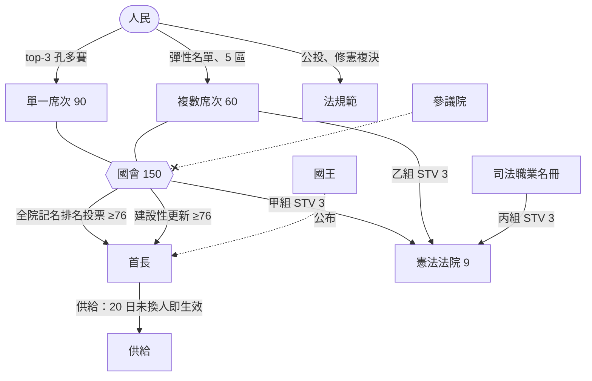
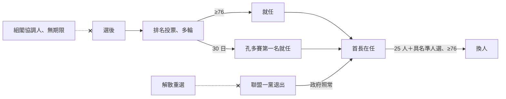
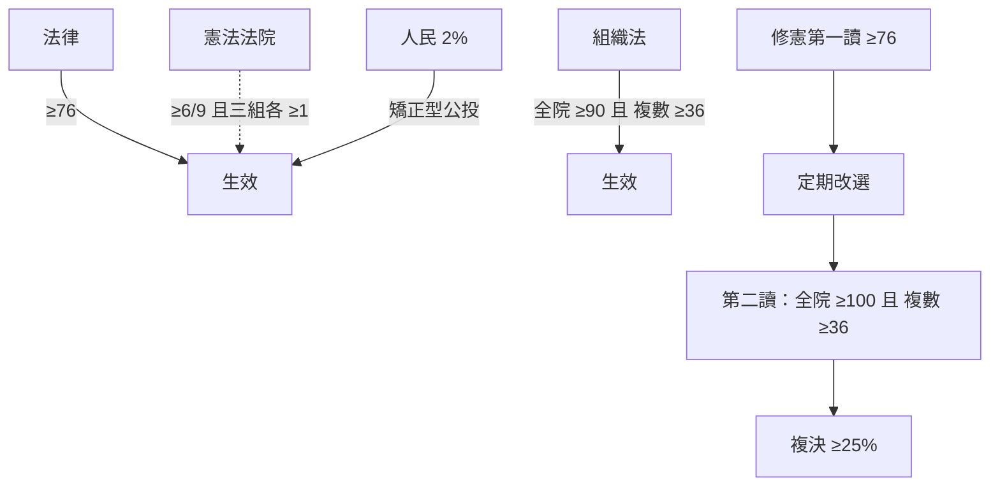
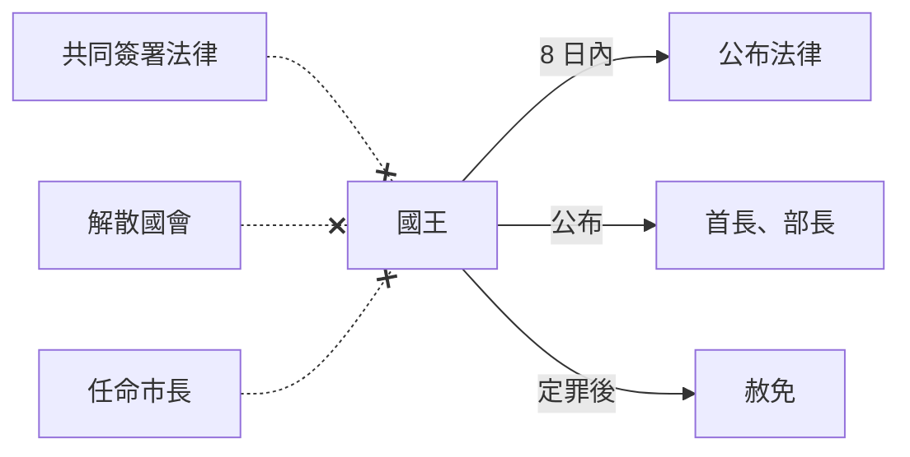

# 憲政架構圖

## 1 總覽

```mermaid
flowchart TB
  P([人民]) -->|top-3 孔多賽| SMD[單一席次 90]
  P -->|彈性名單、5 區| PR[複數席次 60]
  P -->|公投、修憲複決| LAW[法規範]
  SMD --- K{{國會 150}}
  PR --- K
  K -->|全院記名排名投票 ≥76| PM[首長]
  K -->|建設性更新 ≥76| PM
  PM -->|供給：20 日未換人即生效| BUD[供給]
  KING[國王] -.->|公布| PM
  K -->|甲組 STV 3| CC[憲法法院 9]
  PR -->|乙組 STV 3| CC
  ROSTER[司法職業名冊] -->|丙組 STV 3| CC
  X[參議院] -.-x K
```

## 2 組閣：從「談判沒有期限」到「30 日」

```mermaid
flowchart LR
  E[選後] --> R[排名投票、多輪]
  R -->|≥76| OK[就任]
  R -->|30 日| DEF[孔多賽第一名就任]
  OK --> GOV[首長在任]
  DEF --> GOV
  OUT[聯盟一黨退出] -->|政府照常| GOV
  GOV -->|25 人＋具名準人選、≥76| NEW[換人]
  OLD1[組閣協調人、無期限] -.-x E
  OLD2[解散重選] -.-x OUT
```

## 3 改規則

```mermaid
flowchart TB
  L[法律] -->|≥76| L1[生效]
  O[組織法] -->|全院 ≥90 且 複數 ≥36| O1[生效]
  C1[修憲第一讀 ≥76] --> EL[定期改選]
  EL --> C2[第二讀：全院 ≥100 且 複數 ≥36]
  C2 --> REF[複決 ≥25%]
  CC[憲法法院] -.->|≥6/9 且三組各 ≥1| L1
  INI[人民 2%] -->|矯正型公投| L1
```

## 4 國王的權力全部形式化

```mermaid
flowchart LR
  KING[國王] -->|8 日內| PUB[公布法律]
  KING -->|公布| APPT[首長、部長]
  KING -->|定罪後| PARDON[赦免]
  X1[共同簽署法律] -.-x KING
  X2[解散國會] -.-x KING
  X3[任命市長] -.-x KING
```
