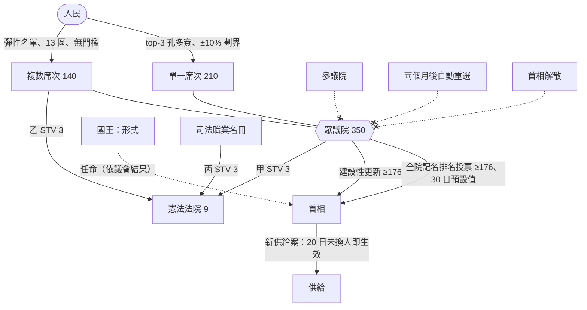
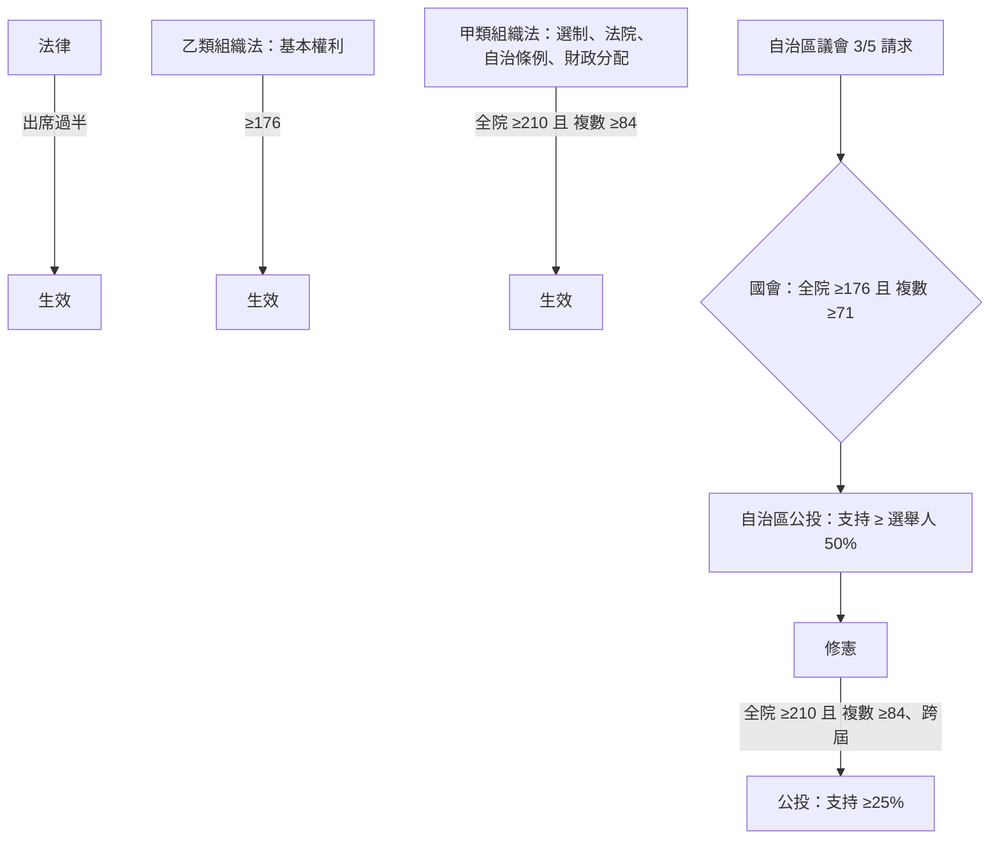

# 憲政架構圖

## 1 總覽

```mermaid
flowchart TB
  P([人民]) -->|top-3 孔多賽、±10% 劃界| SMD[單一席次 210]
  P -->|彈性名單、13 區、無門檻| PR[複數席次 140]
  SMD --- C{{眾議院 350}}
  PR --- C
  C -->|全院記名排名投票 ≥176、30 日預設值| PM[首相]
  C -->|建設性更新 ≥176| PM
  REY[國王：形式] -.->|任命（依議會結果）| PM
  PM -->|新供給案：20 日未換人即生效| BUD[供給]
  C -->|甲 STV 3| TC[憲法法院 9]
  PR -->|乙 STV 3| TC
  ROSTER[司法職業名冊] -->|丙 STV 3| TC
  X1[參議院] -.-x C
  X2[兩個月後自動重選] -.-x C
  X3[首相解散] -.-x C
```

## 2 改規則與領土

```mermaid
flowchart TB
  L[法律] -->|出席過半| L1[生效]
  O2[乙類組織法：基本權利] -->|≥176| O21[生效]
  O1[甲類組織法：選制、法院、自治條例、財政分配] -->|全院 ≥210 且 複數 ≥84| O11[生效]
  C1[修憲] -->|全院 ≥210 且 複數 ≥84、跨屆| REF[公投：支持 ≥25%]
  AR[自治區議會 3/5 請求] --> CG{國會：全院 ≥176 且 複數 ≥71}
  CG --> RR[自治區公投：支持 ≥ 選舉人 50%]
  RR --> C1
```
