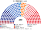
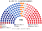
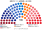

# 席次圖

`0-基本/總體.md`：**給**仿維基百科的議會席次圖。**如**（本夾採用）：有單一畫單一、有複數畫複數；圓點顏色＝所屬政黨／派系的代表色。

數字來自 [`15-預期政治生態.md`](15-預期政治生態.md) 的第 4 屆示意。產生器：`shared/tools/parliament_diagram.py`。

## 全院 250（加總）

民主黨・改革派 56、民主黨・勞動派 48、國民力量・傳統派 52、國民力量・改革派 42、改革新黨 22、進步黨 15、祖國革新黨 8、無黨籍 7。過半 **126**、3/5 **150**、2/3 **167**。

**最大黨 104 席，離 126 差 22。** 法律要跨黨。

## 單一席次 150

單一席次議員表決行政權預算（[`03`](03-行政權預算.md)），所以另出一張。

民主改革 36、民主勞動 32、國民傳統 38、國民改革 23、改革新黨 9、進步黨 5、無黨籍 7。**過半 76。**

**民主黨 68 不過 76。國民力量 61 也不過。** 預算鑰匙在兩大黨與改革新黨／無黨籍之間。

## 複數席次 100

黑爾額數＋最大餘數：35／32／13／10／8 → 36／33／13／10／8。

民主改革 20、民主勞動 16、國民傳統 14、國民改革 19、改革新黨 13、進步黨 10、祖國革新黨 8。過半 **51**。兩大黨在這一組成都不過半。祖國革新黨 8 席全在這裡。
