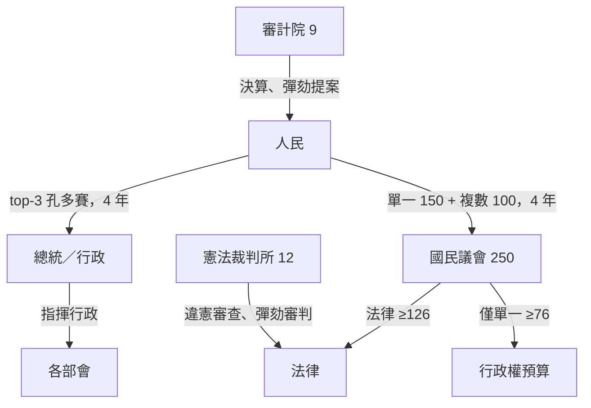
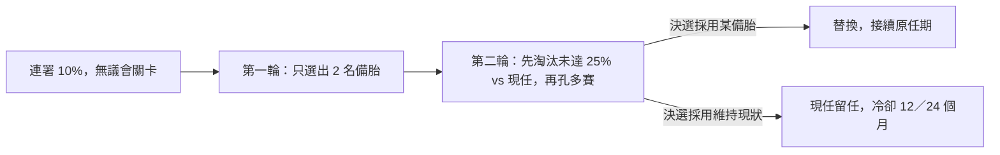
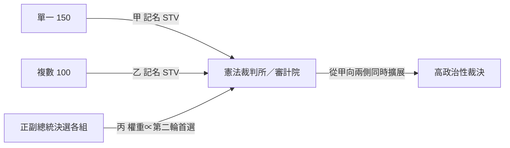

# 憲政架構圖

`0-基本/總體.md`：給多張憲政設計架構圖。

## 1 全景：四權與人民

```mermaid
flowchart TD
  People[人民]
  People -->|top-3 孔多賽，4 年| Pres[總統／行政]
  People -->|單一 150 + 複數 100，4 年| NA[國民議會 250]
  Pres -->|指揮行政| Admin[各部會]
  NA -->|法律 ≥126| Law[法律]
  NA -->|僅單一 ≥76| Bud[行政權預算]
  Court[憲法裁判所 12]
  Audit[審計院 9]
  Court -->|違憲審查、彈劾審判| Law
  Audit -->|決算、彈劾提案| People
```

## 2 更新：先淘汰再決選

```mermaid
flowchart LR
  Sign[連署 10%，無議會關卡] --> R1[第一輪：只選出 2 名備胎]
  R1 --> R2[第二輪：先淘汰未達 25% vs 現任，再孔多賽]
  R2 -->|決選採用某備胎| Change[替換，接續原任期]
  R2 -->|決選採用維持現狀| Stay[現任留任，冷卻 12／24 個月]
```

## 3 其他權：甲乙丙，互不否決

```mermaid
flowchart LR
  SMD[單一 150] -->|甲 記名 STV| Court[憲法裁判所／審計院]
  PR[複數 100] -->|乙 記名 STV| Court
  PresCand[正副總統決選各組] -->|丙 權重∝第二輪首選| Court
  Court -->|從甲向兩側同時擴展| Decide[高政治性裁決]
```
