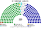

# 席次圖

`0-基本/總體.md`（`44b3fbe`）：**給**仿維基議會席次圖。本夾**沒有複數席次**，只畫唯一組成。**如**（元素）：圓點色＝所屬政黨／派系。那條可選掛在席次如下，不掛在本檔的給上。

數字來自 [`12`](12-預期政治生態.md) 第 7 屆。產生器：`shared/tools/parliament_diagram.py`。

## 全院 225（唯一組成）

民進黨・增列要價派 67、民進黨・行政協調派 34、國民黨・增列要價派 60、國民黨・行政協調派 32、無黨籍／地方派系 24、民眾黨 4、基進 2、時代力量 2。

過半 **113**、2/3 **150**、3/4 **169**。

**兩大黨 101 對 92，誰都不過半。** 24 名無黨籍＋各黨要價派定增列價（[`04`](04-預算與財政.md) §2.1 得增列）。150 與 169 沒有人過得了。兩大黨相加 193，過 169 只存在於合作的反事實。

## 不另出複數席次圖

**全院即單一席次**——沒有複數組成。不發明複數圖。225 全 FPTP 是自由發揮，不是提示詞數字。

## 失真

| 政黨／派系 | 得票率 | 席次率 | 差 |
|---|---|---|---|
| 民進黨計 | 32% | 44.9% | **＋12.9** |
| 國民黨計 | 31% | 40.9% | **＋9.9** |
| 無黨籍／地方派系 | 16% | 10.7% | −5.3 |
| 民眾黨 | 11% | 1.8% | **−9.2** |
| 基進 | 5.5% | 0.9% | −4.6 |
| 時代力量 | 4.5% | 0.9% | −3.6 |

## 顏色（如：政黨／派系代表色）

兩大黨按派系分色（母黨色的變體），不是整黨塗成一色。無黨籍／地方派系用灰。座位由左至右依政治光譜排列。

| 政黨／派系 | 色 |
|---|---|
| 民進黨・增列要價派 | `#1B9431` |
| 民進黨・行政協調派 | `#0E5C22` |
| 國民黨・增列要價派 | `#000095` |
| 國民黨・行政協調派 | `#4A6CFF` |
| 無黨籍／地方派系 | `#CCCCCC` |
