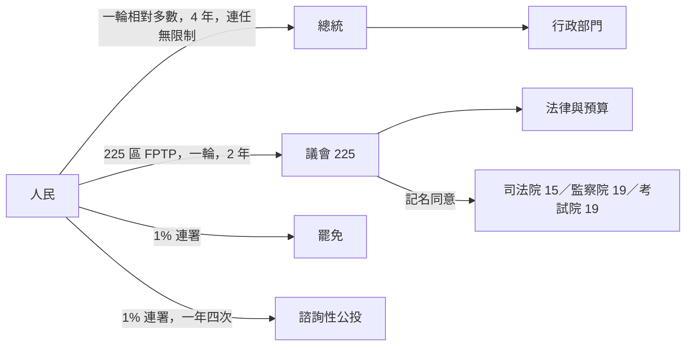
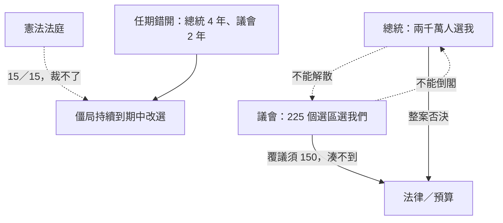
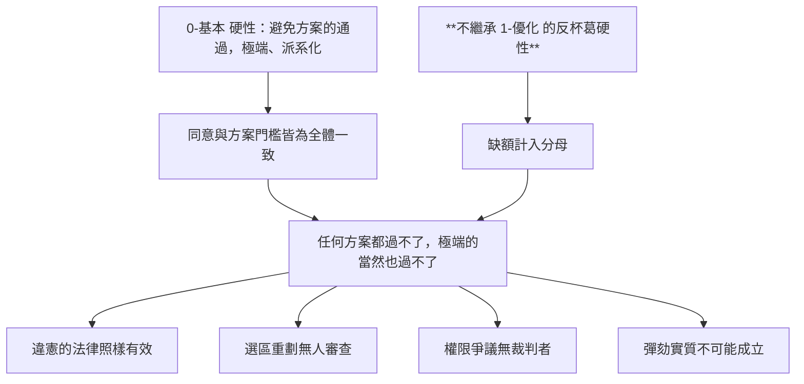
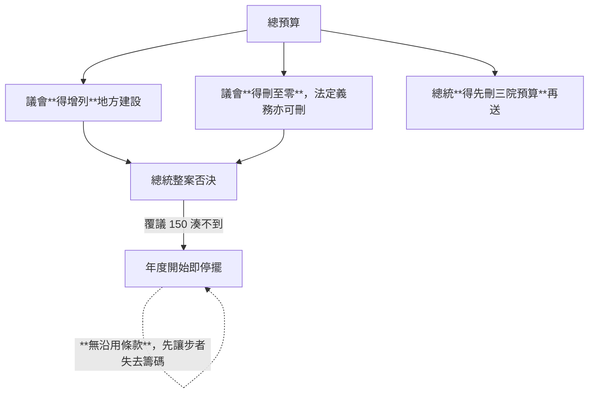
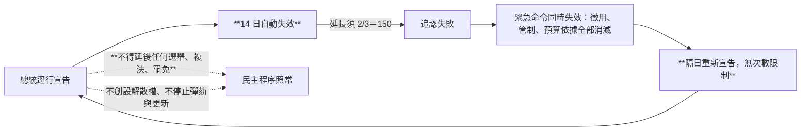
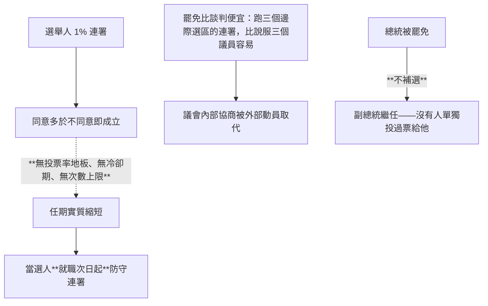
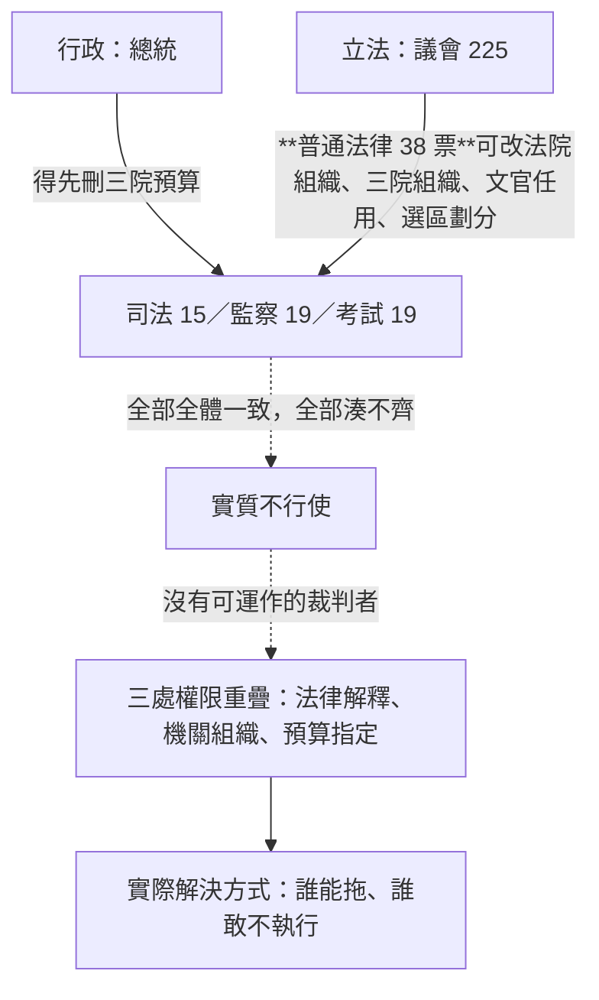
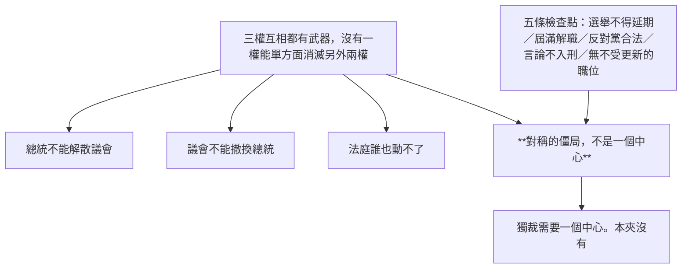
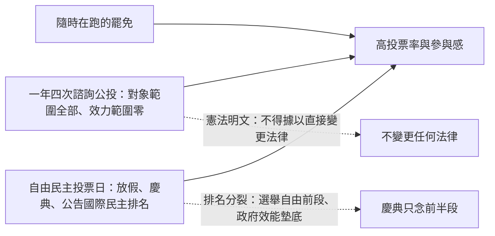

# 憲政架構圖

`0-基本/總體.md`：給多張憲政設計架構圖，方便讀者理解。

## 1 外形：一個標準的總統制民選國家

## 2 沒有出口的雙元正當性

## 3 三院：字面達成，功能歸零

## 4 預算：沒有防餓死機制

## 5 緊急狀態：每 14 天歸零，但選舉照常

## 6 罷免常態化

## 7 五權：多兩個院等於多兩個湊不齊的機關

## 8 為什麼這仍然不是獨裁

## 9 正當性零件

