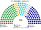
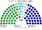
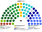

# 席次圖

`0-基本/總體.md`（`82943c0`）：**給**仿維基百科的議會席次圖。**如**（本輪採用，仍標如）：有單一畫單一、有複數畫複數；圓點顏色＝所屬政黨／派系的代表色。那條可選掛在席次如下，不掛在本檔的給上。

數字來自 [`15`](15-預期政治生態.md) 第 3 屆。預提已運行約 12 年，**不是**正式夾那張表。產生器：`shared/tools/parliament_diagram.py`。測試夾在產生器裡是獨立變數，不複用正式夾資料。

## 全院 180（加總）

民進黨 73（服務 46、政策 27）、國民黨 59（服務 37、政策 22）、民眾黨 22、時代力量 9、無黨籍／地方 7、基進 6、綠黨與環境團體聯盟 4。過半 **91**、3/5 **108**。兩大黨相加 **132**。

## 單一席次 100

單一席次表決**預提外調整／雙鑰匙**（[`03`](03-行政權預算.md) §2.5）。四年包本身由人民授權。

民進黨 44（服務 34、政策 10）、國民黨 36（服務 28、政策 8）、民眾黨 9、無黨籍／地方 5、時代力量 3、基進 2、綠黨 1。過半 **51**。

**民進黨 44＋無黨籍 5 ＝ 49。** 差的那幾席管任內改包，不是「有沒有錢」（[`15`](15-預期政治生態.md) §5.1）。

## 複數席次 80

複數席次是本夾第二個議會組成，**有組成就出圖**。

民進黨 29（政策 17、服務 12）、國民黨 23（政策 14、服務 9）、民眾黨 13、時代力量 6、基進 4、綠黨與環境團體聯盟 3、無黨籍／地方 2。過半 **41**。

綠黨 3 席全部在這一張。預提不改這一組成的無門檻。

## 顏色（如：政黨／派系代表色）

兩大黨按派系分色（母黨色的變體），不是整黨塗成一色。無黨籍／地方用灰。座位由左至右依政治光譜排列。
