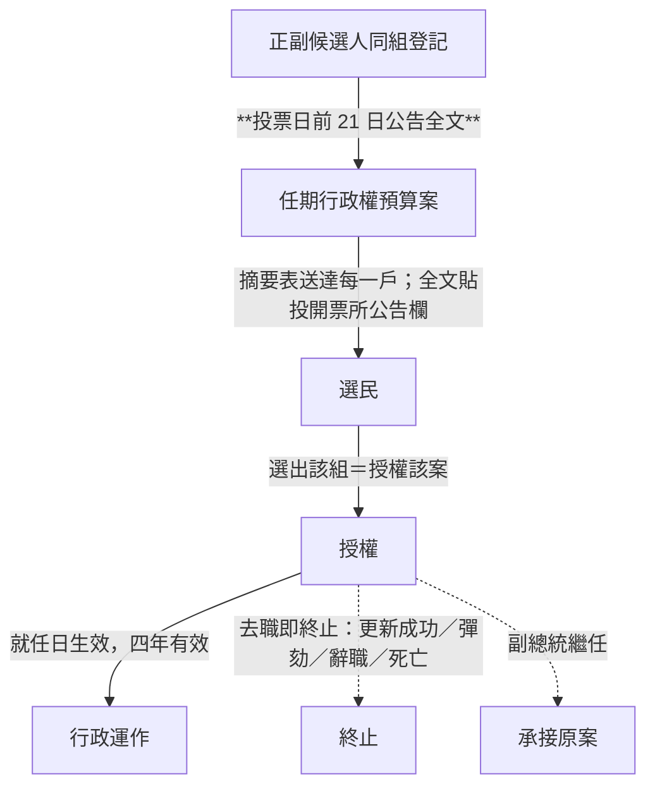
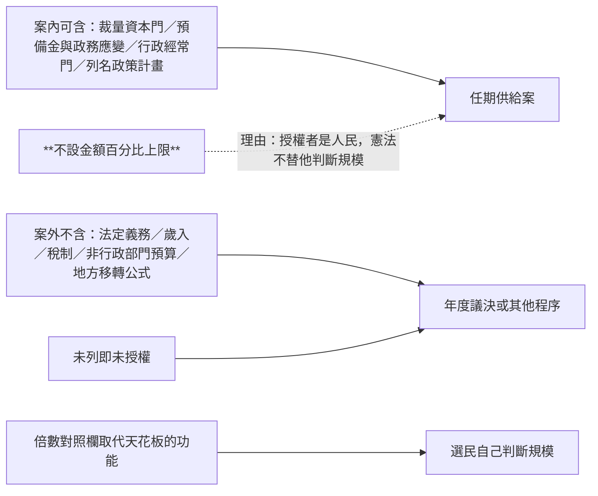
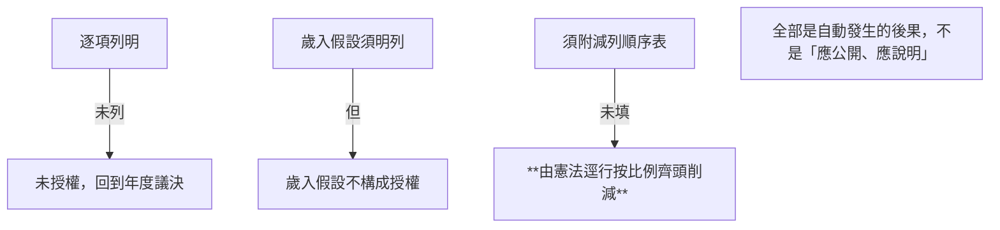
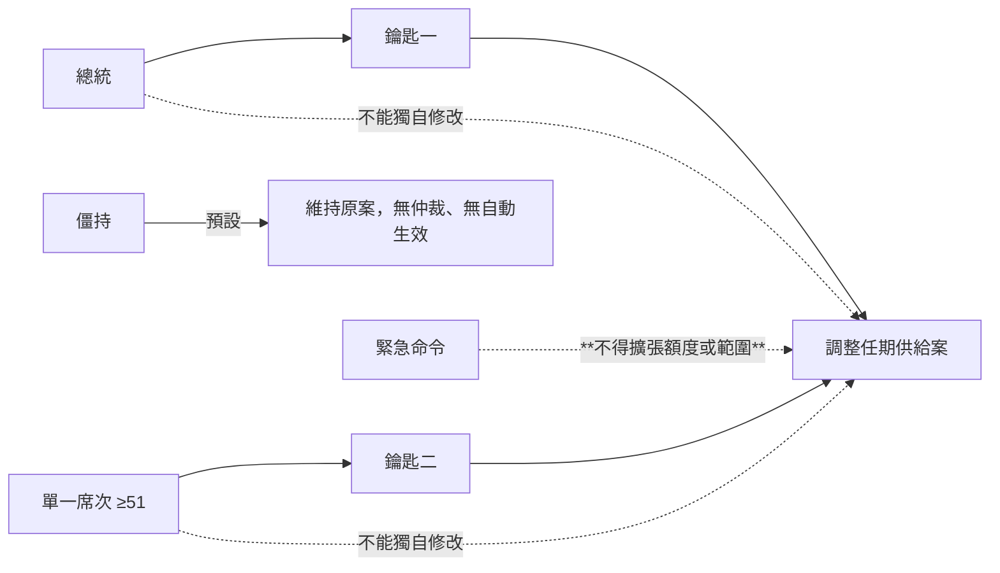
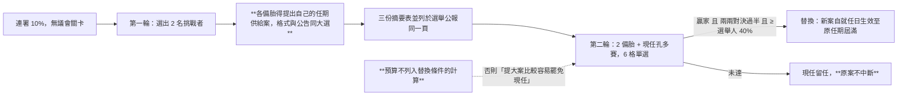
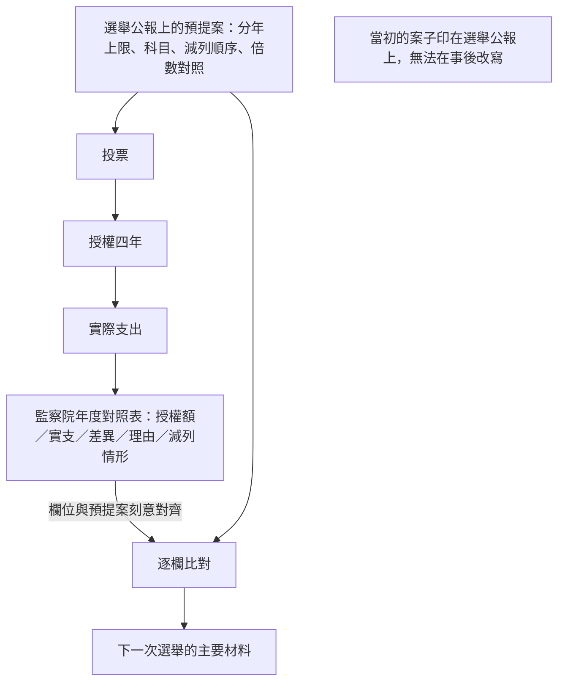
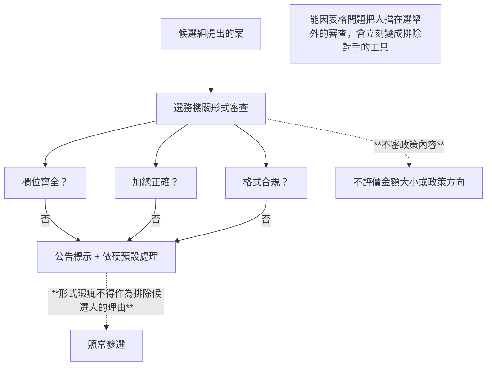

# 憲政架構圖

`0-基本/總體.md`：給多張憲政設計架構圖。

**大部分結構與 [`../一院總統制/憲政架構圖.md`](../一院總統制/憲政架構圖.md) 相同**（五權、無倒閣無解散、三院人事、司法方案門檻、緊急狀態、更新程序）。本檔只畫**預提改變的部分**。

## 1 供給的授權鏈：從議會改成人民

## 2 「部分」怎麼落實：範圍，不是天花板

## 3 三個硬預設：不需要誰去查

## 4 雙鑰匙：兩邊都不能單獨動

## 5 更新：在「人＋預算」的包裹之間排序

## 6 課責從「今年給不給錢」換成「說的和做的差多少」

## 7 形式審查：只擋錯誤，不擋人

