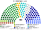
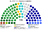

# 席次圖

`0-基本/總體.md` 硬性：繪製仿維基百科的議會席次圖（有黨議員的圓點顏色為所屬政黨的代表色）。

數字來自 [`15`](15-預期政治生態.md) 的第 3 屆示意。產生器：`shared/tools/parliament_diagram.py`。

## 全院 180

民進黨 61、國民黨 55、民眾黨 26、無黨籍 13、時代力量 11、基進 8、綠黨與環境團體聯盟 6。

過半 **91**、3/5 **108**、2/3 **120**。

**兩大黨相加 116 才過 91。** 現行 5% 門檻下，圖中約 40 席會被兩大黨吸走，兩大黨相加會變成約 150——那才是常態的兩大塊議會。

## 單一席次 100

單一席次議員**專屬表決行政權預算**（[`03`](03-行政權預算.md) §2.1），所以另出一張。

民進黨 40、國民黨 38、無黨籍 10、民眾黨 8、時代力量 2、基進 2、綠黨 0。過半 **51**。

**民進黨 40＋無黨籍 10 ＝ 50，差 1 席。** 無黨籍與地方人士在這張圖上的比重（10%）遠高於全院（7.2%），所以他們是每一次預算的樞紐——但因為「得刪不得增」，他們的籌碼是**保住既有科目**，不是加新的（[`15`](15-預期政治生態.md) §3.2）。

## 複數席次 80

不另出圖：複數席次不參與行政權預算表決，沒有專屬權力。其分布為全院圖減去單一席次圖（民進黨 21、民眾黨 18、國民黨 17、時代力量 9、基進 6、綠黨 6、無黨籍 3）。

值得注意的是**綠黨與環境團體聯盟 6 席全部來自複數席次**——無得票門檻是它存在的直接原因。

## 顏色

政黨代表色；無黨籍用灰。座位由左至右依政治光譜排列。
