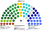

# 席次圖

`0-基本/總體.md`（`82943c0`）：**給**仿維基百科的議會席次圖。**如**（本輪採用，仍標如）：有單一畫單一、有複數畫複數；圓點顏色＝所屬政黨／派系的代表色。那條可選掛在席次如下，不掛在本檔的給上。

數字來自 [`15`](15-預期政治生態.md) 第 3 屆（名單聖拉古＋單一孔多賽 mill）。產生器：`shared/tools/parliament_diagram.py`。

## 全院 180（加總）

民進黨 67（服務 43、政策 24）、國民黨 55（服務 35、政策 20）、民眾黨 20、無黨籍／地方 16、時代力量 10、基進 7、綠黨與環境團體聯盟 5。過半 **91**、3/5 **108**、2/3 **120**。兩大黨相加 **122**。

## 單一席次 100

單一席次議員**專屬表決行政權預算**（[`03`](03-行政權預算.md) §2.1）。

民進黨 40（服務 32、政策 8）、國民黨 33（服務 26、政策 7）、無黨籍／地方 12、民眾黨 8、時代力量 4、基進 2、綠黨 1。過半 **51**。

**民進黨 40＋無黨籍 12 ＝ 52。** 無黨籍在這一組成佔 12%，在複數只佔 5%（[`15`](15-預期政治生態.md) §3.1）。

## 複數席次 80

複數席次是本夾第二個議會組成，**有組成就出圖**。

民進黨 27（政策 16、服務 11）、國民黨 22（政策 13、服務 9）、民眾黨 12、時代力量 6、基進 5、綠黨與環境團體聯盟 4、無黨籍／地方 4。過半 **41**。

綠黨 4 席有 4 席在這一張、單一只有 1 席。無法定門檻是它主要活在這裡的原因。

## 顏色（如：政黨／派系代表色）

兩大黨按派系分色（母黨色的變體），不是整黨塗成一色。無黨籍／地方用灰。座位由左至右依政治光譜排列。
