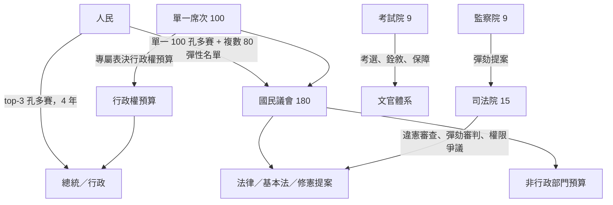
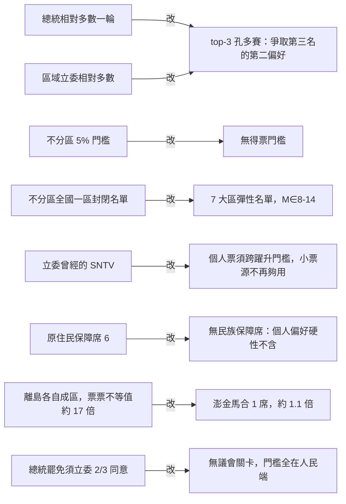
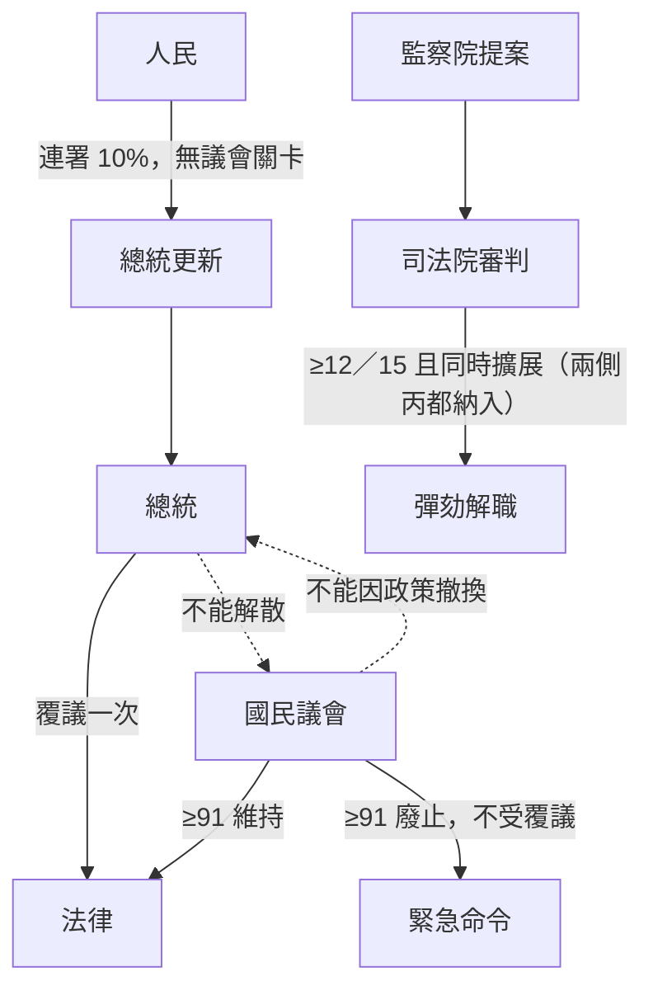
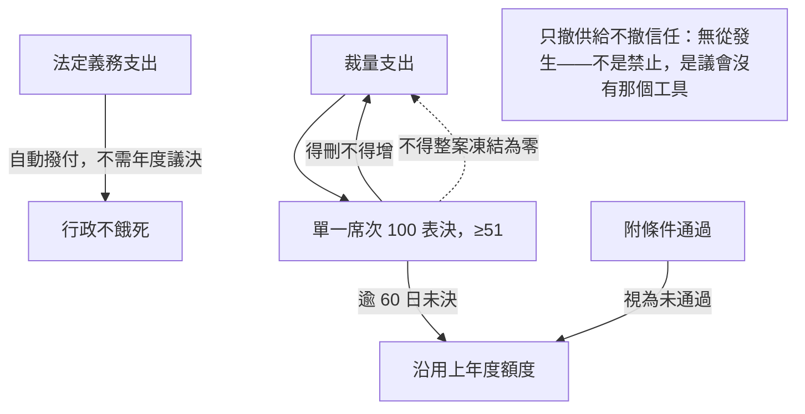
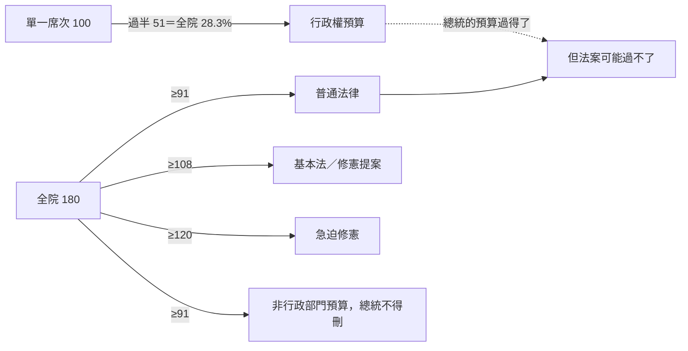
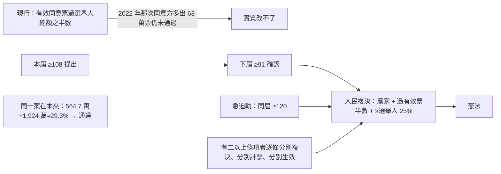
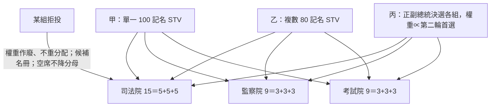
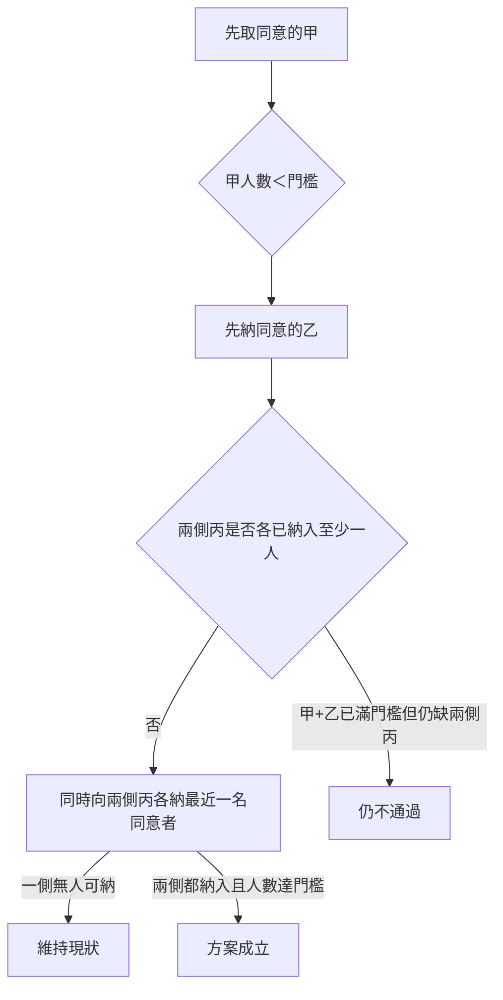
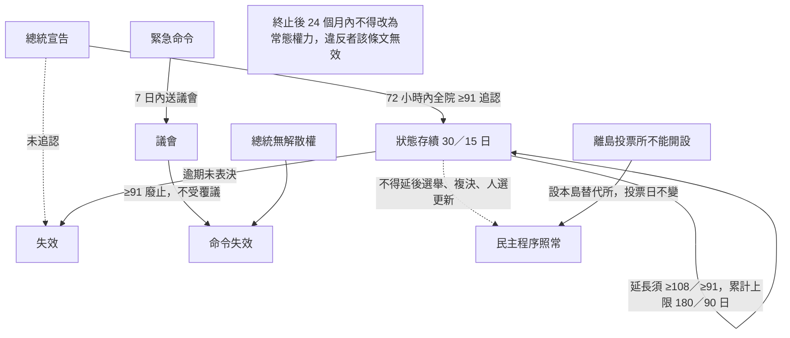
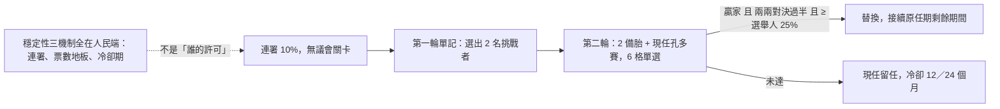

# 憲政架構圖

`0-基本/總體.md`：給多張憲政設計架構圖，方便讀者理解。

## 1 全景：五權與人民

## 2 為什麼不長得像現行制度

## 3 行政與議會：兩者都拆不掉對方

## 4 供給問題怎麼在不用預提的情況下解

## 5 錢與規則分屬不同多數

## 6 修憲：從「實質改不了」到「多數就能過」

## 7 三院人事：甲乙丙代理人，杯葛者浪費投票權

乙組留下。溫床在議會法案，不是禁止複數席次議員當選舉權人。不設須專選的院長。

## 8 高政治性：從甲向兩側同時擴展

抽籤工作組只分案，不當通過門檻。

## 9 緊急狀態：預設是結束，而且不碰選舉與更新

## 10 更新：要不要換成這個人

