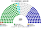

# 預期政治生態

## 1 本檔繼承

`0-基本/總體.md`：給預期政治生態（**含長期運行下的各黨各派席次、朝野互動、候選人行為**），要有一定合理性，可大膽假設，**越詳細具體越好**；繪製仿維基百科的議會席次圖。

席次圖見 [`席次圖.md`](席次圖.md)。示意 **第 14 屆議會**（任期 2 年，制度運行約 28 年後）。大膽假設標 ★。

## 2 席次

| 黨派 | 席次 | 得票率（示意） | 席次率 | 失真 |
|---|---|---|---|---|
| 中國國民黨 | 82 | 32.1% | 36.4% | ＋4.3 |
| 民主進步黨 | 79 | 31.4% | 35.1% | ＋3.7 |
| 無黨籍／地方派系 | 41 | 20.3% | 18.2% | −2.1 |
| 台灣民眾黨 | 12 | 8.6% | 5.3% | −3.3 |
| 台灣基進 | 6 | 4.3% | 2.7% | −1.6 |
| 時代力量 | 5 | 3.3% | 2.2% | −1.1 |
| **計** | **225** | | | |

過半 **113**。**兩大黨相加 161，仍然過半——但它們從不合作。** 41 名地方派系決定一切。

★ 與總統制惡搞夾（98/94，無黨籍 18）的差別值得並列：**本夾的無黨籍與地方派系明顯更肥（41 席）**。理由是 §4.3——在本夾，做無黨籍的報酬率比在總統制惡搞夾高得多。

## 3 三個結構性事實

### 3.1 政府的平均壽命短於空窗

★ 示意統計（近十屆，20 年）：

| 項目 | 數字 |
|---|---|
| 正式行政首長的任期中位數 | **7 個月** |
| 一屆（24 個月）平均倒閣次數 | **2.4 次** |
| 一屆平均處於「看守」狀態的月數 | **13 個月** |
| 十屆中有正式首長超過一半時間的屆數 | **3 屆** |

> **看守是常態，正式政府是例外。**

### 3.2 沒有人湊得到 113 去選人，卻常常湊得到過半去倒人

★ 這不是矛盾，是兩種多數的差別：

| | 需要什麼 | 實務上 |
|---|---|---|
| **拆**（倒閣） | 對「這個人不行」有共識，**出席過半即可**，不必說出替代者 | 常常成立 |
| **組**（選首長） | 對「換誰上」有共識 | 幾乎不成立 |

★ 而且選首長只要**相對多數**——照理說 62 票就夠。**那為什麼還是選不出來？** 因為誰也不想讓對手的人以 62 票掛上「正式首長」的名義：一旦有了正式政府，**沿用預算的保護就消失**（[`04`](04-預算與財政.md) §2.4）。

> **不投票給任何人，比投票給某個人划算。這才是空窗的真正引擎。**

### 3.3 議會唯一能穩定通過的東西

★ 二十年來實際留存的法律只有兩類：

1. **選區重劃**——多數黨內部利益一致（[`01`](01-議會組成.md) §2.5）。
2. **議員自身待遇與助理費**——全院利益一致。

其餘法律的中位數存活時間：**11 個月**（下一個多數上台就翻掉，每次只要 38 票）。

## 4 候選人與議員行為

### 4.1 選前：向自己的選區極化

FPTP＋一輪＋2 年任期。★ 誘因與總統制惡搞夾相同，且更急：**每兩年就要重打一次**。候選人與其媒體的最優策略是鞏固基本盤、發表激進言論激怒敵對陣營選民。

★ `1-優化/行政立法/共用.md` 正是為了處理這一點才推向心型選制——**本夾不繼承。**

### 4.2 選後：待價而沽

★ 一名邊際席次的地方派系議員，在本夾手上有三張牌：

| 牌 | 內容 |
|---|---|
| **倒閣票** | 出席過半，一票可能決定成敗 |
| **首長票** | **秘密**，所以可以同時向兩邊承諾 |
| **預算增列** | 向**看守首長**要，比向正式政府要容易（[`04`](04-預算與財政.md) §2.4） |

★ 第二張牌是本夾獨有的：**秘密投票讓「答應了不投」零成本**。於是首長選舉前的談判普遍失效——沒有人相信任何承諾。

★ **這是本夾選不出首長的第二個引擎**，與 §3.2 的預算誘因並列。

### 4.3 為什麼無黨籍愈來愈多

★ 政黨提名能給候選人的東西在本夾很少：政黨無法承諾「當選後入閣」（閣期中位數 7 個月）、無法承諾政策（法律活 11 個月）、無法承諾預算（要跟看守首長要，跟黨無關）。

**而無黨籍在議會裡的邊際價值反而更高**——他沒有黨紀，兩邊都要拉。

於是：**無黨籍席次從第 1 屆的 12 席，長到第 14 屆的 41 席。** 這是一個自我強化的過程，而它讓組閣更難。

### 4.4 職業「看守者」

★ 一種新的政治生涯出現：**專職看守首長。**

某些政治人物的履歷是「三度出任行政首長，累計任職 41 個月，其中 34 個月為看守」。他們的技術是**被倒閣後不辭職**，並在看守期間把預算增列做給關鍵議員。

★ 而這在本夾**完全合憲、完全民選、完全可被拿掉**——只是沒有人拿得掉（[`00`](00-為何這仍然不是獨裁.md) §5）。

## 5 一屆的典型時序（第 12 屆，示意）

| 月 | 事件 |
|---|---|
| 第 1 月 | 新屆就任。三輪投票，最高票 58 票，未選出首長。**前屆看守首長繼續看守** |
| 第 3 月 | 選出正式首長（61 票）。**沿用預算保護消失** |
| 第 5 月 | 預算被刪至零，機關停工三週 |
| 第 6 月 | 倒閣通過（出席 154，同意 79）。**同一人繼續看守，預算恢復沿用** |
| 第 9 月 | 兩名議員被罷免，議會算術改變 |
| 第 11 月 | 颱風災害，看守首長宣告緊急狀態，並增列救災科目 |
| 第 13 月 | 議會出席過半追認延長狀態——**追認的是他們七個月前否定的人所宣告的狀態** |
| 第 16 月 | 選出第二任正式首長（63 票） |
| 第 19 月 | 再度倒閣。看守 |
| 第 24 月 | 屆期屆滿，改選 |

★ 本屆有正式政府的時間：**6 個月**。有看守政府的時間：**18 個月**。**沒有一天沒有行政權，也沒有一天有正當性。**

## 6 選舉本身乾淨

★ 值得單獨說：投票率長期維持 **68% 以上**，計票在投開票所人工進行、當場公告、不集中運票（[`01`](01-議會組成.md) §2.6），從無重大爭議。政黨輪替頻繁，敗選者一律交出席次。

**這正是本夾的形狀：程序完美，結果荒謬。**

## 7 指向

席次圖：[`席次圖.md`](席次圖.md)。理由：[`10`](10-憲政選擇.md)。為何仍不是獨裁：[`00`](00-為何這仍然不是獨裁.md)。
