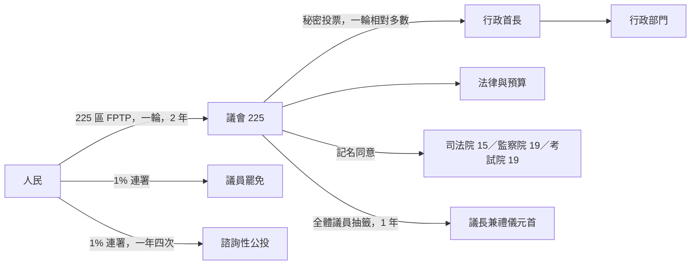
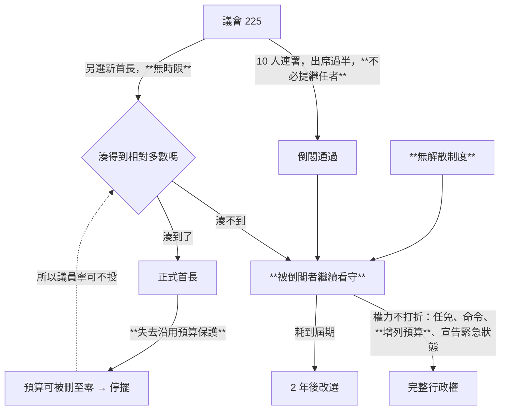
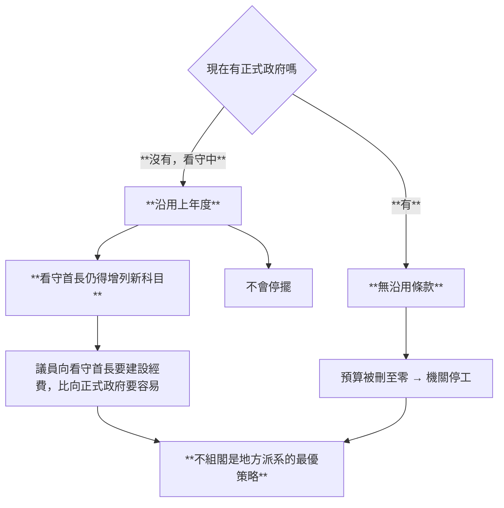
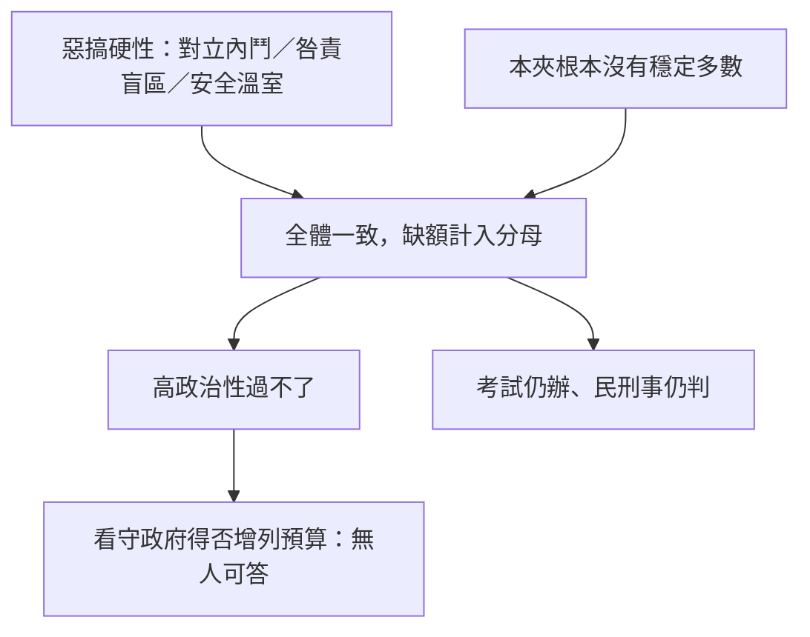
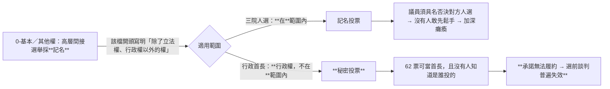
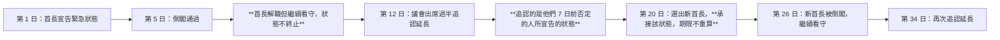
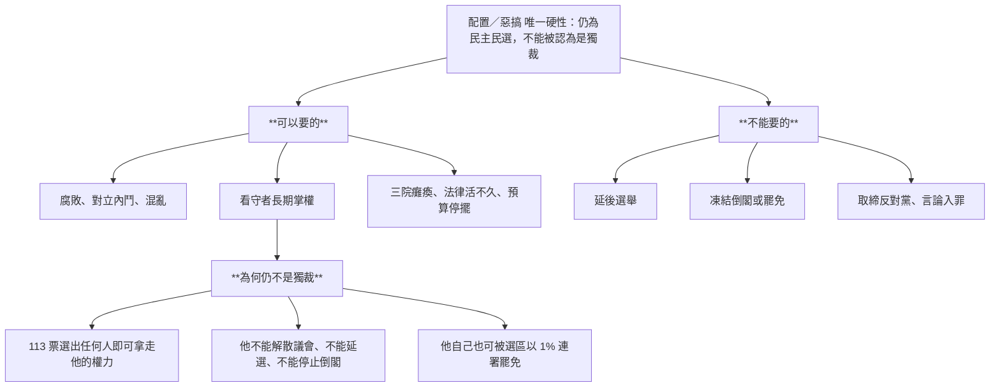

# 憲政架構圖

`0-基本/總體.md`：給多張憲政設計架構圖，方便讀者理解。

## 1 外形：一個標準的議會制民選國家

★ 這張圖上沒有任何異常。**異常全在下一張。**

## 2 拆得掉，組不出

★ 兩條回饋線是全圖的重點：**「湊不到 → 看守」與「湊到了 → 失去保護 → 所以不投」。** 第二條讓第一條變成理性選擇。

## 3 預算：半條沿用條款把誘因設反

## 4 三院：安全溫室，高政治性歸零

★ 中間多出來的 `NoMaj` 是本夾與總統制惡搞夾的差別：**那邊是兩大黨互否，這邊是連湊出一個多數來同意都做不到。**

## 5 兩種公開性

## 6 緊急狀態：同一場災害，三次指揮官名義

★ 紅線：**不得延後任何選舉、不停止倒閣。** 沒有但書（[`07`](07-緊急狀態.md) §2）。

## 7 唯一的硬性：一條沒有越過的線

> **一個隨時可以被投票拿掉、卻始終沒人來拿的權力，仍然是民主的權力。**

## 8 指向

各項規則：[`00`](00-為何這仍然不是獨裁.md)–[`09`](09-人選更新.md)。理由：[`10`](10-憲政選擇.md)。落點與對照：[`11`](11-對照.md)。
