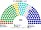
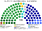

# 席次圖

`0-基本/總體.md` 硬性：繪製仿維基百科的議會席次圖（有黨議員的圓點顏色為所屬政黨的代表色）。

數字來自 [`15`](15-預期政治生態.md) 的第 3 屆示意。產生器：`shared/tools/parliament_diagram.py`。

## 全院 180

民進黨 58、國民黨 52、民眾黨 27、無黨籍 15、時代力量 12、基進 9、綠黨與環境團體聯盟 7。

過半 **91**、3/5 **108**、2/3 **120**。

**執政聯盟（民進黨＋無黨籍）73 席，離 91 差 18。** 政府活得下去，但每一部法律都要另外找人。

## 單一席次 100

單一席次議員**選出並更新行政首長、表決行政權供給**（[`02`](02-行政首長.md)、[`03`](03-行政權預算與供給.md)），是本夾權力最集中的一群人，所以另出一張。

民進黨 39、國民黨 36、無黨籍 12、民眾黨 9、時代力量 2、基進 2、綠黨 0。過半 **51**。

**民進黨 39＋無黨籍 12 ＝ 51，剛好等於門檻。** 任何一位無黨籍議員離開就失去多數——但**失去多數不會自動倒台**，建設性更新須有人提得出贏過現任的具名準人選。

而替代政府確實湊得出來（國民黨 36＋民眾黨 9＋無黨籍 12 ＝ 57），**這正是建設性更新能約束現任的原因**（[`15`](15-預期政治生態.md) §3.2）。

## 複數席次 80

不另出圖：複數席次**不參與政府的產生，也不表決行政權供給**。其分布為全院圖減去單一席次圖（民進黨 19、民眾黨 18、國民黨 16、時代力量 10、基進 7、綠黨 7、無黨籍 3）。

★ 值得注意：綠黨 7 席全部、時代力量 10／12 來自複數席次——**無得票門檻是它們存在的直接原因**；而它們在單一席次幾乎沒有席位，所以**不參與政府的產生**，只參與規則。

## 顏色

政黨代表色；無黨籍用灰。座位由左至右依政治光譜排列。
