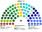

# 席次圖

`0-基本/總體.md`（`82943c0`）：**給**仿維基百科的議會席次圖。**如**（本輪採用，仍標如）：有單一畫單一、有複數畫複數；圓點顏色＝所屬政黨／派系的代表色。那條可選掛在席次如下，不掛在本檔的給上。

數字來自 [`15`](15-預期政治生態.md) 第 3 屆。**不是**總統制那張表。產生器：`shared/tools/parliament_diagram.py`。

## 全院 180（加總）

民進黨 72（服務 48、政策 24）、國民黨 61（服務 40、政策 21）、民眾黨 20、時代力量 9、無黨籍／地方 7、基進 6、綠黨與環境團體聯盟 5。過半 **91**、3/5 **108**。兩大黨相加 **133**。全院圖看不出「政府在單一 100」。

## 單一席次 100

單一席次議員**選出並更新行政首長、表決行政權供給**（[`02`](02-行政首長.md)、[`03`](03-行政權預算與供給.md)）。

民進黨 48（服務 38、政策 10）、國民黨 39（服務 31、政策 8）、民眾黨 5、無黨籍／地方 4、時代力量 2、基進 1、綠黨 1。過半 **51**。

**民進黨 48＋民眾黨 5 ＝ 53。** 無黨籍在這一組成佔 4%，在複數佔 3.75%——槓桿是組閣，不是人數。

## 複數席次 80

複數席次是本夾第二個議會組成，**有組成就出圖**。長期這一層仍碎（[`15`](15-預期政治生態.md) §4.3）。

民進黨 24（政策 14、服務 10）、國民黨 22（政策 13、服務 9）、民眾黨 15、時代力量 7、基進 5、綠黨與環境團體聯盟 4、無黨籍／地方 3。過半 **41**。

綠黨 4 席有 4 席在這一張、單一只有 1 席。民眾黨 15／20 席在這裡。

## 顏色（如：政黨／派系代表色）

兩大黨按派系分色（母黨色的變體），不是整黨塗成一色。無黨籍／地方用灰。座位由左至右依政治光譜排列。
