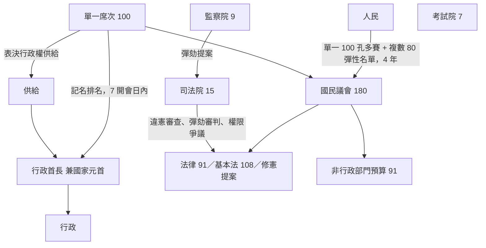
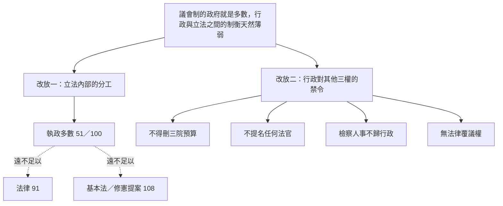
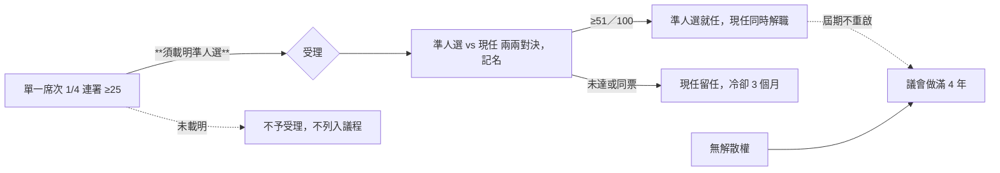
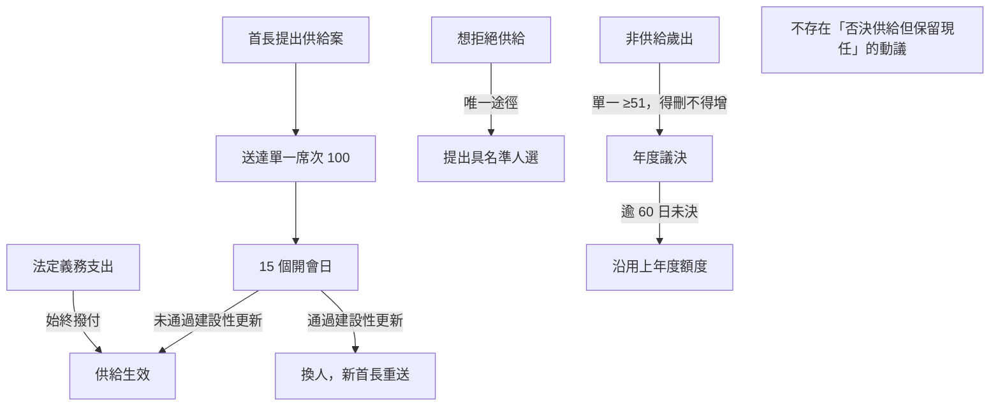
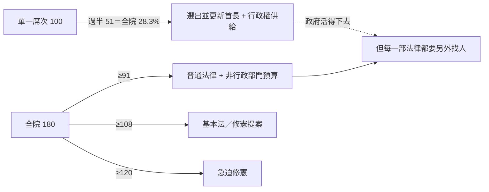
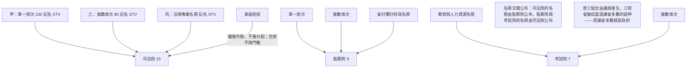
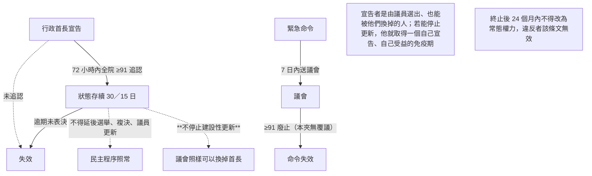
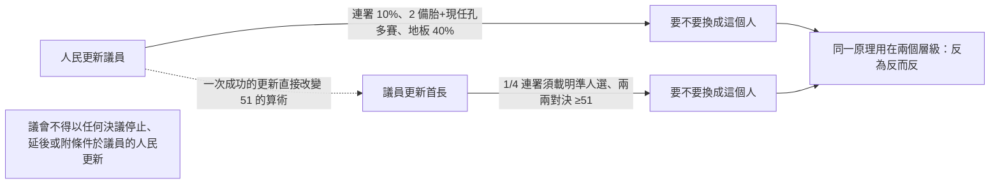

# 憲政架構圖

`0-基本/總體.md`：給多張憲政設計架構圖。

## 1 全景：一個授權來源，五權

```mermaid
flowchart TD
  People[人民]
  People -->|單一 100 孔多賽 + 複數 80 彈性名單，4 年| NA[國民議會 180]
  SMD[單一席次 100] --> NA
  SMD -->|記名排名，7 開會日內| PM[行政首長 兼國家元首]
  SMD -->|表決行政權供給| Supply[供給]
  Supply --> PM
  PM --> Exec[行政]
  NA --> Law[法律 91／基本法 108／修憲提案]
  NA --> OthBud[非行政部門預算 91]
  J[司法院 15]
  S[監察院 9]
  E[考試院 7]
  S -->|彈劾提案| J
  J -->|違憲審查、彈劾審判、權限爭議| Law
```

## 2 制衡在哪裡

```mermaid
flowchart TD
  Note[議會制的政府就是多數，行政與立法之間的制衡天然薄弱]
  Note --> A[改放一：立法內部的分工]
  A --> A1[執政多數 51／100]
  A1 -.->|遠不足以| A2[法律 91]
  A1 -.->|遠不足以| A3[基本法／修憲提案 108]
  Note --> B[改放二：行政對其他三權的禁令]
  B --> B1[不得刪三院預算]
  B --> B2[不提名任何法官]
  B --> B3[檢察人事不歸行政]
  B --> B4[無法律覆議權]
```

## 3 換人：議會內部的兩兩對決

```mermaid
flowchart LR
  Sign[單一席次 1/4 連署 ≥25] -->|**須載明準人選**| Recv{受理}
  Sign -.->|未載明| Reject[不予受理，不列入議程]
  Recv --> Duel[準人選 vs 現任 兩兩對決，記名]
  Duel -->|≥51／100| New[準人選就任，現任同時解職]
  Duel -->|未達或同票| Stay[現任留任，冷卻 3 個月]
  New -.->|屆期不重啟| NA[議會做滿 4 年]
  NoDis[無解散權] --> NA
```

## 4 供給：拒絕這筆錢與換掉這個人是同一個動作

```mermaid
flowchart TD
  Gov[首長提出供給案] --> Send[送達單一席次 100]
  Send --> Wait[15 個開會日]
  Wait -->|未通過建設性更新| Live[供給生效]
  Wait -->|通過建設性更新| Change[換人，新首長重送]
  Reject[想拒絕供給] -->|唯一途徑| Sign[提出具名準人選]
  Obl[法定義務支出] -->|始終撥付| Live
  Rest[非供給歲出] -->|單一 ≥51，得刪不得增| Year[年度議決]
  Year -->|逾 60 日未決| Roll[沿用上年度額度]
  NoOnly[不存在「否決供給但保留現任」的動議]
```

## 5 錢與政府 vs 規則

```mermaid
flowchart LR
  SMD[單一席次 100] -->|過半 51＝全院 28.3%| Gov[選出並更新首長 + 行政權供給]
  All[全院 180] -->|≥91| LawT[普通法律 + 非行政部門預算]
  All -->|≥108| Basic[基本法／修憲提案]
  All -->|≥120| Urgent[急迫修憲]
  Gov -.->|政府活得下去| Note[但每一部法律都要另外找人]
  LawT --> Note
```

## 6 三院人事：丙組不由當屆多數產生

```mermaid
flowchart TD
  A[甲：單一席次 100 記名 STV] --> J[司法院 15]
  B[乙：複數席次 80 記名 STV] --> J
  C[丙：法律專業名冊 記名 STV] --> J
  A2[單一席次] --> S[監察院 9]
  B2[複數席次] --> S
  C2[會計審計財政名冊] --> S
  C3[教育與人力資源名冊] --> E[考試院 7]
  B3[複數席次] --> E
  Cross[名冊交錯公布：司法院的名冊由監察院公布，監察院與考試院的名冊由司法院公布]
  Why[若三組全由議員產生，三院會變成當屆議會多數的延伸——而議會多數就是政府]
  Boy[某組拒投] -->|權重作廢、不重分配；空席不降門檻| J
```

## 7 緊急狀態：不停止換人

```mermaid
flowchart TD
  Dec[行政首長宣告] -->|72 小時內全院 ≥91 追認| Live[狀態存續 30／15 日]
  Dec -.->|未追認| End[失效]
  Live -->|逾期未表決| End
  Order[緊急命令] -->|7 日內送議會| NA[議會]
  NA -->|≥91 廢止（本夾無覆議）| Void[命令失效]
  Live -.->|不得延後選舉、複決、議員更新| Elec[民主程序照常]
  Live -.->|**不停止建設性更新**| Change[議會照樣可以換掉首長]
  Why[宣告者是由議員選出、也能被他們換掉的人；若能停止更新，他就取得一個自己宣告、自己受益的免疫期]
  After[終止後 24 個月內不得改為常態權力，違反者該條文無效]
```

## 8 兩種更新，同一個原理

```mermaid
flowchart LR
  P1[人民更新議員] -->|連署 10%、2 備胎+現任孔多賽、地板 40%| Q1[要不要換成這個人]
  P2[議員更新首長] -->|1/4 連署須載明準人選、兩兩對決 ≥51| Q2[要不要換成這個人]
  Q1 --> Same[同一原理用在兩個層級：反為反而反]
  Q2 --> Same
  P1 -.->|一次成功的更新直接改變 51 的算術| P2
  NoBlock[議會不得以任何決議停止、延後或附條件於議員的人民更新]
```
