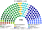
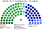
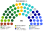
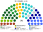

# 席次圖

`0-基本/總體.md`（`82943c0`）：**給**仿維基百科的議會席次圖。**如**（本輪採用，仍標如）：有該組成就畫該組成；圓點顏色＝所屬政黨／派系的代表色。

數字來自 [`15`](15-預期政治生態.md) 第 3 屆。**不是**一院議會制那張表，也不是從 180 抄來。產生器：`shared/tools/parliament_diagram.py`。

## 國民院全院 150（加總）

描述圖：半圓席次圖，總額 150。過半線標 **76**、3/5 線標 **90**。

民進黨 61（服務 41、政策 20）、國民黨 52（服務 35、政策 17）、民眾黨 16、時代力量 7、基進 5、無黨籍／地方 5、綠黨與環境團體聯盟 4。兩大黨相加 **113**。全院圖看不出「政府在單一 90」。

## 國民院單一席次 90

單一席次議員**選出並更新行政首長、表決行政權供給**（[`02`](02-行政首長.md)、[`03`](03-行政權預算與供給.md)）。

描述圖：半圓 90 席。過半線標 **46**。

民進黨 44（服務 34、政策 10）、國民黨 36（服務 28、政策 8）、民眾黨 5、無黨籍／地方 3、時代力量 1、基進 1。綠黨聯盟 0。

**民進黨 44＋民眾黨 5 ＝ 49。**

## 國民院複數席次 60

複數席次是國民院第二個議會組成，**有組成就出圖**。長期這一層仍碎（[`15`](15-預期政治生態.md) §4.2）。

描述圖：半圓 60 席。過半線標 **31**。

民進黨 17（政策 10、服務 7）、國民黨 16（政策 9、服務 7）、民眾黨 11、時代力量 6、基進 4、綠黨聯盟 4、無黨籍／地方 2。

綠黨 4 席全在這一張、單一 0 席。民眾黨 11／16 席在這裡。

## 參議院 75

參議院民選、**不掌行政**；得延宕普通法律、共決基本法與修憲（[`01b`](01b-參議院組成與選制.md)、[`05`](05-法律與法規位階.md)）。

描述圖：半圓 75 席。過半／延宕線標 **38**、3/5 線標 **45**。

民進黨 20（政策 12、服務 8）、國民黨 19（政策 11、服務 8）、民眾黨 15、時代力量 8、基進 5、綠黨聯盟 5、無黨籍／地方 3。

## 顏色（如：政黨／派系代表色）

兩大黨按派系分色（母黨色的變體），不是整黨塗成一色。無黨籍／地方用灰。座位由左至右依政治光譜排列。
