# 憲政架構圖

`0-基本/總體.md`：給多張憲政設計架構圖，方便讀者理解。

## 1 全景：五權、兩院與人民

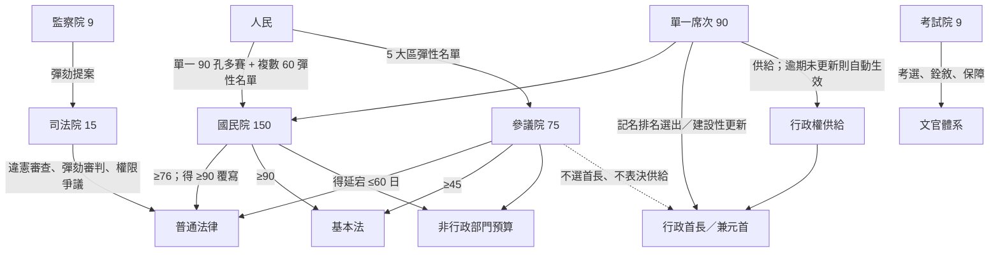

## 2 兩院分工：誰掌行政、誰審查

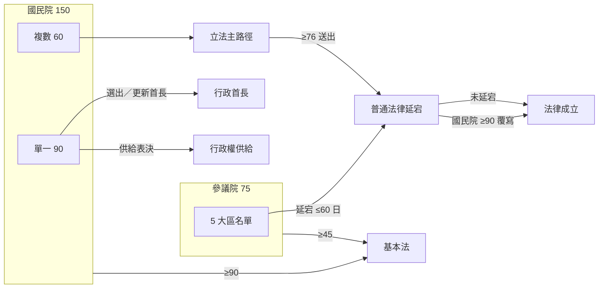

## 3 為什麼不長得像現行制度

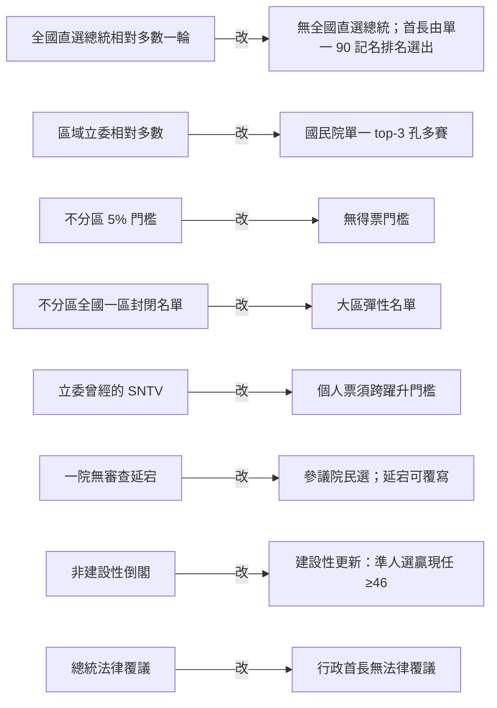

## 4 行政與國民院：拆得掉，但必須組得出

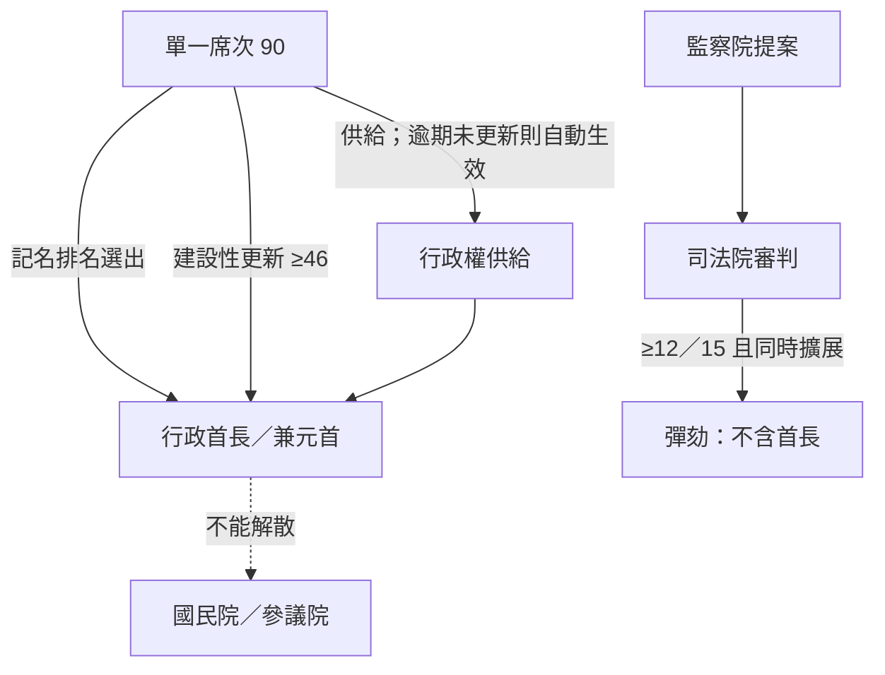

## 5 供給問題怎麼解（建設性＋自動生效）

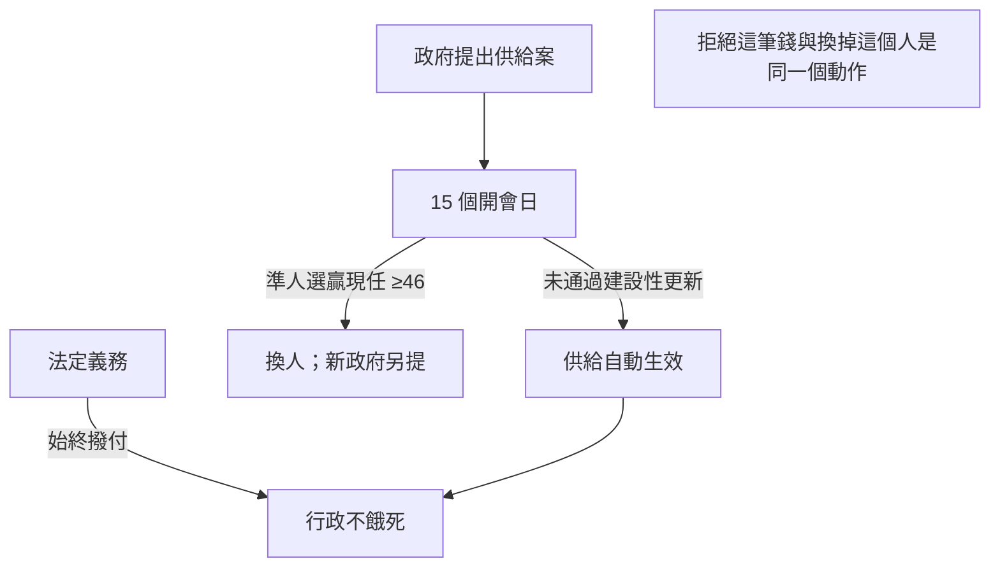

## 6 錢與規則分屬不同多數

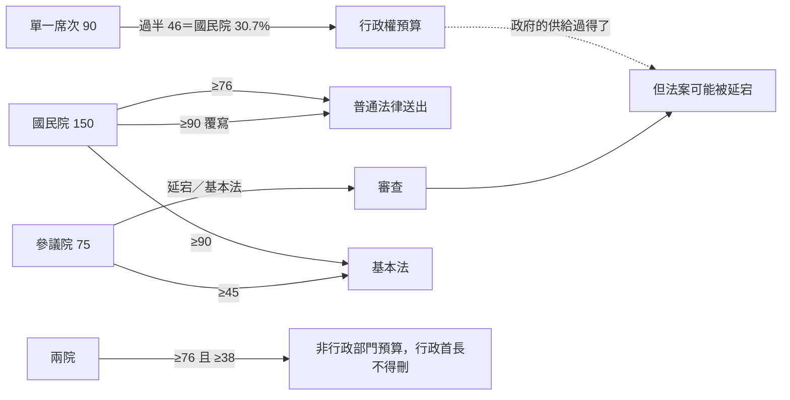

## 7 修憲：兩院跨屆＋人民替代現狀

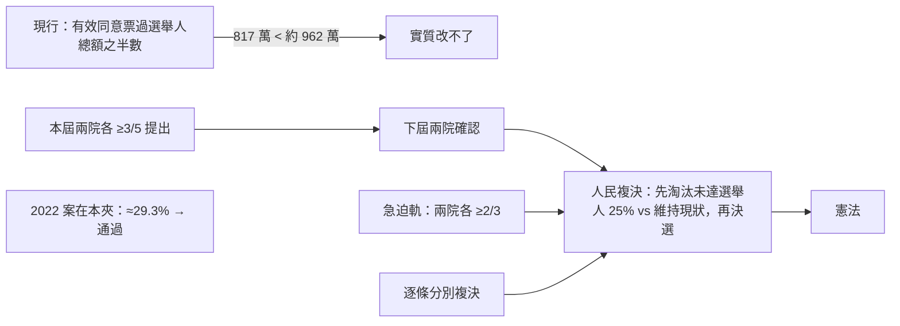

## 8 三院人事：甲乙丙錨在國民院

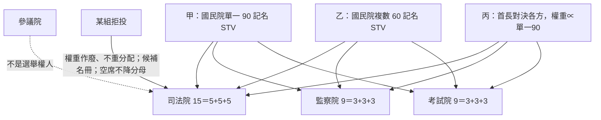

## 9 高政治性：從甲向兩側同時擴展

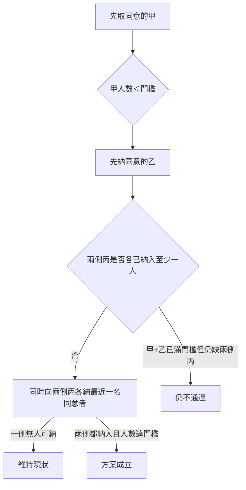

## 10 緊急狀態：預設是結束，而且不碰選舉與更新

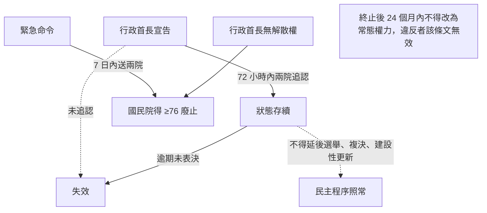

## 11 更新：建設性換人（總統更新無適用對象）

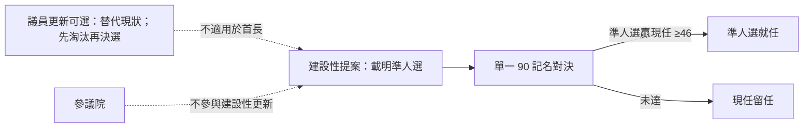
