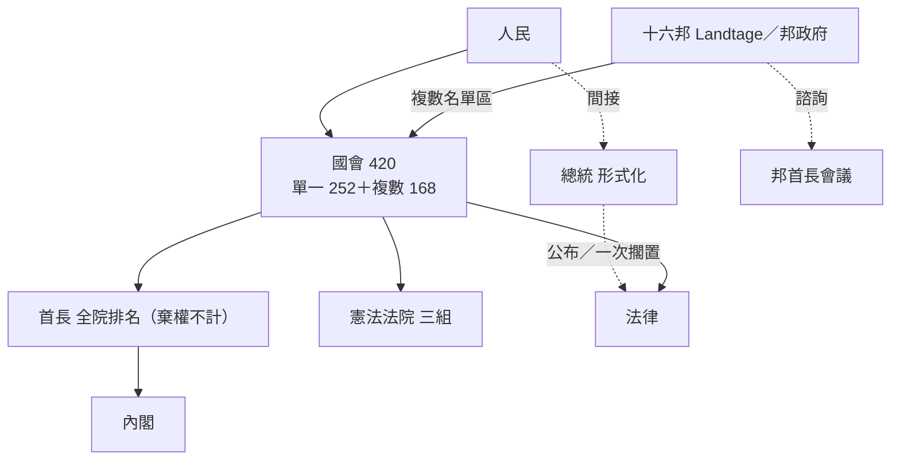
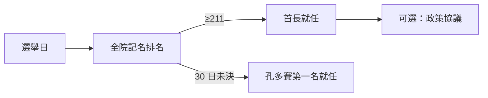
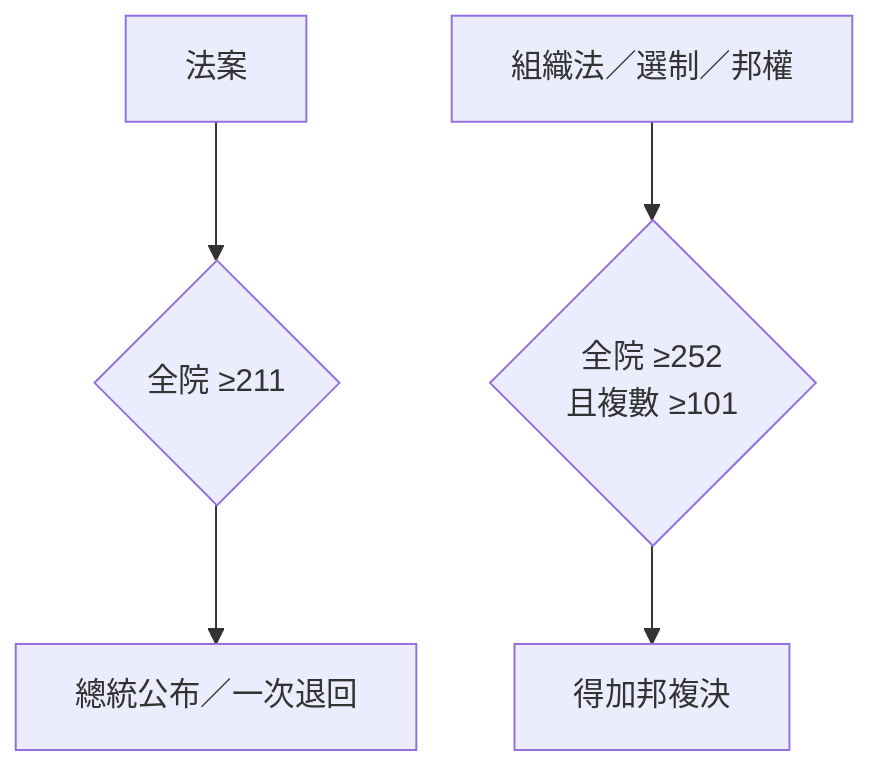
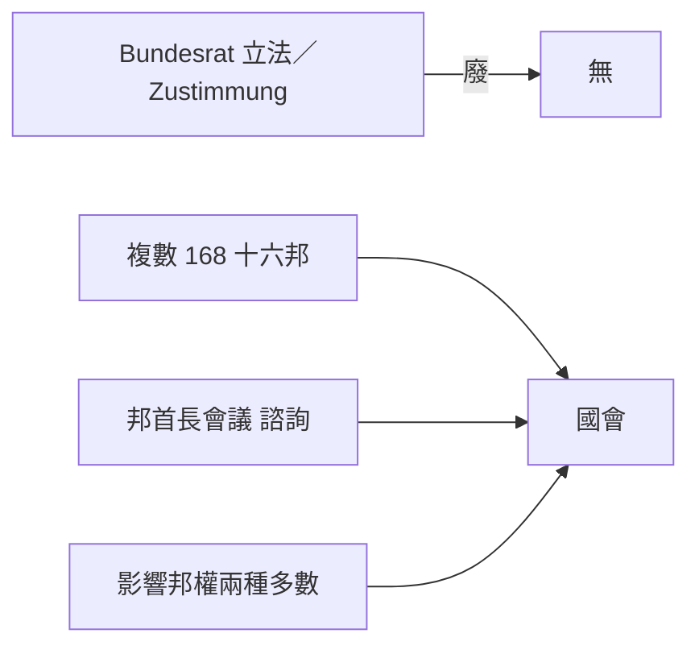

# 憲政架構圖

## 1 權力總覽

```mermaid
flowchart TB
  P[人民] --> BT[國會 420<br/>單一 252＋複數 168]
  P -.->|間接| PR[總統 形式化]
  BT --> HG[首長 全院排名（棄權不計）]
  HG --> CAB[內閣]
  BT --> BVerfG[憲法法院 三組]
  PR -.->|公布／一次擱置| LAW[法律]
  BT --> LAW
  LAND[十六邦 Landtage／邦政府] -.->|諮詢| CONF[邦首長會議]
  LAND -->|複數名單區| BT
```

## 2 組閣（30 日）

```mermaid
flowchart LR
  E[選舉日] --> V[全院記名排名]
  V -->|≥211| HG[首長就任]
  V -->|30 日未決| DEF[孔多賽第一名就任]
  HG --> POL[可選：政策協議]
```

## 3 立法與改規則

```mermaid
flowchart TB
  BILL[法案] --> MAJ{全院 ≥211}
  MAJ --> PUB[總統公布／一次退回]
  RULE[組織法／選制／邦權] --> TWO{全院 ≥252<br/>且複數 ≥101}
  TWO --> OPT[得加邦複決]
```

## 4 聯邦

```mermaid
flowchart LR
  OLD[Bundesrat 立法／Zustimmung] -->|廢| X[無]
  NEW1[複數 168 十六邦] --> BT[國會]
  NEW2[邦首長會議 諮詢] --> BT
  NEW3[影響邦權兩種多數] --> BT
```
