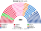
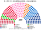

# 預期政治生態

## 1 本檔繼承

`0-基本/總體.md`：給預期政治生態（**含長期運行下的各黨各派席次、朝野互動、候選人行為**），要有一定合理性，**可大膽假設，越詳細具體越好**；繪製仿維基百科的議會席次圖（**含單一席次圖**，因其有特殊權力）。

席次圖見 [`席次圖.md`](席次圖.md)。示意 **第 6 屆國民議會**（任期 4 年，制度運行約 24 年後）。大膽假設標 ★。

## 2 席次

### 2.1 全院 400

| 陣營 | 複數席次得票率 | 複數 170 | 單一 230 | **合計** | 席次率 | 失真 |
|---|---|---|---|---|---|---|
| 國民聯盟系 | **27.0%** | 46 | **38** | **84** | 21.0% | **−6.0** |
| 復興系（中間） | 17.0% | 29 | **55** | **84** | 21.0% | **＋4.0** |
| 社會黨系 | 15.0% | 25 | **45** | **70** | 17.5% | **＋2.5** |
| 共和黨系 | 11.0% | 19 | **36** | **55** | 13.8% | **＋2.8** |
| 不屈法國系 | 13.0% | 22 | **20** | **42** | 10.5% | **−2.5** |
| 民主運動 | 6.0% | 10 | 20 | **30** | 7.5% | ＋1.5 |
| 生態派 | 6.0% | 10 | 12 | **22** | 5.5% | −0.5 |
| 共產黨系 | 3.0% | 5 | 3 | **8** | 2.0% | −1.0 |
| 地方與無黨籍 | 2.0% | 4 | 1 | **5** | 1.3% | −0.7 |
| **計** | **100%** | **170** | **230** | **400** | | |

### 2.2 單一席次 230（有特殊權力）

**過半 116。** 這 116 票決定三件事：**誰是行政首長、他能不能被換掉、行政權供給過不過**（[`02`](02-政府組成與建設性更新.md)、[`03`](03-行政權預算與供給.md)）。

## 3 三個結構性事實

### 3.1 政府多數存在，而且只有一種

單一席次 230 席裡，能湊到 116 的組合：

| 組合 | 席次 | 是否成立 |
|---|---|---|
| **復興 55＋民運 20＋社會黨 45** | **120** | **✓** |
| 復興 55＋民運 20＋共和黨 36 | 111 | ✗（差 5） |
| 社會黨 45＋不屈 20＋生態 12＋共產 3 | 80 | ✗ |
| 國民聯盟 38＋共和黨 36 | 74 | ✗ |
| 復興 55＋民運 20＋共和黨 36＋地方 1 | 112 | ✗ |

★ **只有一種組合過得了 116**，而它是一個跨越中間的三黨聯合。

★ 這與 2024 年的三分議會形成對照：**那裡沒有任何組合能過半，而且拆政府不需要組得出替代者。** 本夾的兩處差異各自貢獻一半——**孔多賽讓中間陣營在單一席次超額**（復興 17% 得票拿 23.9% 的單一席次），**建設性更新讓「拆」等於「換」**。

### 3.2 執政多數 ≠ 立法多數

| 場域 | 門檻 | 執政聯盟（復興＋民運＋社會黨） |
|---|---|---|
| 建設性更新、行政權供給 | 116／230 | **120 ✓** |
| 法律 | 201／400 | **184 ✗**（差 17） |
| 組織法 | 240／400 | 184 ✗ |
| 修憲 | 240／267 | ✗ |

★ **政府活得下去，大法案要另外找票。** 通常是生態派（22 席）加入使法律過關（206），或共和黨系（55 席）在特定議題上加入（239，足以動組織法）。

★ 這正是 [`03`](03-行政權預算與供給.md) §2.7 承認的結構性代價。**本夾滿足的是「政府穩定」那條硬性，不是「立法順暢」——後者沒有被要求。**

### 3.3 國民聯盟系被系統性低估 6 個百分點

★ **這一項要正面寫，不能只寫在代價欄。**

國民聯盟系以 **27% 的得票**拿到 **21% 的席次**。低估來自單一席次那一半：27% 得票只換到 38／230（16.5%）。

**機制**：top-3 孔多賽的第二輪由**第三名支持者的第二偏好**決定。一個在其他陣營支持者裡排序普遍靠後的陣營，即使首選票最高，也很難在兩兩對決中勝出。

| | 現行兩輪多數決 | **本夾 top-3 孔多賽** |
|---|---|---|
| 低估的機制 | 「共和陣線」——其他政黨在第二輪協商退選 | **選票上的排序算術** |
| 誰承擔協商成本 | 政黨（每次都要重談，且愈來愈難維持） | **沒有人**——它是計票規則 |
| 是否可被個別政黨破壞 | **是**（只要有一黨不退選） | 否 |

★ **兩種制度低估的幅度可能相近，但性質不同**：現行制度的低估是政黨聯合行動的結果，**本夾的低估是選制本身的性質**。

★ **這是本夾要付的代價，而且它是雙面的**：同一個機制既降低了二極化（`1-優化` 那條非硬性要的），也讓一個四分之一選民支持的陣營在席次上被壓縮。**本設計不宣稱這是純粹的好事**（[`15`](15-完善與自洽.md)）。

★ 值得注意的是**複數席次那一半沒有低估**：46／170 對應 27%，聖拉古、無門檻。**本夾的 57.5%／42.5% 佔比因此同時是「政府穩定」與「比例性」的分配比例。**

## 4 朝野互動

### 4.1 一屆的典型時序（第 6 屆，示意）

| 月 | 事件 |
|---|---|
| 第 1 月 | 新屆集會。單一席次記名排名投票，三輪，輪間各 48 小時協商。第三輪由復興系人選以孔多賽勝出，120 票在其上（[`02`](02-政府組成與建設性更新.md) §2.2） |
| 第 3 月 | 首份供給案送達。共和黨系提出建設性更新，準人選為其自己的黨魁；表決得 96 票，未達 116。**供給案於次日生效** |
| 第 9 月 | 生態派以「加入立法多數」交換兩項法案；法律門檻 201 首次跨過（206） |
| 第 18 月 | 社會黨系內部分裂，執政聯盟在單一席次剩 112 席。**政府未倒**——因為沒有任何準人選能拿到 116 |
| 第 22 月 | 供給案再度送達，仍自動生效。**這是本夾最重要的一個時刻：一個只有 112 席支持的政府，仍然拿到錢** |
| 第 30 月 | 兩個複數選區的選民發動全區重選（[`11`](11-人選更新.md) §4），改變全院算術但不影響單一席次 |
| 第 34 月 | 建設性更新第二次提出，準人選為社會黨系新黨魁，得 118 票。**通過，當日就任** |
| 第 48 月 | 屆期屆滿，定期改選 |

★ 第 18–22 月那段是本夾與第四共和最尖銳的對照：**一個失去多數的政府仍然存續**，因為沒有人湊得出替代者。

**這是好事還是壞事？** 本夾的立場是：**它比「沒有政府」好，比「有多數的政府」壞。** 而憲法只能在這兩者之間選一個預設值。

★ **注意它與[`議會制惡搞夾`](../../台灣/一院議會制-惡搞/)的差別**：那裡也是「拿不掉的人繼續執政」，但那個人**已經被倒閣過**、且**沒有任何一票支持他**。本夾的首長從未被推翻，且仍有 112 票——**差別在於憲法是否曾經記錄過一次「多數否定他」的表決。**

### 4.2 建設性更新的實際頻率

★ 示意統計（近六屆，24 年）：

| 項目 | 數字 |
|---|---|
| 建設性更新案提出次數 | **17 次** |
| 其中通過 | **4 次** |
| 一屆平均更換首長次數 | **0.67 次** |
| 行政首長任期中位數 | **35 個月** |
| **政府空窗的總日數** | **0 日** |
| 供給案未自動生效的次數 | **4 次**（即那 4 次通過的更新） |

★ 對照第四共和的平均 6 個月與 24 屆政府。**差別不在議員比較合作，在於「拆」這個動作被綁上了「組」。**

★ **空窗 0 日是結構性的**：建設性更新通過的那一刻準人選就任，而組閣期限屆滿有預設值（[`02`](02-政府組成與建設性更新.md) §2.3）。**憲法上沒有一個叫「看守政府」的狀態。**

### 4.3 供給案是政府的例行動作，不是危機

★ 現行第 49.3 條每次使用都是新聞。**在本夾它是行事曆上的一格。**

一年兩次供給案，各 15 個開會日。反對者若不打算換人，**最理性的做法是不提建設性更新**——提了不過，等於公開證實現任的多數還在。

★ 於是本夾出現一個現行制度沒有的現象：**反對黨會刻意「不提」建設性更新，以避免替政府背書。** 而不提的後果就是供給生效。

## 5 候選人行為

### 5.1 單一席次：向第三名的支持者說話

★ 誘因與現行兩輪制不同的地方在**第二輪的三人結構**。

| 階段 | 候選人做什麼 |
|---|---|
| 第一輪 | 鞏固基本盤以擠進前三 |
| **第二輪** | **爭取第三名的支持者把自己排在對手之上** |
| 選後 | 對第三名陣營的議題有具體承諾——因為那是他當選的原因 |

★ **攻擊第三名等於自殺**：第三名的支持者的第二偏好決定勝負。

★ 這是 `1-優化/行政立法/共用.md` 那條非硬性（FPTP 激勵候選人**及其背後媒體**發表激進言論以激怒敵對陣營選民）的直接反面。**但本夾只改變候選人的誘因**——媒體是否跟著改變，[`15`](15-完善與自洽.md) 明說不宣稱。

### 5.2 複數席次：跨得過躍升門檻的人才做個人動員

彈性名單的躍升門檻是該區 Droop 額數的 25%。M＝14 的區，Droop 約 6.7%，門檻約 **1.7% 的區內票**。

★ 誰會去衝這個門檻？**名單上排在當選線邊緣的人。** 排第 1 的不必衝，排第 20 的衝不到。**於是個人動員集中在名單中段的三、四個人身上，而不是全體候選人。**

★ 這正是「黑金」那條硬性要的效果：**個人票動員的規模經濟被壓縮到極小的一群人身上**，樁腳體系撐不起來。

### 5.3 兩種議員的分工在職涯上固化

★ 大膽假設：**兩類議員的職業路徑分開。**

| | 單一席次議員 | 複數席次議員 |
|---|---|---|
| 主要工作 | 選區服務＋政府信任與供給 | 立法、組織法、修憲、預算監督 |
| 進入內閣的機率 | **高**（政府依賴他們） | 低 |
| 專業化方向 | 談判、聯盟維持 | 法案技術、政策專業 |
| 黨內地位 | 黨團與政府的樞紐 | 委員會與政策的樞紐 |
| 兩者間的轉換 | ★ 罕見 | ★ 罕見——兩種選制要的能力不同 |

★ 這是一個**未被要求、但由制度推出來**的結果，而它有一個副作用：**政府的人才池只有 230 人。** 寫進 [`15`](15-完善與自洽.md)。

## 6 公投與人選更新的使用頻率

★ 示意（近六屆，24 年，每年至多兩個投票日）：

| 項目 | 次數 |
|---|---|
| 公投成案 | 11 次 |
| 其中領銜人版本或政府版本取代現狀 | **4 次** |
| 因未達 20% 首選票地板而維持現狀 | 5 次 |
| 因非孔多賽勝者而維持現狀 | 2 次 |
| 單一席次議員更新案 | 23 次，**替換成功 6 次** |
| 複數選區全區重選 | 5 次，**其中 2 次分配未變** |

★ 對照現行第 11 條第 3 項的共同倡議公投**從未成案**。本夾的 1.5% 是刻意調到可用的量級（[`13`](13-憲政選擇.md) 第 40 項）。

★ 「因未達地板而維持現狀」5 次，比「取代現狀」4 次還多。**地板是實際在運作的，不是裝飾。**

## 7 一句話

> **本夾買到的是「政府不會沒有」，付出的是「政府不一定有多數」與「一個四分之一選民支持的陣營在單一席次被壓縮」。**

## 8 指向

席次圖：[`席次圖.md`](席次圖.md)。反例對照：[`12`](12-反例診斷.md)。理由：[`13`](13-憲政選擇.md)。承認的空白：[`15`](15-完善與自洽.md)。
