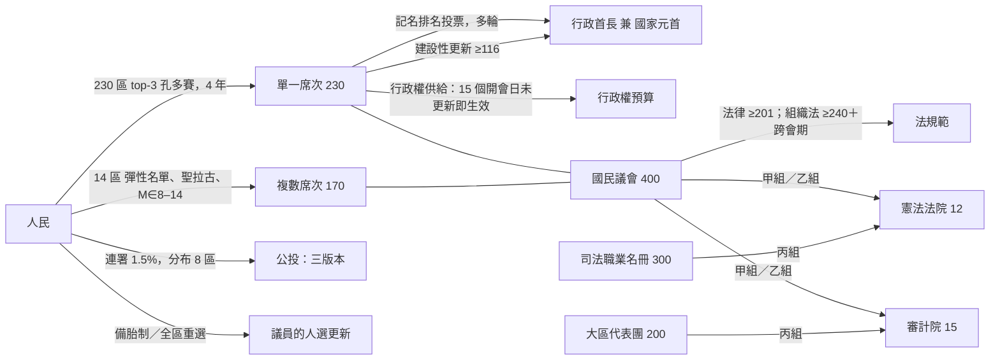
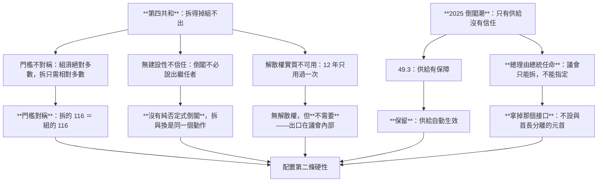
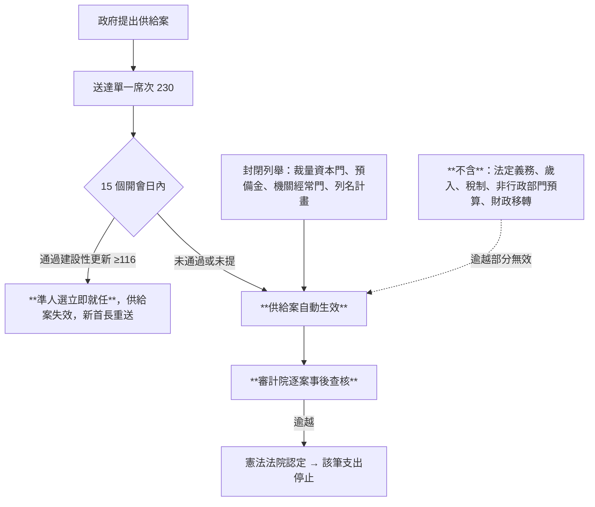
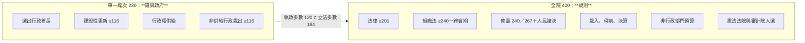
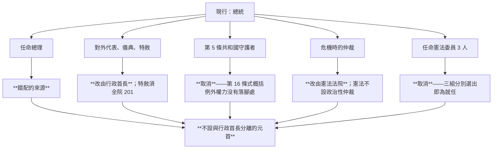
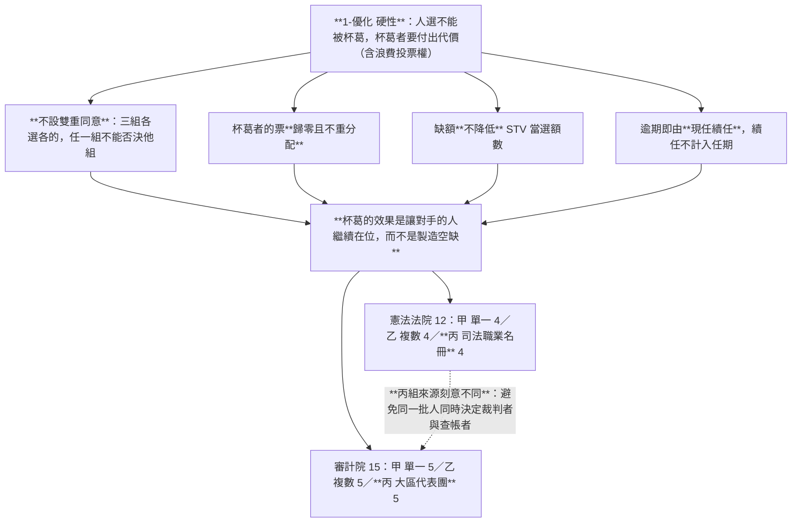
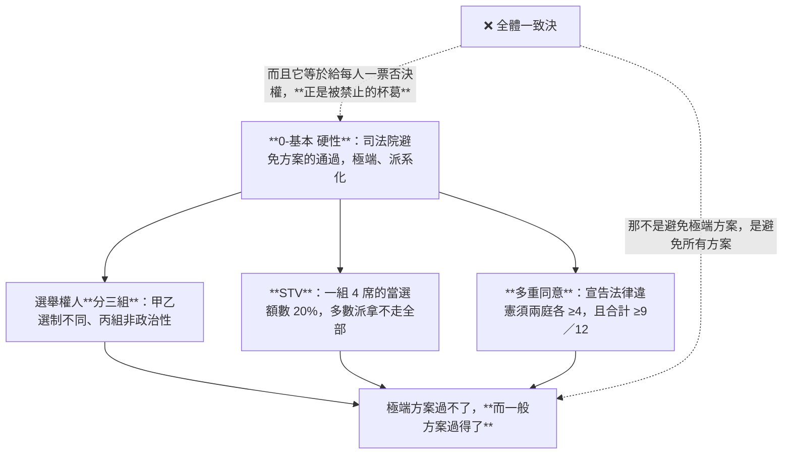
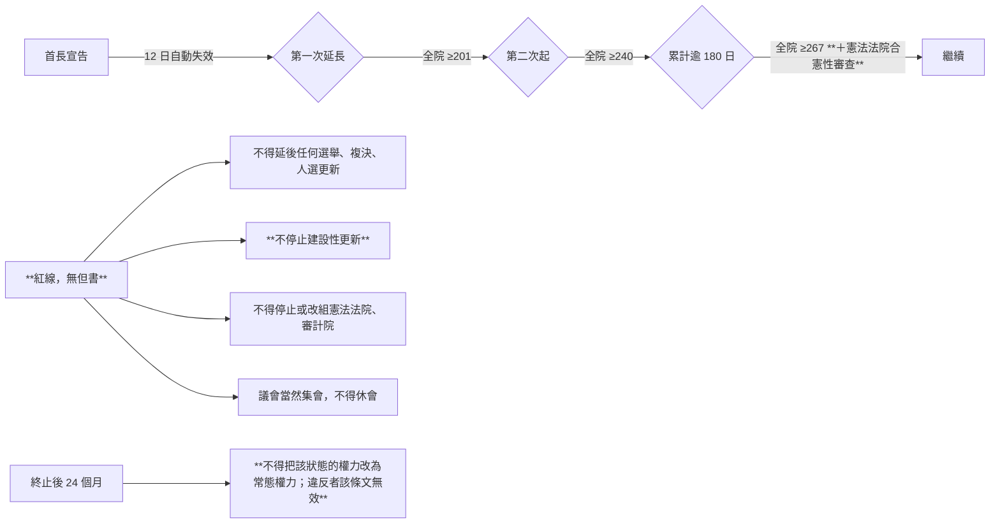

# 憲政架構圖

`0-基本/總體.md`：給多張憲政設計架構圖，方便讀者理解。

## 1 全景

★ **沒有的東西**：總統、參議院、解散權、省、政治性仲裁者。

## 2 兩個反例，兩帖藥

★ **本夾與現行法國的關係不是「加裝」而是「換接口」**——在「總統決定總理」的結構上，建設性不信任裝不上去。

## 3 供給：預設值是給

> **拒絕這筆錢與換掉這個人是同一個動作。事前門檻放低，事後查核就必須放高。**

## 4 兩種議員，兩種場域

★ **政府活得下去，大法案要另外找票。** 這是承認的代價（[`15`](15-完善與自洽.md) §3.2）。

## 5 沒有元首：那個位子被拆掉之後

★ **無實權的元首解決不了問題**：第四共和的總統就是議會選出的，他仍實際主導了 12 年間每一屆政府的人選。**無實權的元首在組閣危機裡會自動長出權力**，因為那是憲法上唯一還在運轉的中立點。

## 6 反杯葛：兩院的人選怎麼產生

## 7 「避免方案通過極端、派系化」怎麼落，而且不用全體一致決

## 8 緊急狀態：門檻隨時間遞增

★ 遞增門檻回應的是 2015–2017 年**連續延長 6 次共 2 年、每次門檻相同**；防常態化回應的是 2017 年把緊急權力寫進普通法。

## 9 指向

規則：[`00`](00-讀法與政體選擇.md)–[`11`](11-人選更新.md)。理由：[`13`](13-憲政選擇.md)。反例：[`12`](12-反例診斷.md)。生態：[`14`](14-預期政治生態.md)。
