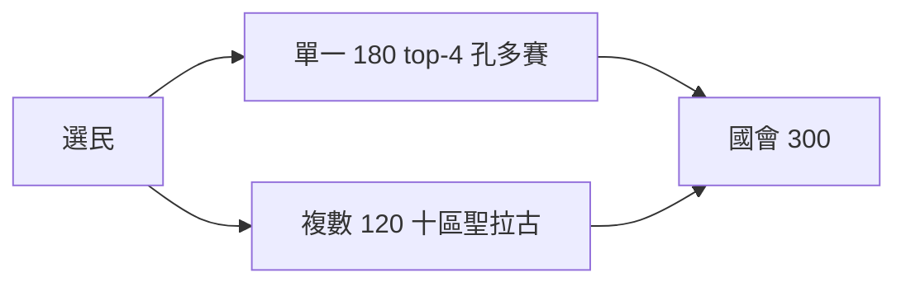
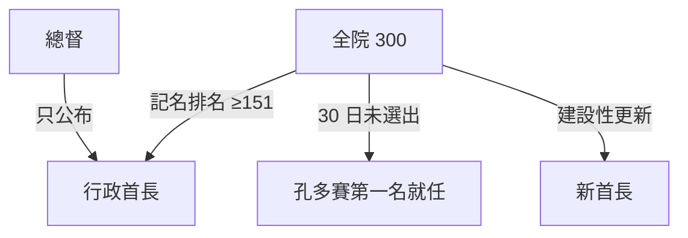
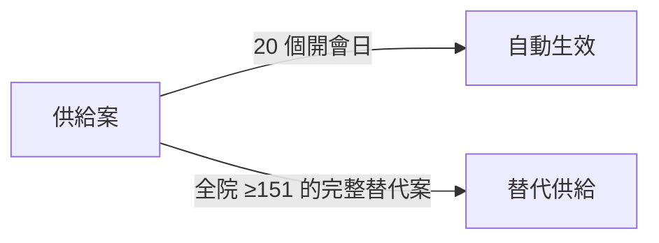
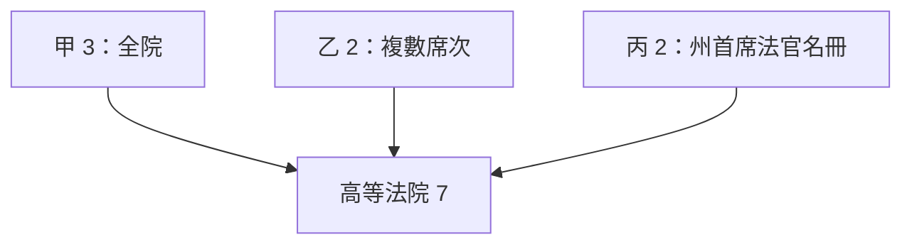

# 憲政架構圖

## 1 選制

```mermaid
flowchart LR
  V[選民] --> SMD["單一 180 top-4 孔多賽"]
  V --> LIST["複數 120 十區聖拉古"]
  SMD --> H[國會 300]
  LIST --> H
```

## 2 政府

```mermaid
flowchart TD
  H[全院 300] -->|記名排名 ≥151| PM[行政首長]
  H -->|30 日未選出| DEF[孔多賽第一名就任]
  H -->|建設性更新| PM2[新首長]
  GG[總督] -->|只公布| PM
```

## 3 供給

```mermaid
flowchart LR
  B[供給案] -->|20 個開會日| AUTO[自動生效]
  B -->|全院 ≥151 的完整替代案| ALT[替代供給]
```

## 4 高等法院

```mermaid
flowchart TB
  A[甲 3：全院] --> HC[高等法院 7]
  B[乙 2：複數席次] --> HC
  C[丙 2：州首席法官名冊] --> HC
```
