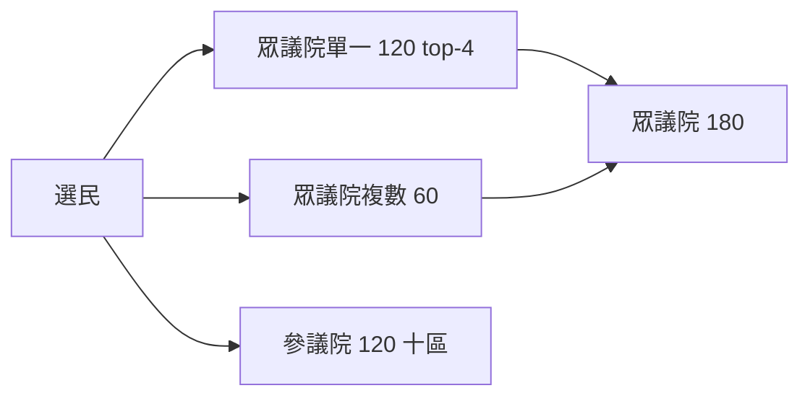
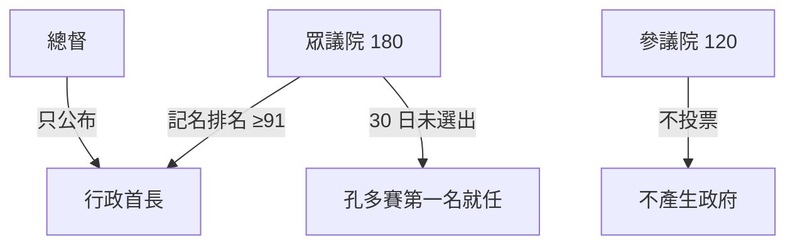
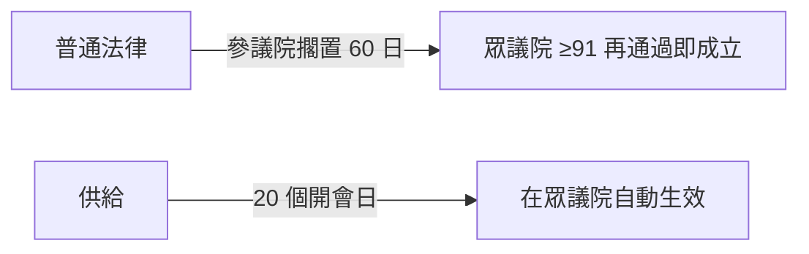
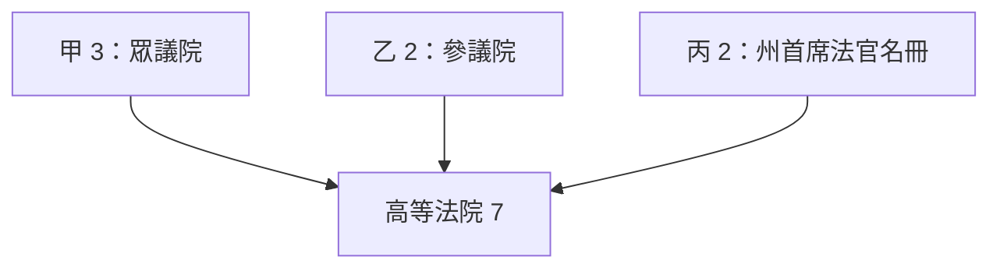

# 憲政架構圖

## 1 選制

```mermaid
flowchart LR
  V[選民] --> SMD["眾議院單一 120 top-4"]
  V --> HL["眾議院複數 60"]
  V --> S["參議院 120 十區"]
  SMD --> H[眾議院 180]
  HL --> H
```

## 2 政府

```mermaid
flowchart TD
  H[眾議院 180] -->|記名排名 ≥91| PM[行政首長]
  H -->|30 日未選出| DEF[孔多賽第一名就任]
  S[參議院 120] -->|不投票| X[不產生政府]
  GG[總督] -->|只公布| PM
```

## 3 法律與供給

```mermaid
flowchart LR
  BILL[普通法律] -->|參議院擱置 60 日| H[眾議院 ≥91 再通過即成立]
  MONEY[供給] -->|20 個開會日| AUTO[在眾議院自動生效]
```

## 4 高等法院

```mermaid
flowchart TB
  A[甲 3：眾議院] --> HC[高等法院 7]
  B[乙 2：參議院] --> HC
  C[丙 2：州首席法官名冊] --> HC
```
