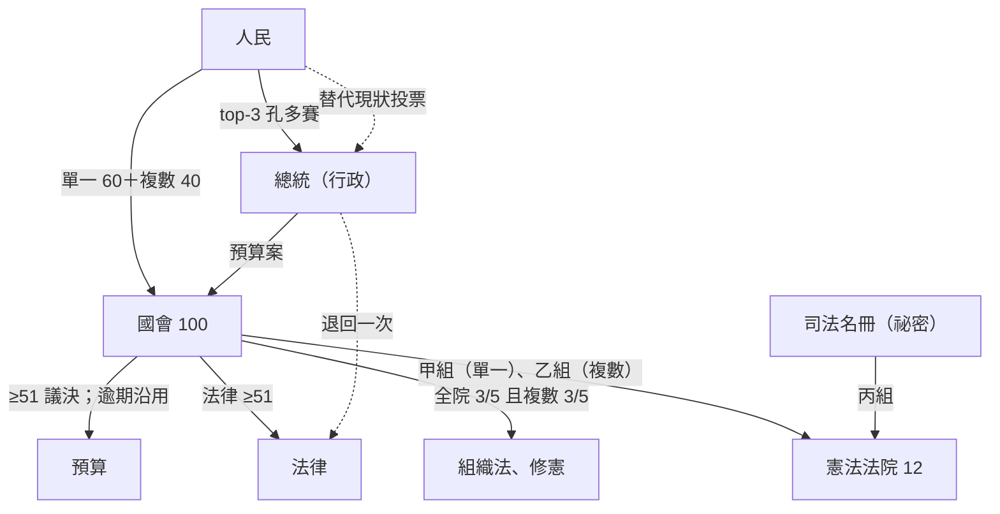

# 憲政架構圖

```mermaid
flowchart TB
  P[人民] -->|top-3 孔多賽| Pr[總統（行政）]
  P -->|單一 60＋複數 40| C[國會 100]
  P -.->|替代現狀投票| Pr
  Pr -->|預算案| C
  C -->|≥51 議決；逾期沿用| B[預算]
  C -->|法律 ≥51| L[法律]
  Pr -.->|退回一次| L
  C -->|全院 3/5 且複數 3/5| O[組織法、修憲]
  C -->|甲組（單一）、乙組（複數）| Ct[憲法法院 12]
  R[司法名冊（祕密）] -->|丙組| Ct
```
