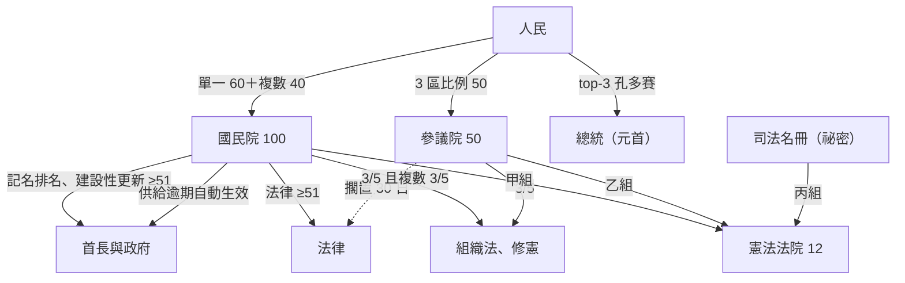

# 憲政架構圖

```mermaid
flowchart TB
  P[人民] -->|單一 60＋複數 40| H[國民院 100]
  P -->|3 區比例 50| S[參議院 50]
  P -->|top-3 孔多賽| Pr[總統（元首）]
  H -->|記名排名、建設性更新 ≥51| G[首長與政府]
  H -->|供給逾期自動生效| G
  H -->|法律 ≥51| L[法律]
  S -.->|擱置 30 日| L
  H -->|3/5 且複數 3/5| O[組織法、修憲]
  S -->|3/5| O
  H -->|甲組| C[憲法法院 12]
  S -->|乙組| C
  R[司法名冊（祕密）] -->|丙組| C
```
