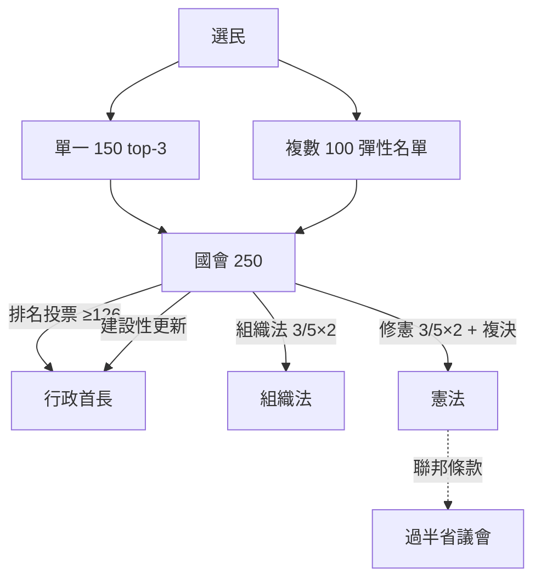

# 憲政架構圖

## 全景

```mermaid
flowchart TB
  V[選民] --> SMD[單一 150 top-3]
  V --> PR[複數 100 彈性名單]
  SMD --> H[國會 250]
  PR --> H
  H -->|排名投票 ≥126| PM[行政首長]
  H -->|建設性更新| PM
  H -->|組織法 3/5×2| L[組織法]
  H -->|修憲 3/5×2 + 複決| C[憲法]
  C -.->|聯邦條款| Prov[過半省議會]
```

## 組閣與供給

```mermaid
flowchart LR
  E[大選同日] --> H[國會]
  H -->|30 日內選首長| PM[首長]
  PM --> B[提出供給]
  B -->|20 開會日| Auto[未換人即生效]
```
